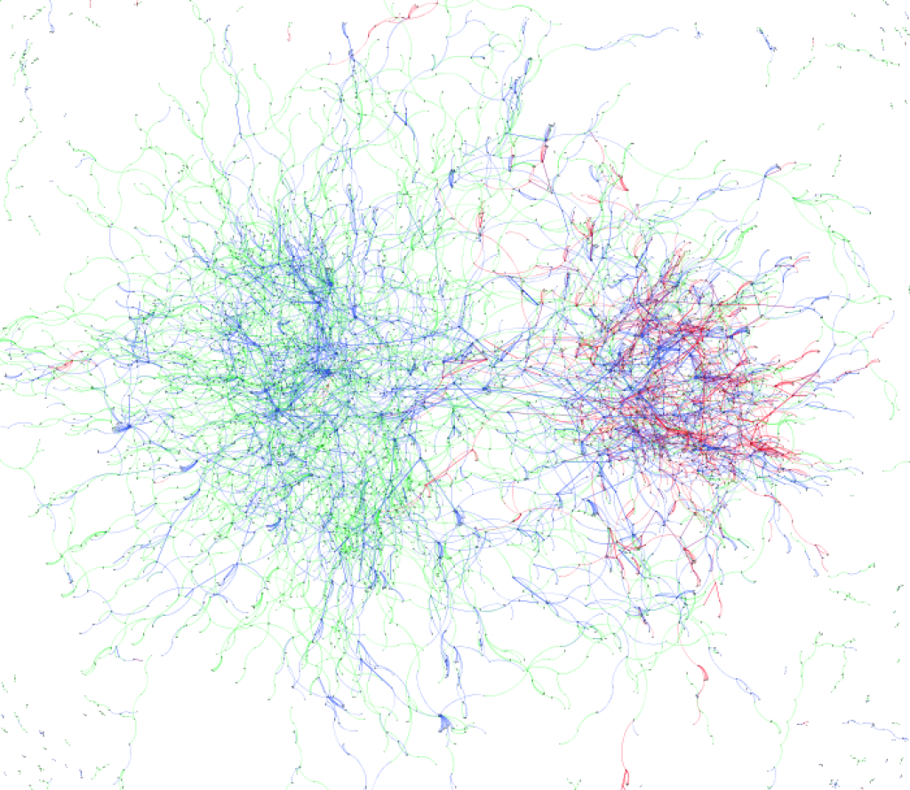

четверг, 9 июня 2011 г. в 15:23:47

- [Визуализация эволюционных каскадов сообщений в социальных сетях с помощью силовых графов](Msc%20work.pdf)

Свою магистрантскую работу я решил посвятить графам, потому что во-первых мне показалось что в ТТУ я о них мало слышал, а во-вторых потому что моя бакалаврская работа была связана с индексацией сети. Сначала я хотел отрисовать эстонский сегмент .ee доменов, но потом решил что можно переключиться на социальные сети и поизучать их особенности. Надо сказать что интересные темы только и проносились мимо - то твиттер-революция в арабском мире, то выборы и скайп-падения в Эстонии.. Жаль что из-за большой ширины выбранной темы, не удалось именно эти темы исследовать более пристально.

В практической части я использовал Gephi и написал свой [**инструмент для рисования**](https://kurapov.ee/msc_tool/) .  
Вы также можете помочь в [коллективном переводе работы на английский](https://docs.google.com/document/d/18JqjHNSY52hx2lx3wN8is5OQbeiiMLNqGXqNv1LzrvE/edit?hl=ru&authkey=CMKM94EF).  

Интересным результатом работы для меня была визуализация социальной сети с сегрегацией по языку (русский и эстонский)..

[Networks, Cdouds, and Markets](img/272.pdf)