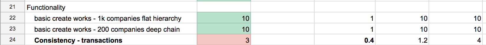
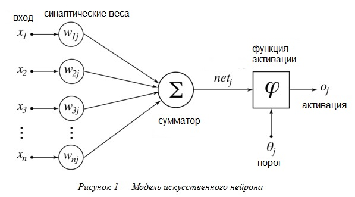

вторник, 18 сентября 2018 г. в 22:14:41

Процесс найма разработчиков различен и на моём пути я был как на стороне [кандидата со своей системой вопросов](https://kurapov.ee/rus/pholosophica/8258/), получал свою [уйму лулзов](https://kurapov.ee/rus/lab/control/phpdev_interview/), так и на стороне интервьюера. Поскольку встреч с кандидатом в больших компаниях несколько, то мне удалось принимать интервью на фазе технической оценки. Постараюсь тут кратко описать итоги.

### Цели

Для компании смысл технического интервью - оценка кандидата. В это входит:

1. Оценка горизонтальных архитектурных познаний. Насколько богатый спектр технологий и процессов разработки использовал или хотя-бы знает человек. Как он может связать их между собой. Какие решения для одной и той же проблемы он может предложить.

2. Оценка вертикальных, практических познаний. Насколько глубоко он знает технологии с которыми он работает. Как детально он вникает во все возможные нюансы. Как сильно он может оптимизировать задачу по performance

3. Прочие не технические качества - инициативность, качество, скорость мышления, реакция на критику, любопытство

### Объективная оценка

Как это же оценить разработчика на деле и сравнить его с другими разработчиками, если все люди разные? Дабы уменьшить уровень философии и субъективности, я подхожу к оценке очень практично. 

Почти все компании высылают кандидатам **домашнее задание**. Я подхожу к оценке его с холодным расчётом Excel'я и TDD. Так как домашняя работа должна показать знание всего цикла разработки, то я составляю **таблицу оценок** на каждого кандидата

Таблица большая где каждый ряд это своего рода тест домашней работы итог которого - оценка от 0 до 10.

Дальше каждая оценка умножается на относительный коэффициент важности и итог суммируется. Дальше он делится на максимально достижимый рейтинг и мы получаем простое число от 0 до 100.

По такому же принципу работает искусственный нейрон. Вся тонкость конечно в том на что надо проверять домашнюю работы (какие ряды = тесты = входы) и насколько они друг относительно друга важны (веса = коэффициенты)

Могу сказать что такая оценка даёт хорошую обратную связь для HR. Некоторые разработчики набирают пункты делая прилежную работу по всем пунктам, некоторые углубляются в performance, теряя качество, но относительно друг-друга, оценка разработчиков выходит объективная.

### Интервью

Ко времени встречи, я уже знаю сильные и слабые стороны разработчика судя по его коду. Интервью достаточно напряжённое и длится ~1.5 часа. Встреча состоит из нескольких частей:

1. Объяснение с его стороны, как работает приложение. По ходу дела я могу спрашивать почему так или иная часть сделана так (плохо) и как это можно улучить.  
    
2. Пробегание по разным областям. Это мини-тест на понимание концепций и получение опыта не выводимого из домашней работы.
    
3. Архитектурные проблемы которые у нас есть и какие решения он может нам предложить. Это фаза эмоционального подъёма, т.к. задачи становятся более абстрактными. Типичным вопросом может быть - каким проектом вы гордитесь и как бы его переделали сегодня?
    
4. Его вопросы. К этому времени кандидат уже устал, поэтому надо спрашивать именно "Какие вопросы у вас", а не "Есть ли у вас вопросы", т.к. это заставляет думать и на самом деле показывает что человеку важно.
    

### Итог

В конце для HR у меня есть доклад - как сделана домашняя работа, что человек знает, как общается, в каких областях проблемные места и что это будет значить для организации. Например если разработчик широко использует фреймворки и показывает способности организации кода, но при этом не может сделать хороший performance это одна крайность, а если разработчик намеренно тратит мало времени и пишет лаконичный код заточенный только на performance одной области, то это другая крайность. 

Люди сложные, говорят и мыслят с разной скоростью, предлагают решения со своими преимуществами, но в итоге интервью, HR должен получить упрощённую цифру уровня ЗП + возможные риски и стратегии по обучению и росту

P.S. [мы нанимаем](https://www.pipedrive.com/en/jobs), приходите попробовать на практике

<iframe width="934" height="350" src="https://www.youtube.com/embed/ZTtkyFjvyJQ" title="Все, что тимлид должен знать о найме и увольнении / Степан Овчинников (ИНТЕРВОЛГА)" frameborder="0" allow="accelerometer; autoplay; clipboard-write; encrypted-media; gyroscope; picture-in-picture; web-share" referrerpolicy="strict-origin-when-cross-origin" allowfullscreen></iframe>
