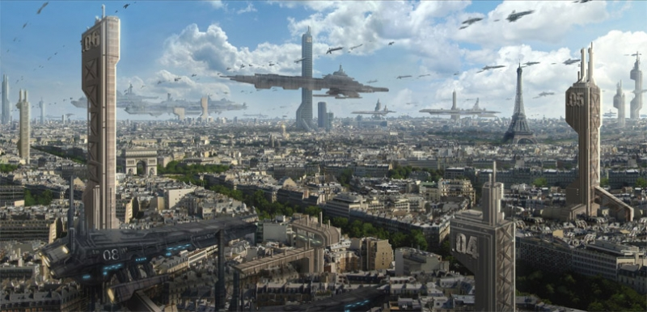
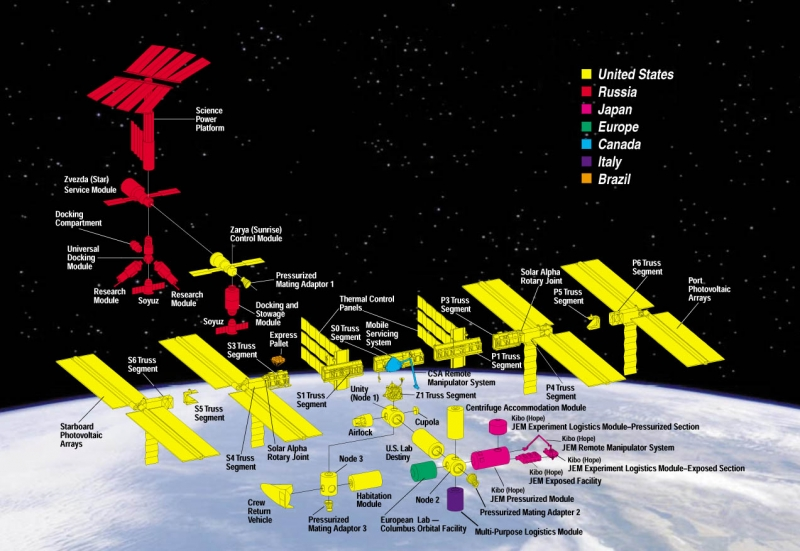

# О проектировании космического корабля
воскресенье, 13 сентября 2009 г. в 01:25:45

Посмотрел «Andromeda» — очередной космический сериал по принципу Star Trek, Babylon 5, но более близкий к «Firefly» и постарался представить какие будут космические корабли в будующем. Проблема в том что проектирования формы корабля всегда зависит от начинки и назначения, а эти характеристики неизменно приводят к двум вещам — физике и социальной организации.

Когда я смотрю на то что рисуют концепт-дизайнеры космических кораблей то мне хочется смеяться — та же самая проблема видна и если посадить такого художника нарисовать доспехи к фентези игре — слишком много мелких или выступающих деталей и полигонов.

Впрочем художников можно понять — эстетическая составляющая так или иначе будет представлять _часть культуры человечества_. А естественная красота и гармония систем очень связана и с художественным чувством прекрасного.

Прежде всего в зависимости от развитости цивилизации, дизайнеру и архитектору космического корабля надо всегда думать о следующем

- Сколько времени и энергии занимает путешествие? От этого зависят размеры и автономность?
- Какая специализация корабля? От этого зависят размеры и рассположение функциональных отсеков
- Как максимально легко чинить части корабля в космосе и на земле, как понизить цену на постройку.
- В какой среде корабль часто бывает?
    - Какие максимальные давления, столкновения, радиацию, температуру он может выдерживать?
    - Какие средства движения в этих средах?
- Как лучше располагать все системы что-бы быть максимально выживаемым?

### Эволюция дизайна в фильмах

1. Star Trek (60е гг.) Несуразная тарелка с двумя внешними двигателями. Несуразная потому что попадание по ножкам ведущим к двигателям лишало бы станцию любого средства передвижения, тогда как иллюминаторы в «тарелке» в большинстве своём смотрят вверх и вниз (впрочем всегда можно использовать боковые видеокамеры).
2. Space Odissey (70 гг.) Более реалистический подход. Шарообразные и кольцевидные орбитальные станции, вопросы гравитации и систем управления.
3. Star Wars (80 гг.) Опять возвращение к принципам Star Trek — но теперь с широким размахом. Самые большие коробли империи достигают 17 км в длину. Очень странные Tie-fighter'ы с вертикальными пластинами.
4. Babylon 5, Lexx (90 гг.) Представление о космосе как о безвоздушном пространстве вновь даёт волю дизайнерским изыскам. Формы приобретают всё более невероятные виды.

### Окунаясь в реальность

Сейчас цена доставки килограмма массы на орбиту стоит 22 тыс. долларов. Если рассматривать дизайн современной МКС то она выглядит как крест — в одну сторону идёт основа для солнечных батарей и рассеивателей тепла (с передвижным краном), а в другую сторону — цилиндрические отсеки со стыковочными узлами.

Если смотреть на аварии с которыми сталкивались космонавты, то в основном это поломки компьютеров, человеческий фактор и поломка туалета :)

Впрочем если рассматривать дизайн кораблей не с дешёвой модульно-функциональной точки зрения (Союз, Прогресс), а сточки зрения универсальности и многократного использования (Шатл, Буран), тогда каждый корабль очень начинает напоминать подводную лодку. И тут конечно приходится выделять отдельные помещения.

- Спальня
- Лаборатория
- Комната отдыха / обзорная
- Склад припасов
- Туалет, душевая

Кроме того практически каждый отсек так или иначе реализует общие системы корабля:

- управления и связи
- опоры, герметичности
- охлаждения, энергообеспечения и вентиляции
- восстановления кислорода и воды
- движения (топливные баки, двигатели)

### Размер имеет значение  

Теперь поговорим о _классах_ кораблей и зависимости от их размеров.

- Разведывательный / исследовательский безпилотный корабль.
- Спасательный челнок (от 40 м). Основная цель - спастись основного с разрушающегося корабля. Как правило отличаются по дальности и числу пассажиров. В отличие от фантастики, расходовать на одного-двух человек целый мини-корабль с жизнеобеспечением слишком дорого. Правильней спасать небольшую комманду в районе 5-10 человек
- Частные яхты / Шатл (от 40 м). Аналогично современным машинам, просто достаточно вместимое средство передвижения на 1-4 человек с возможностью межсистемных полётов.
- Истребители и бомбардировщики (от 40 м). Быстрые, с целью перехвата противника и медлительные с большим количеством торпед.
- Транспортные корабли (от 150 м). Как грузовые, пассажирские, военные. В зависимости от числа людей или свойств груза могут отличаться по размерам. Аналогично грузовикам, автобусам и бронетранспортёрам.. просто в космосе — дёшево и сердито
- Колонизационные корабли с полным универсальным комплектом терраформирования
- Орбитальные станции, верфи, корабли-города (от 1 км)
- Военные межсистемные крейсеры (от 3 км). Захват и уничтожение планетарных поселений, борьба с пиратами и тп.

Помоему корабли типа «звезды смерти», маловозможны поскольку для полноценной естественной гравитации необходима настолько большая масса, что внутренности так или иначе превратились бы в жидкую мантию. Проще использовать существующий астероид в несколько сот километров диаметром. Проблема лишь в том что такую бандуру невозможно как-либо передвигать.

Кстати, американские космонавты активно твитят — [Mike Massimino](http://twitter.com/Astro_Mike), [Mark Polansky](http://twitter.com/Astro_127).. Тем временем [Роскосмос](http://www.roscosmos.ru/) имеет убогий сайт с [битыми линками](http://www.roscosmos.ru/u-st.asp) (стыдно товарищи!)