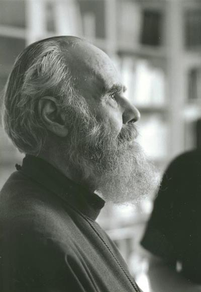

# Человек как целевая система
суббота, 25 июля 2009 г. в 14:55:51

«Смысл жизни» вопрос философский. В более узком понятии «смысл» это наличие **цели**. Конечно в некоторые игры можно рубиться бесконечно, но в _коротких_ циклах всегда должны быть цели. Купить новый диван (в Sims), проапгрейдить процент защиты (в WoW), увеличить пенсию (в государстве), накормить свою стаю (в природе), добиться большей энергоёмкости батареи (в электронике), увеличить популярность сайта до 1000 посетителей в сутки (в web-проектах).

Теперь свяжем цели с предыдущей темой — широтой систем. Менеджеры подобно рутерам имеют высокую информационную нагрузку. Это элемент отвечающий за правильное исполнение целей. В корпорациях «цель» должна быть чётко описана для эффективного позиционирования на рынке. Если система широкая, универсальная, всеядная как например MS Office, то управляющие элементы должны быть с широким спектром знаний. Вопрос о том как этот спектр формировать частый вопрос как стратегических игр, так и бюджета страны.

Для определения целей нужно сначала определить понятие **заинтересованных лиц**. Заинтересованные лица бывают как внутренние, так и внешние. Например в строительстве дома заинтересованные лица - заказчик, строители, аудитор, воры, соседи, пожарные с полицией, дети, недееспособные лица.

Принцип «маленьких шажков» всегда выручает перегруженных работников. Я например часто ловлю себя на том что делаешь, делаешь систему по кусочкам, а потом удивляюсь как она вся вместе работает. Просто из личной эффективности замечаю что когда видишь сколько надо пройти до цели, то страшно становится, но идти **шажками** - не так затратно. То же самое и с эволюцией жизни. Цель на середине этапа не так видна, когда разум забит частностями реалий, а широта не позволяет охватить пройденный путь.

---

Watchmen

Теперь про фильм Хранители (Watchmen). По сути очень эффектный своим реализмом фильм о супергероях. Ведь герои это именно те целевые элементы, которые наделены силой. Это телефон переделанный в iphone - то к чему стремится общество, хит продаж. Это закон направленный в нужное время против возникающей опасности.

Но фильм не идеализирует эти целевые точки. Напротив, фильм говорит о том различном **направлении целей**, разных методах, их столкновениях и последствиях которые приводят даже к падению этих героев, самоуничтожением системы.

Если взять тот же мульт [Battle for Terra](http://www.battleforterra.com/), где земляне лишаются своей планеты и вынуждены захватывать её у инопланетян то ясно становится что есть три долговременных состояния системы

- Выживание
- Сохранение
- Развитие

Очевидно когда система **всемогуща**, то цель как таковая  пропадает. В Хранителях это синикожий Доктор Манхэттен, или просто Джон. Он случайно попал в камеру с физическим экспериментом и приобрёл возможность манипулирования пространством, временем и материей (что в принципе одно сущее). Иными словами приблизился к понятию Бога. Немного он цеплялся за своё прошлое, но вскоре жизнь наскучила. То же самое случается когда узнаёшь чит-коды типа IDDQD, такой же сценарий и в «Боге-императоре Дюны» Френка Герберта, да и вообще концепция человечества как единой глобальной империи с единым президентом, единой системой не нова.

Следующий интересный пункт касается _нирваны_. Буддизм как известно состоит из двух или трёх школ (т.н. колесниц) и ставит перед собой целью пробуждение (человека или всё человечество). Проблема в том что насколько правильно достигать пробуждения самому? Тоесть правильней ведь своими поступками просвятить всё человечество и следовательно отказаться от личного просветления ради просветления общества.

### Дианетика

Лженаука "[Дианетика](http://www.dianetics.org/)" Рона Хаббарда и секта "Сайентологии" слишком близко подходит к представлению **человека как объекта** системологии. Хаббард предполагает следующую структуру разума

- Аналитический ум - делает основные логические выводы
- Реактивный ум - пассивно записывает абсолютно все воспринимаемые события
- Соматический ум - поддерживает жизнедеятельность

Цель "жизни" согласно этой Дианетике является самосовершенствование по уровням самосознания (т.н. динамики жизни)

1. Выживание себя и симбионтов
2. Размножение и творчество
3. Выживание ради группы
4. Выживание ради человечества
5. Сохранение живой природы
6. Сохранение неживой материи
7. Духовное развитие
8. Созидательная динамика веры

В общем очень напоминает ступени самосовершенствования в буддизме или пирамиду Маслова. Однако кроме научной необоснованности и явной денежной заинтересованности сайентологии, основная ошибка в том что человек считается слишком идеальной моделью, где любые неполадки могут быть исправлены одним способом - очистки реактивного ума от наслоений инграмм, т.е. подсознательных причинно-следственных совокупностей (мокрые руки+искрящаяся розетка+случайно прикоснулся+чёрная кошка=удар током).

На самом деле проблема в том что человек самостоятельно не в состоянии у себя удалить память. Это происходит естественным образом при малом использовании, либо даже при read-only доступе (которое в свою очередь может "подкорректировать" память!). Таким образом практика "очищения" реактивного мозга на самом деле подобна гипнозу и кодированию, которые внушением просто отключают участки мозга отвечающие за алкоголь и все эти воспоминания. А ведь это не решение.

### Вера как синтез  

Антоний, митрополит Сурожский (1914-2003 гг.) очень [интересно рассказывает](http://www.predanie.ru/mp3/Mitropolit_Antonij_Surozhskij/) об основах православной веры (см [formazon](http://formazon.com/malenkij-mir-i-bolshoj-mir)). Как можно заметить, веру как правило в пирамидах психологии и самоцелей динамических социальных систем ставят на самом верху. И не мудрено, ведь вера в Бога подразумевает сначала веру в человека. А это то самое что ни на есть созидательная гравитация, изменяющая не просто сближение систем внешне, но и перестраивающая их внутренне, вызывая новую эволюцию

Для достижения целей системы существуют стратегии управления внутренними ресурсами и процессами, но об этом позже..

