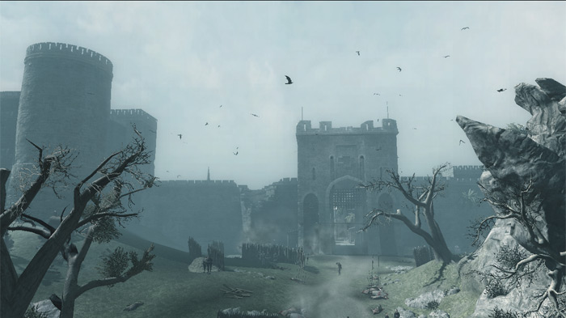
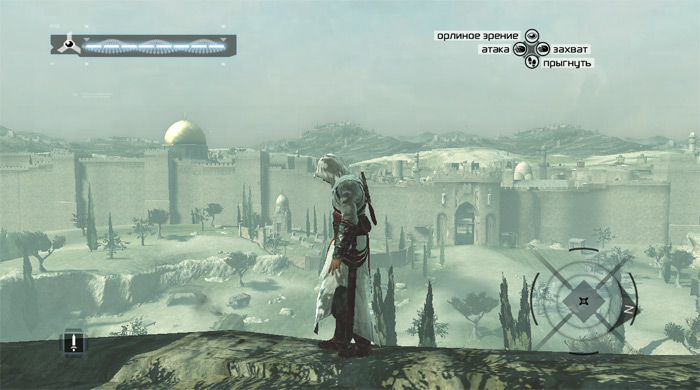
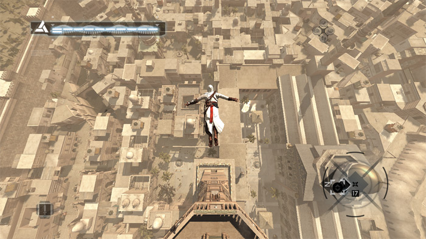
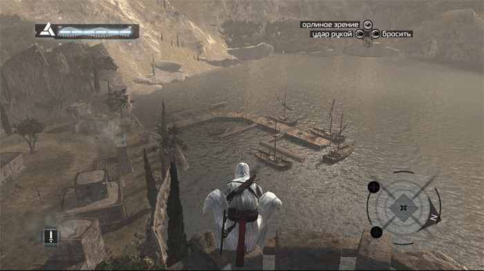
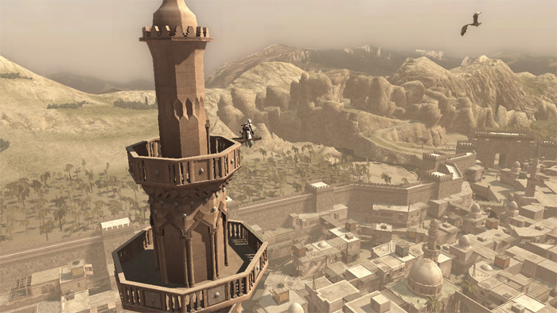
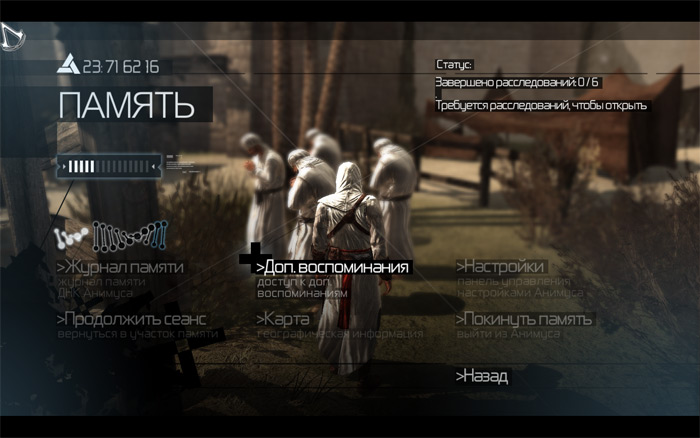

воскресенье, 23 марта 2008 г. в 01:07:19

Игрушка по вводному сюжету схожая с Timeshift - учёный-идеалист _Vidic_ из фармацевтической компании _Abstergo Industries_ (лат. "очищать") находит главного героя - бармена _Desmond_'а, убежавшего с фермы сектантов, который в прошлой жизни был клановым наёмным убийцей. Благодаря специальному устройству _Animus_ (лат. дух), теперь можно прочитать генетическую память из прошлого, а самому герою - _Альтаиру_ прийдётся пережить приключения в "центре мира" 1191 года - на Священной земле.

### Политический сценарий  

Как известно, поводом крестовых походов стала всё так же Палестина - вся Европа взбудоражилась и начала отправлять рыцарей на завоевания священной земли. Захватив Иерусалим в 1099, европейцы были остановлены Нурэдином, а потом - в 1187 Саладин отвоевал Иерусалим. К 1191 году был созван третий крестовый поход, в котором немецкий король погиб, а французы с англичанами отвоевали Акру.

В игре четыре основных города - Масиаф, Дамаск, Акра и Иерусалим. Идеология клана отличается от такового в  Oblivion - assasin это не наёмный убийца, это как террорист-смертник готовый к убийству ради абстрактного высшего блага. Сценаристы пошли по стопам Overlord'а - все герои на самом деле чудовища, просто об этом мало кто слышал в наши дни. Альтаир должен убить 9 ключевых фигур в вышеназванных городах:

- Тамир в Дамаске - поставщик оружия
- Гарнье де Наплуа в Акре - пытатель из ордена госпитальеров  
    
- Талал в Иерусалиме - поставщик рабов
- Абу-аль-Нуквод в Дамаске - богатый купец
- Вильям Монферрат в Акре
- Мажд Аддин в Иерусалиме
- (дальше не доиграл)

### Играбельность

Хотя игра не в квестовом жанре, а сюжет по началу очень прямолинеен, атмосфера даёт о себе знать. Так и хочется лазить по стенам и прыгать в сено от восторга - ведь тут тамплиеры и крестоносцы. Конечно надо увиливать от стражи по крышам подобно скалолазу или человеку-пауку, вспоминая GTA.

Пара новшеств, которые мало где я ещё видел - активная толпа. Людей просто много, они мешают как вам так и противнику. Эффектная битва на самом деле мало управляема - против пяти противников в круге биться нереально. Приёмы разделены по комбинациям:

---

- Комбо-атака - защита пробивается быстрым ударом сразу после столкновения мечей
- Контр-удар - защитное ожидание в верхней стойке быстро переходит в наступление при атаке противника
- Разбивание захвата - если враг пытается схватить вас голыми руками, то по аналогии с контр-ударом, руки просто выворачиваются.

Оружия кроме кулаков есть только три типа - меч, метательные кинжалы и встроенное в руку лезвие (вместо безымянного пальца). Биться против крестоносцев в хорошейброне очень не советую..

### Аркадный движок  

Движок мягко говоря не ахти. Конечно сразу видно что разработчики уделили большое внимание бою и внешней грации персонажа - смотрится как настоящий, но ничего универсального как в Crysis нет. Погода не меняется, на дворе вечный день, люди особо ничего не говорят да и вообще NPC крайней мало, что создаёт ощущение аркады.

Аркадный стиль значит однообразие - получив задание на убийство вы как правило слоняетесь по крышам, залазя на мечети что-бы с высоты птичьего полёта открыть новую территорию. Ввязываетесь в битву против охранников-насильников, узнаёте где можно найти жертву и исполняете убийство. Единственное разнообразие это последняя речь объекта - в остальном очень тягостная игрушка.

Незнаю почему, может из-за русификации, но игра висла каждый час. Представляете - убиваете чуть ли не последнего стражника, куча трупов лежит.. и бах, грузись заново.

### За и против

Плюсы:

- Отличная анимация главного героя, битвы, стиля. Если девушки-игроки влюбляются в Blood-эльфов из Warcraft, мечтают о докторе Хаусе и любят Ведьмака, то Альтаир уж точно понравится
- Видна продуманность нескольких идей - прыжок веры, инициация, вводная история с генетикой
- Удачный исторический фон, учитывая заработки Брауна на "Коде ДаВинчи" и "Ангелах и Демонах". Хорошо проделана работа по воссозданию атмосферы того времени - архитектуры, одежды.
- Относительная свобода передвижения внутри города, схожая с GTA система правопорядка  
    

Минусы:

- Вялый сценарий, отсутсвие хорошо продуманных квестов. Скудная реакция публики - в Elders scrolls: Oblivion практически любой прохожий имел бы для вас задание.
- Трудно управляемая камера и битва, практически никакое развитие персонажа.  
    
- Неинтерактивный мир - кроме разрушения торговых лавок по заданию, нельзя ничего использовать типа верёвки, нельзя плавать, переодеваться, приставать к прохожим, отбирать оружие. Нет никакой торговли и экономики, вещей. Отсутсвие времени суток, погоды.

Вердикт - поиграть можно, но надолго не задержится. Вас могут переубедить статьи:

- [Превью игры](http://xtgamers.com/page-id-1637.html)
- [О бедном убийце замолвите слово](http://www.gametech.ru/cgi-bin/show.pl?option=review&id=178) - Александр Тутевич
- [Обзор Assasin's creed](http://www.uaplay.com/games/action/assassins/review.html) - Demetrius