понедельник, 16 апреля 2012 г. в 18:31:04

Прибыла заказанная мною на амазоне настольная игра Cosmic encounter и дополнение к ней Cosmic incursion. Я играл в неё три раза, всякий раз проигрывал и тем не менее очень нравился процесс, поэтому объясню основы..

В оригинальную версию могут играть 3-5 человек, 1-3 часа. Существуют 3 дополнения, которые позволяют уместиться восьмерым игрокам за одним столом с некоторыми дополненными правилами. Игра с 1977 года пережила несколько издателей и изменений правил, что о чём-то должно говорить. У меня последняя версия от [Fantasy Flight games](http://www.fantasyflightgames.com/).

### Сюжет

Каждый игрок выступает в качестве цивилизации, которая была создана исчевнушей пра-цивилизацией, построившей систему гиперсветовых врат по всей галактике. Теперь вы испытываете эти врата и сталкиваетесь с другими цивилизациями. Цель игры - экспансия и создание **пяти колоний** во внешних звёздных системах, то есть на планетах других игроков. Не напоминает Mass Effect и Star Gate?

### Начало

В начале игры каждый выбирает расу из 3х случайных карт. Рас много и их комбинации дают весь колорит игре, внося существенный хаос в рутинный процесс завоевания. Способность расы может ограничиваться фазой хода или zap-картами.
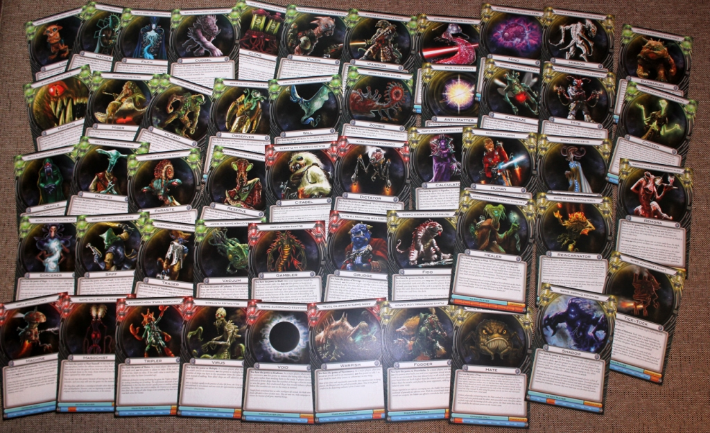

Вначале все начинают со звёздной системой где есть пять планет и 20 кораблей на них. По центру - галактическое кладбище для погибших кораблей (warp) и метки числа колоний на каждого игрока что-бы было проще уследить.
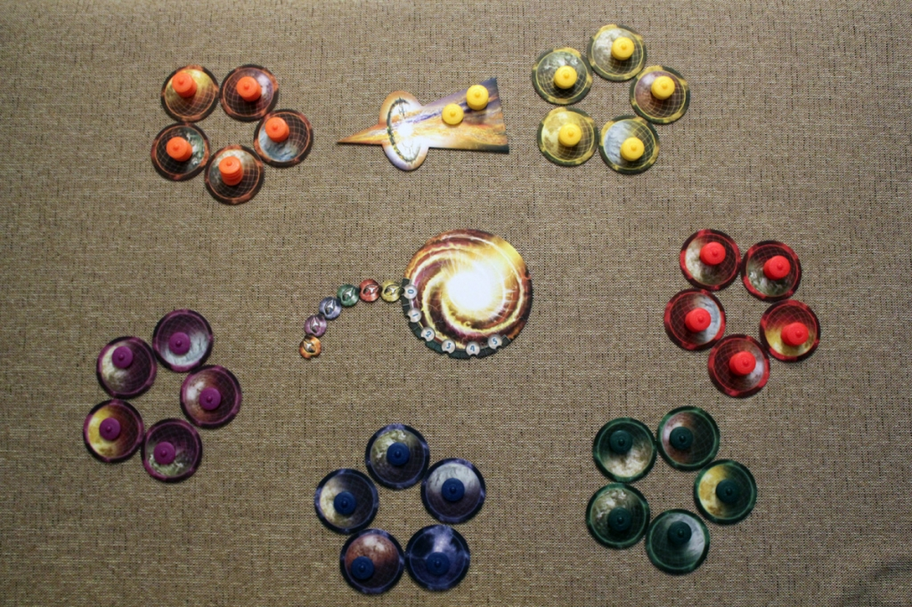
Игра пошаговая - Ход главного игрока переходит по кругу. За этот ход главными считаются нападающий игрок и защищающийся. 

### Ход

Вначале игры каждый выбирает одну карту из двух случайно выданных карт технологий. В дальнейшем при начале круга, можно инвестировать один корабль в изучение технологий. Также на этой фазе можно забрать один корабль из кладбища.
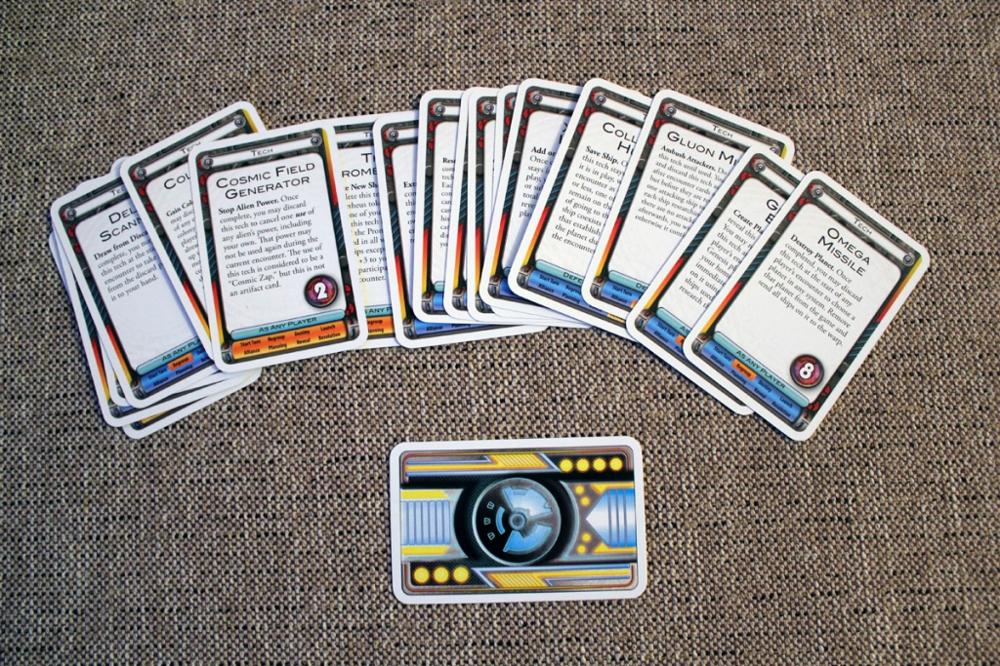

После стадии regroup, нападающий использует гиперсветовые врата и вытягивает карту из колоды судьбы (destiny deck), которая определяет жертву (по цвету, по позиции или на выбор). После этого происходит фаза запуска кораблей (launch) на выбранную планету. Покуда корабли летят, происходит фаза alliance - нападающий предлагает выбранным игрокам присоединиться к атаке, добавление подмоги происходит по кругу. После этого защищающийся делает также. Корабли подмоги и защиты добавляются к основным силам.
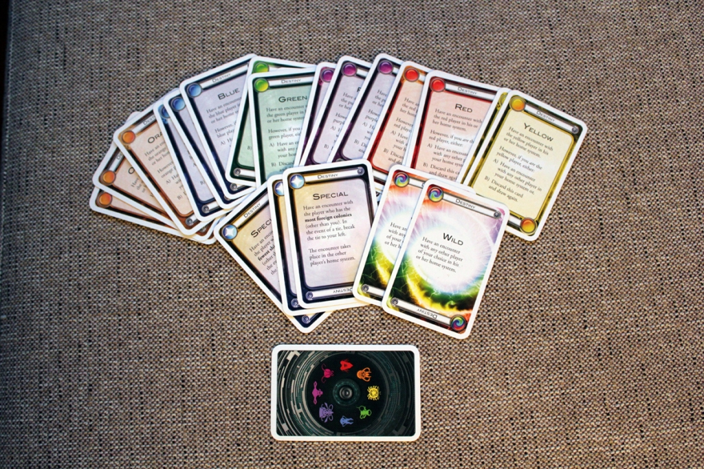
На фазе планирования нападающий и защищающийся кладут карты из колоды встречи (encounter deck) лицом вниз, после чего раскрывают. Эти карты выдаются в начале игры по 8 на человека и они либо усиливают атаку, либо содержат всякие артефакты или нейтралитет.

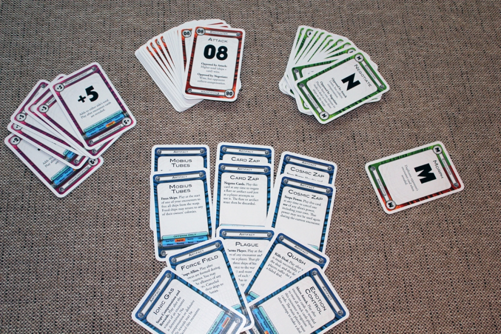

После раскрытия основных карт, все могут подкидывать карты подмоги (reinforcements). Побеждает та сторона у кого больше баллов (сумма кораблей, карты атаки, подмоги и проч.). Если выиграли атакующие, то они основывают колонию, если защищающиеся - то они могут либо вернуть корабли из кладбища, либо получить карту. Играя с дополнением, защищающиеся могут взять из более сильной колоды, в которых есть умножающие карты.
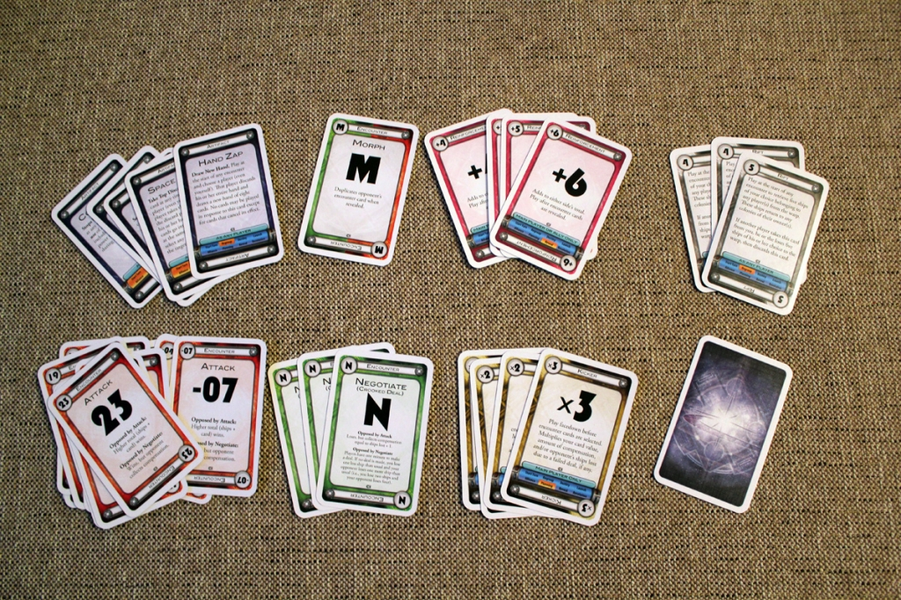
Как видно, механика довольно простая, но нюансов очень много. Кроме названных колод, есть ещё и карты усилители хаоса (flare deck). Они в отличие от обычных, остаются в колоде после хода и позволяют обходить некоторые правила, а если раса совпадает с расой игрока, то она значительно усиливается.

Больше всего в этой игре мне нравится её непредсказуемость. Вы можете сидеть с отличной колодой, а способность противника может взять и смешать ваши карты, или отменить ваши способности zap'ом, или подорвать вам родную планету лишив основной способности. Многое зависит и от альянсов которые будут создаваться по ходу игры.
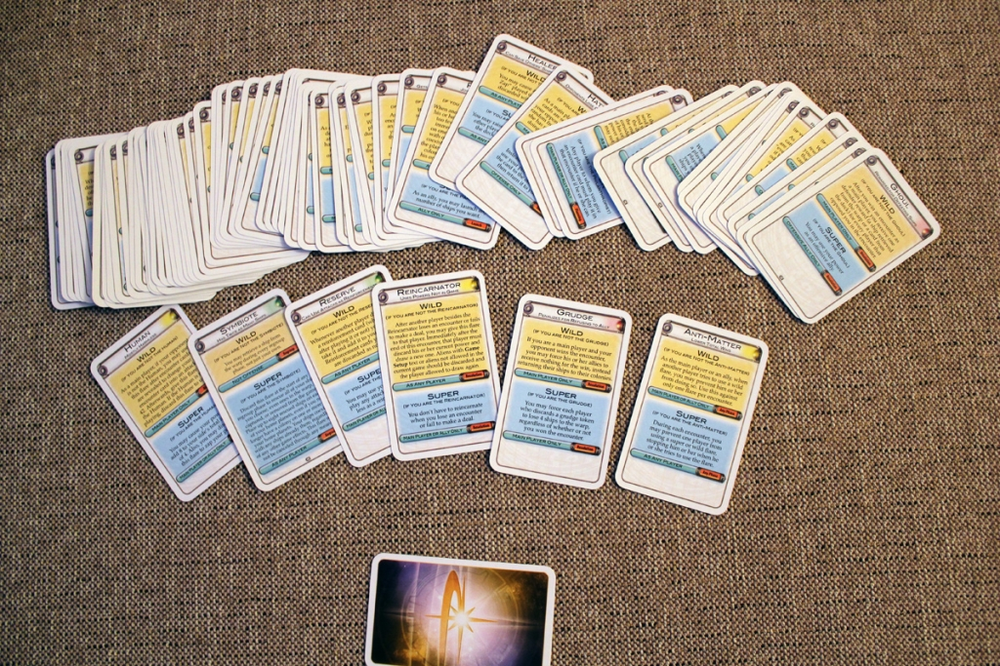

Как правильно сказали в видео обзорах ниже, побеждает в этой игре не тот кто кажется сильнее, а тот кто умеет тонко лавировать в политической ситуации. Против рас с сильными способностями игроки часто объединяются. Но в то же время альянсы недолговечны и в них можно делать и подлянки, которые естественно повлияют на репутацию игрока.

### Игра с Loser

Вот как разворачивалась реальная игра.. Я сначала выбирал между Зомби (корабли не уходят в warp) и Лузером (может объявить проигрыш как победу), выбрал последнего. Противники были мощные - самый грозный Дима Б. (Warrior - копит опыт и добавляет к своим силам), Дима П.(Warpish - добавляет корабли в warpе к своим силам), Илья (Virus - умножает число своих кораблей на карту атаки),  Катя (Cryo - обменивает одну карту за ход).

В самом начале развернулась мощнейшая атака и в первой половине игры ушли card- и cosmic-запы. К счастью на меня никто не нападал и карты из destiny-deck выпали мне самому. В качестве технологии я развивал Energy Cloak - возможность блокировать подмогу у обороняющийся стороны если я в атаке. 

В это время Warrior стал основной угрозой - в его колоде оказалась моя flare-карта которая позволяла объявлять проигрыш обоих сторон ещё до выкладывания карт атаки и тем самым хотя и в урон для себя, он был неуязвим. Тем не менее Катя (Cryo) атаковала его с card-запом и моей помощью, использованием технологии и cosmic-запом (отменяет силу Warrior'а) казалось что можно захватить планету, но не тут то было - Дима сыграл артефактом Space Junk и взял из биты card-zap, отменив таким образом мой cosmic-зап и защитив свои колонии накопленным опытом.

Более того, Warrior уже имел 3 внешних колонии и технологию "Precursor fields", которую все посчитали что даёт дополнительную колонию - на самом деле она даёт силу дополнительной расы. Вобщем все решили не давать никак воину выиграть - Катя и Илья играли впервые, но и у них сил казалось побольше - Вирус умножал свои силы и построил Prometheus кораблик (считается за +3 к атаке), а Cryo выдавал по +10 к reinforcements что сбивало с толку что же в колоде ещё может быть. Warpish же втихую использовал многочисленные убитые кораблики.

По колониям я тянулся в серединке с плохой колодой - практически все Negotiate и одна средняя атакующая на которую мало можно было надеяться при серьёзной атаке. Тем не менее получилась довольно иронично.. я решил не ждать покуда я обновлю колоду и защитил Катю от потери её alien-способности, получив 4 карты. 

В следующий ход я удачно атаковал - Warpish со своей обязательной способностью использовать все корабли получал слишком большую атаку и моя способность дала мне третью колонию. Вторую атаку я направил на вируса, получив четвёртую колонию. В этот момент Warrior испугался и решил максимально ослабить меня, сыграв артефактом Plague (убивает 3 корабля и по одной карте разных типов). Это была роковая ошибка - у меня остались только negotiate и моя колода обновилась. 

В это время переход перешёл к Вирусу с обязательной атакой на меня. Я сыграл Morph, никакой подмоги небыло и по кораблям я выиграл. Наконец настал момент контратаки - с новой раздачей у меня оказался flair воина, которая при успешной защите позволяет атаковать нападавшего, что я и сделал, победив Looser'ом.

Как ниже пишут, я нарушил правила - смены руки не должно было быть

### Игра с Healer

Вторая игра была вчетвером, длилась 2.5 часа. Расы попались неудачные, я играл как **Healer** (может спасать корабли альянса), но учитывая что комманда была небольшая, сила была бесполезная, особенно учитывая что Илья играл как **Fungus** и забирал корабли до моих сил. С ним мы сначала напутали правила, он накопил уйму чужих кораблей и только потом оказалось что эти заражённые корабли должны складываться в стопки и контролироваться его кораблями сверху. Тоесть он как-бы на время крал чужие корабли вместо их падения в warp. Дима Б. играл за Miser имея вторую колоду, а Дима П. за Citadel, с возможностью укрепления планеты своими атакующими картами на начало хода.
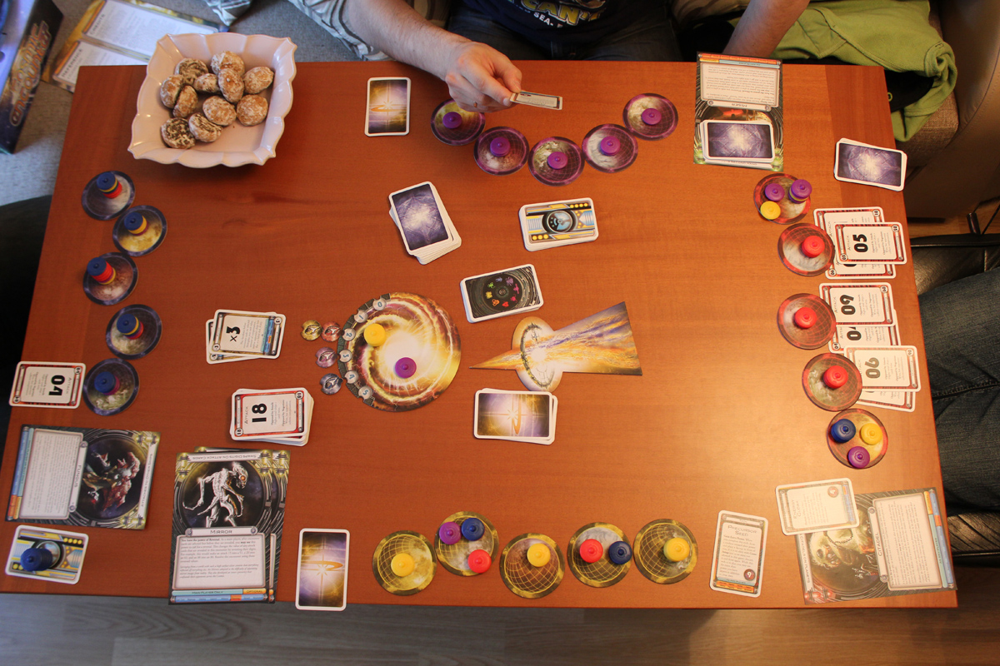
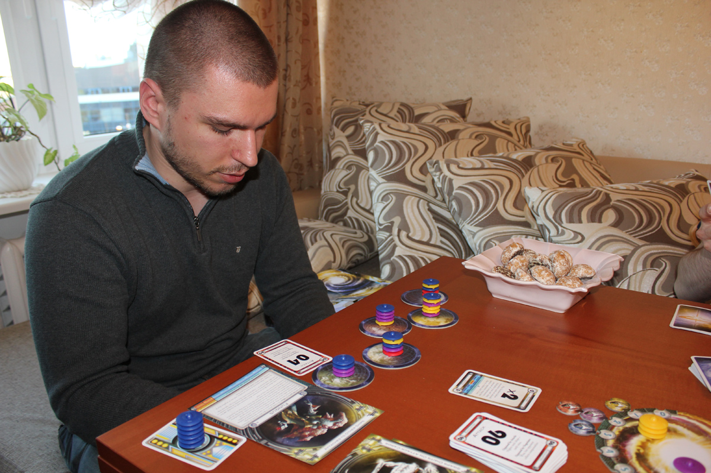
Первая половина игры была довольно неудачная для меня - я растратил неплохие атакующие карты, Дима Б. даже 40вник у меня стащил. Илья укреплялся с каждым ходом, отбирая кораблики, Дима П. строил цитадельки в своих системах.

Тут в дело вступили наконец развитые технологии - я получил вторую расовую способность - Mirror. Fungus получил технологию засады (при защите уничтожает 7 кораблей противника и если ничего не осталось то побеждает, до открытия карт).
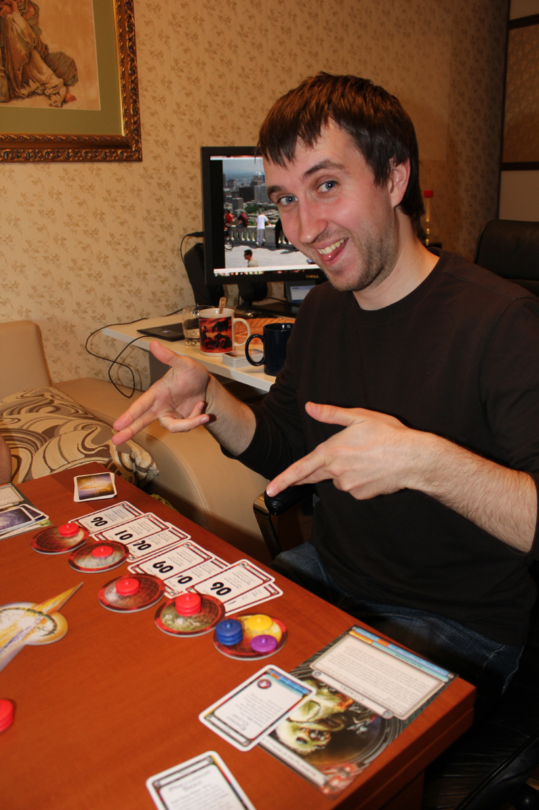
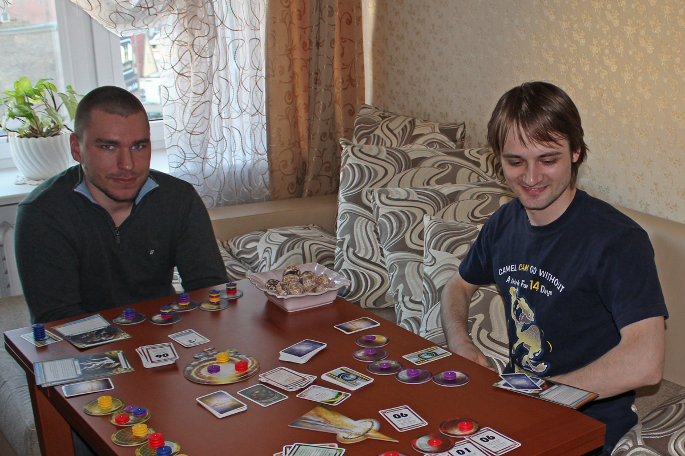
Наконец Miser уничтожил мою планету с колониями топовых игроков, отодвинув конец игры. Я ещё дальше отодвинул его, в отбив колонию Miser'а на своей планете, все столпились на числе двух-трёх колоний. На Fungus я не мог нападать из-за его технологии засады, а Дима П.-цитадельщик был неплохо защищён, тогда как Дима Б. был в лидерах но и самый слабый по кораблям - я наслал на него чуму, проредив новую колоду, после чего захватил его колонию.
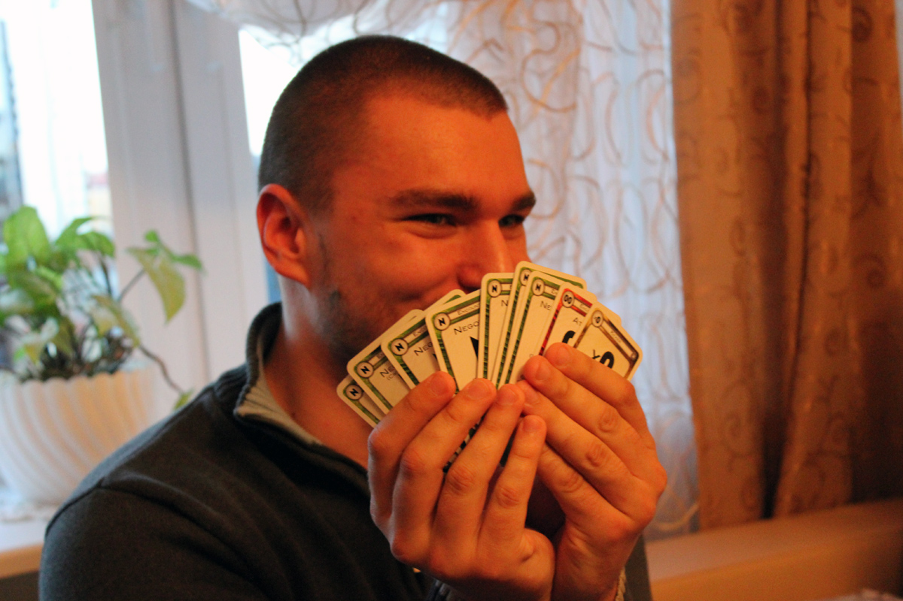
К этому времени Fungus сидел с огромной колодой (как оказалось потом - полной Negotiate), Miser ощущал острую нехватку кораблей, уже испытывая перебои с расовой силой, а Citadel был защищён, но внешних колоний было мало. Я же сидел с тремя планетами, в страхе потерять свои способности.

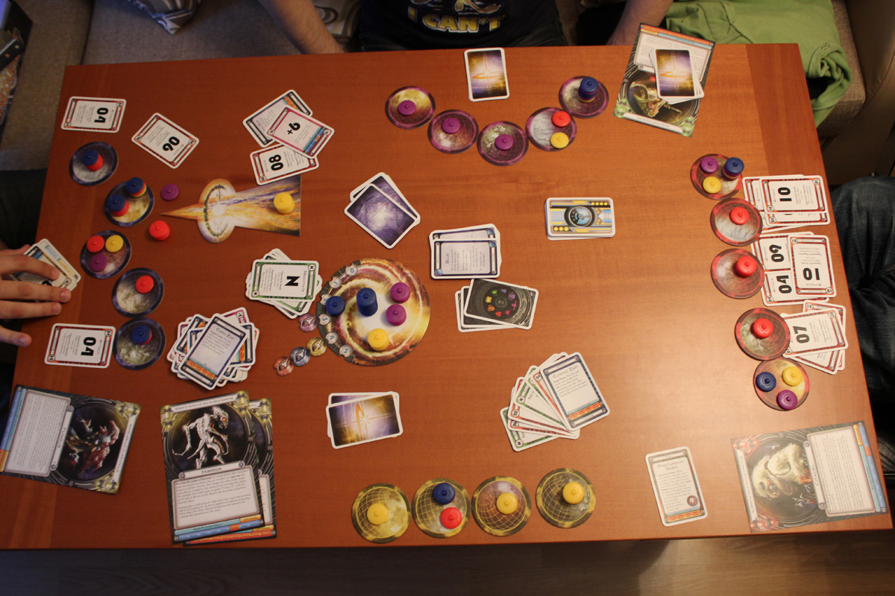

На третьем круге мне повезло - я наконец избавился от последней карты и мне выпало три "08" что со способностью Mirror даёт мощную 80-атаку. К четвёртому кругу я смог не только отбить злостные атаки цитадельщиков, но и отхватить колонию у последнего. Пятая колония была завоёвана у Fungus в сложной битве против всех, с атакой 08 против 06, с использованием Mirror (перевес был бы в 20), которая была отключена Cosmic Zap'ом, с 4 кораблями и +6 подкреплением против 6 кораблей и +2 подкрепления, смогли перевесить чашу весов в мою пользу.

### Расы

Вот расы из основной игры с их кратким описанием способностей

| Название       | Описание силы                                                          |
| -------------- | ---------------------------------------------------------------------- |
| Amoeba         | До раскрытия карт может изменить число своих кораблей даже более 4     |
| Anti-Matter    | Выигрывает тот у кого меньшая сила. У всех корабли отнимаются от карт. |
| Barbarian      | При победе выбирает карты противника. И обновляет ему руку             |
| Calculator     | Вычитает из самой высокой карты низкую                                 |
| Chosen         | Достаёт одну из трёх карт при столкновении                             |
| Citadel        | Builds citadels on planets                                             |
| Clone          | Может оставить карту встречи себе                                      |
| Cudgel         | Побеждённый противник теряет ещё корабли                               |
| Dictator       | Controls destiny deck                                                  |
| Fido           | Достаёт карту из биты и даёт другим и получает награду                 |
| Filch          | Получает карты противника из биты                                      |
| Fodder         | Выбрасывает дополнительные карты добавляя их к силе                    |
| Fungus         | При победе получает корабли противника                                 |
| Gambler        | Bluffs about cards                                                     |
| Grudge         | Penalizes for refusing to ally                                         |
| Hacker         | Выбирает карту вознаграждения у любого игрока                          |
| Hate           | Жертвует картой и все делают так же либо 3 кораблями                   |
| Healer         | Возвращает убитые корабли                                              |
| Human          | Всегда добавляет +4 к своим силам                                      |
| Kamikaze       | Sacrifices ships for cards                                             |
| Loser          | Winner loses and loser wins                                            |
| Machine        | Can continue turn                                                      |
| Macron         | Каждый корабль считается за 4                                          |
| Masochist      | Tries to lose own ships                                                |
| Mind           | Может посмотреть на карты одного из игроков до alliance-фазы           |
| Mirror         | Может объявить смену цифр в атакующих картах                           |
| Miser          | Имеет две колоды карт                                                  |
| Mite           | Противник при столкновении либо даёт колонию, либо теряет 3 карты      |
| Mutant         | Maintains 8-card hand                                                  |
| Observer       | Союзники не теряют корабли, будучи союзником не теряет свои            |
| Oracle         | Видит карту противника                                                 |
| Pacifist       | Выигрывает с negotiate-картой                                          |
| Parasite       | Может присоединиться к любой атаке в качестве союзника                 |
| Philanthropist | Может отдать одну карту (главным игрокам при альянсе)                  |
| Reincarnator   | При проигрыше столкновения получает 1 дополнительную расу              |
| Remora         | Gets cards or ships with others                                        |
| Reserve        | Может использовать атакующие карты до 6 в качестве подмоги             |
| Shadow         | Удаляет корабль игрока согласно карте судьбы                           |
| Sorcerer       | До раскрытия карт, может поменяться с противником                      |
| Spiff          | При проигрыше с разнице более 10 получает колонию                      |
| Tick-Tock      | Ограничивает игру 10 успешными защитами                                |
| Trader         | Trades hands with opponent                                             |
| Tripler        | Утраивает низкие и делит на 3 карты более 10                           |
| Vacuum         | При потере кораблей, выбранные игроки теряют в сумме столько же.       |
| Virus          | Multiplies in attack                                                   |
| Void           | Корабли проигравших уходят из игры                                     |
| Vulch          | Получает артефакты из биты                                             |
| Warpish        | Adds ships in warp to total                                            |
| Warrior        | Adds experience points                                                 |
| Will           | Not controlled by destiny                                              |
| Zombie         | Never goes to warp                                                     |

См. также

- [Cosmic Encounter Wiki](http://cosmicencounter.wikia.com/wiki/Cosmic_Encounter_Wiki)

