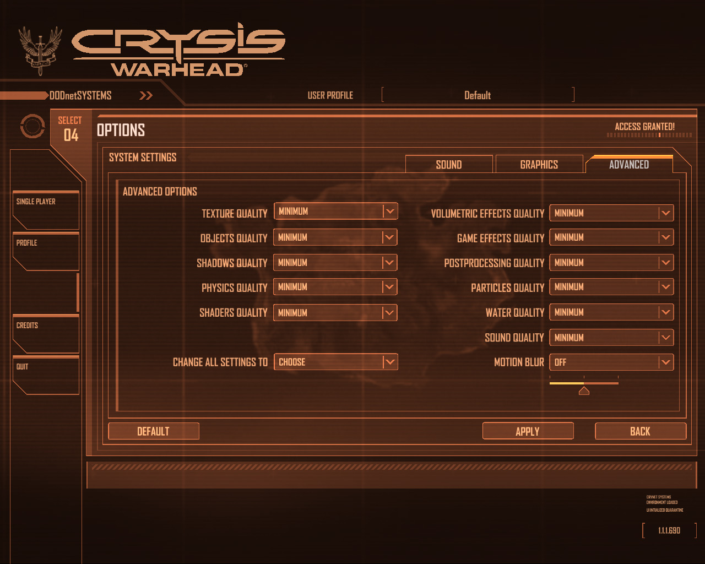
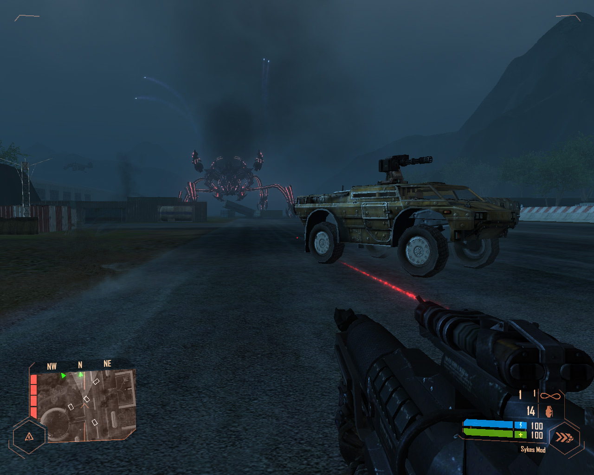
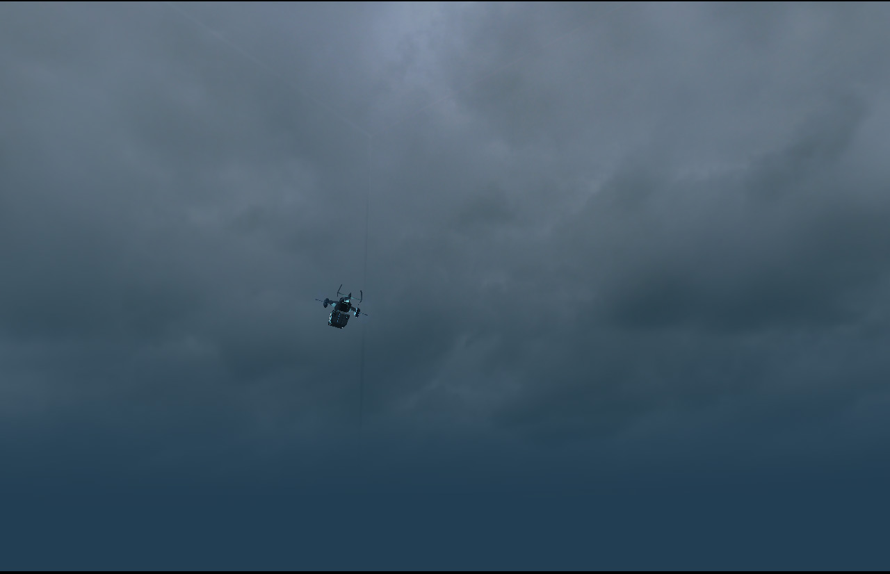
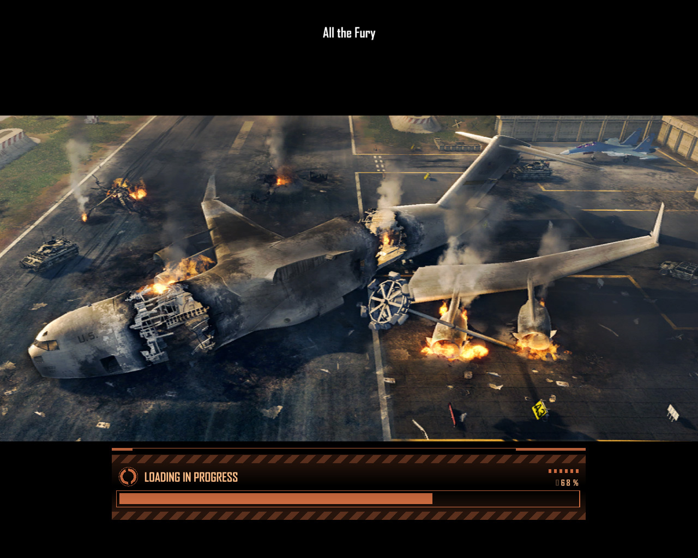
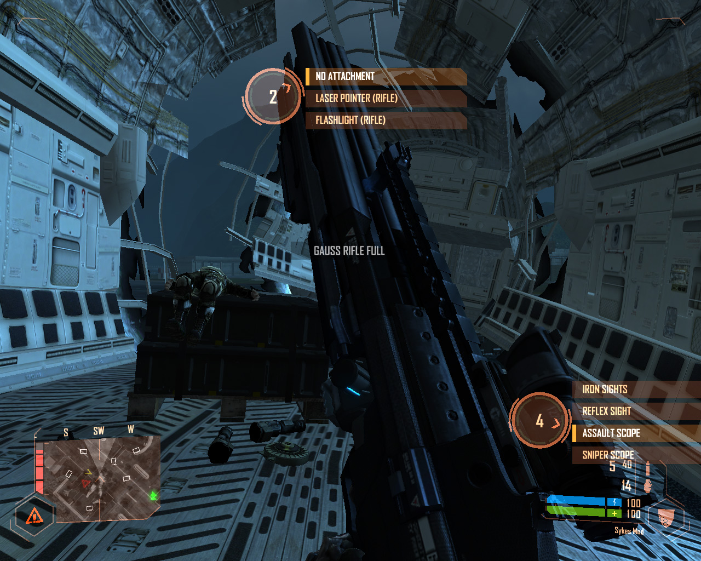
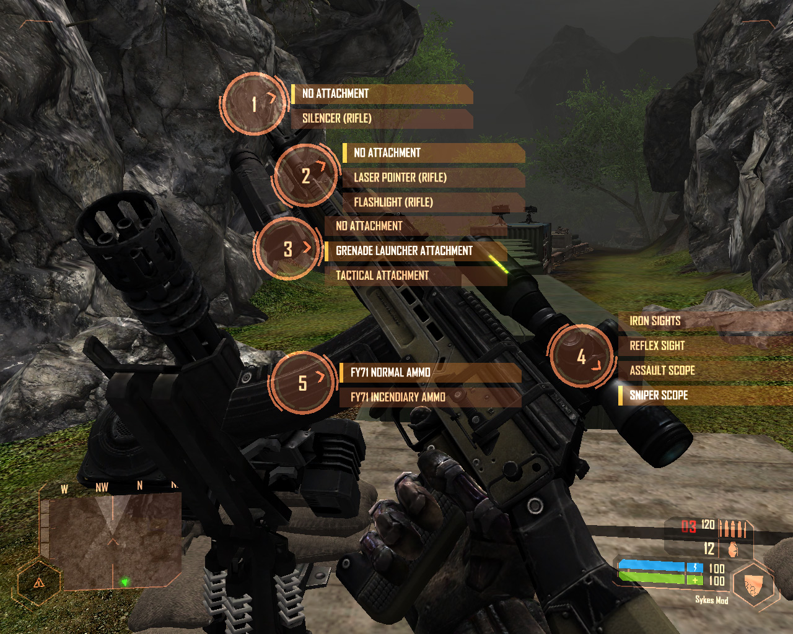
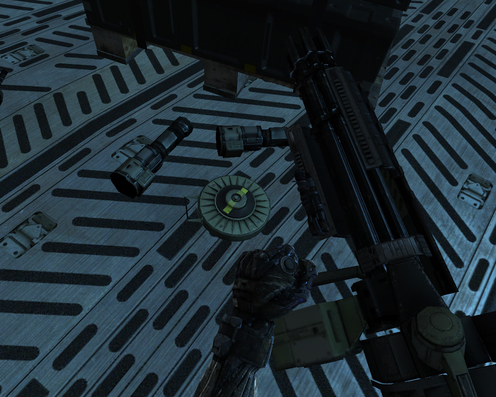
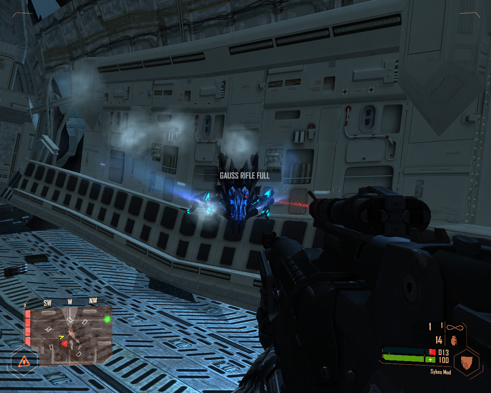

четверг, 2 октября 2008 г. в 22:10:09

Crysis Warhead это не дополнение, а сиквел к выпущенному год назад 3d-shooter'у "Crysis" от немецкой компании Crytec, создавшей практически революцию качеством графики в своём движке CryEngine 2. Эту революцию раньше видели в Doom 3 от компании id software, а поздней в Half Life 2 от Valve. Игра нацелена на молодёжь от 16 лет и старше, ввиду обилия насилия

Конкурентами как Crysis так и Crysis Warhead можно назвать Bioshock, Call of Duty 4 и готовящися к скорому выходу Fallout 3. Каждая из игр имеет отличительную от "просто стрелялки" изюминку. В Bioshock это способность эволюционировать, в Call of Duty 4 это политический сценарий, достаточно не далёк от этого Fallout 3 где апокалипсис уже наступил. За год со времени выпуска было продано более 1.5 миллиона копий первого Crysis'а, удостоилась игра и отличных отзывов - в среднем 9 из 10 среди западных журналов и сайтов компьютерных игр. Над разработкой работали более 7000 разработчиков

### Сценарий  

Я не зря описываю успех первого Crysis'а, поскольку сюжет Warhead мало отличается от первой версии. По сценарию, в 2020 году на острове в Южном Китайском море экспедиция археологов обнаруживает важнейшее открытие, но вскоре оказывается во власти войск Северной Кореи. На остров высаживается спец-отряд Дельта в специальных нано-костюмах для операции по поиску и освобождению археологов. Если в Crysis игрок был в роли лейтенанта под кодовым именем "Nomad" (_букв. "кочевник_"), то в Warhead сценарий в целом тот же, но играть надо в роли бойца "Psycho" (_букв. псих_).

Игра за "психа" отличается во-первых более проработанным сценарием. Nomad был более серой личностью в отличие от эмоционального Psycho. Во-вторых сложность игры по сравнению с Crysis уступает, по всей видимости баланс был специально смещён что-бы ускорить прохождение из-за знакомого сценария. Длина игры претерпела значительное укорачивание - полностью пройти можно за один полный день, практически в два - три раза короче первой версии.

Хотя раньше компания говорила что Crysis будет трилогией, Warhead считается больше расширением (expansion) к оригиналу с улучшенными показателями движка, добавленными типами оружия, транспорта и противников. По всей видимости так производитель и распространитель (Electronic Arts) надеются закрепить свой успех дабы продолжение битвы с инопланетянами прошло так же удачно.

---

Игра за Psycho начинается чуть поздней высадки отряда дельта, когда войска США уже начали полномасштабную интервенсию на остров, топя корабли корейцев, пытаясь закрепится в воздухе. Сопровождая отряд обычного десанта, Psycho оказывается в итоге один и получает приказ захватить таинственный контейнер перевозимый на поезде к подводной лодке, однако после пробуждения инопланетян приказы меняются по поиску китайского генерала Кионга. По пути встречается давний друг Шон О'Нил, поддерживающий передвижения с воздуха.

В игре семь глав, после чего сценарий обрывается, так и не затрагивая общие с первой частью сцены - встреча с Nomad'ом и ледяной пушкой и наконец - прилёт на авианосец Constitution с последующей битвой. Впрочем ненавистный контейнер с усыплённым "чужим" вероятно можно видеть в Crysis сразу после прибытия Nomad'а. Не совсем понятно также откуда берётся и второй отряд дельта, не фигурировавший ранее.

1. Call me Ishmael
2. Shore leave
3. Adapt or perish
4. Frozen paradise
5. Below the thunder
6. From hells heart
7. All the fury

### CryEngine 2 и атмосфера  

Качество игры отличное - даже играя на минимальных показателях качества текстур и остальных настроек с 1280x1024 разрешении я не замечал тормозов. Минимальные требования в 256 мб на видеокарту с лихвой поддерживаются многими современными видеокартами. Если очень присмотреться, то на низком качестве можно заметить "швы" на небе а порой и баги с противниками, так при мне самоубилась группа корейцев, попав в тесный промежуток внутри пещер, так же застряла в небе и инопланетный осьминог, стараясь достать меня среди обломков самолёта. Впрочем первое простительно, а второе достаточно сложно отлаживать во многих играх.

Немного отягощает впечатление долгая загрузка уровней. Уровни, известные также как локации, карты, комнаты создаются для пущей лёгкости движка, но те кто хоть раз сыграл в Dungeon Siege или Elders Scrolls (а теперь и Fallout), знают что подгрузка на лету значительно красивей. Впрочем с другой стороны это логически и уже физически разбивает сценарий

Эффекты в игре должно быть гордость аниматоров, работавших усердно над созданием хаотического поведения воды в ручье, волн и огня. Вода, растения и волосы как известно - наиболее трудные участки при создании реалистичности.

Музыка в том же мрачном стиле бравады, эпичности, даже апокалиптичности. Увы после первого Crysis, эмоционально игра мало впечатляет, разве что сцена на мосту. Первая игра напротив, вызывала даже страх, будучи оказавшимся в просыпающемся улье инопланетян.

### Игровой процесс

Приспособиться или проиграть - вот залог успеха игрока в любой игре. В Crysis множество действий которые могут помочь пройти уровень. Поскольку большой умственной деятельности по разгадыванию ребусов в игре нет, а сценарий полностью линейный при этом вход и выход из локации один и тот же, то основные решения игрока сводятся к выбору:

- Оружия
- Режима костюма в зависимости от ситуации
- Тактики передвижения по местности
- Приоритета целей

Оружие можно разделить по дальности стрельбы и убойности. Эти параметры выбираются в зависимости от размеров окружающей среды и типа противников. Против людей наиболее эффективно стрелковое оружие и гранаты, против транспорта и больших летающих целей - гранатомёт, против мелких инопланетян - энергетическая винтовка Гаусса.

Под конец в Warhead добавлена плазменная пушка "Pax", по убойности сравнимая с атомной пушкой которую получил Nomad на авианосце. Также добавлены двуручные автоматы, которыми удобно стрелять обомим клавишами мышки. Как я уже сказал - мины. Из транспорта - броневая машина пехоты и вездеход.

Передвижение по местности и приоритет противников нераздельны друг от друга. В Crysis я пробежал одну карту без единого выстрела, всё благодаря тому что активно использовал маскировку, деревья и скорость. Однако когда приходится сталкиваться с большим противником или вертолётами, то без сильного вооружения в виде гранатомётов далеко не уйдёшь, приходится искать кров над головой.

Разрекламированный тихий стиль усыпления корейцев специальными дротиками а потом физическая расправа не приживается, видимо из-за частой смены оружия - появляются неожиданные патрули. Впрочем тихое нападение практически единственный выход в большинстве нападений на базы. Так можно проскользнуть даже мимо инопланетян, надо только следить что-бы не оказаться в окружении со спущенными штанами

В корейских частях спасали крыши - запрыгнуть и отсреливать оттуда врагов всегда легче, чем маскироваться, пытаться взять скоростью или силой, но в Warhead таких локаций очень мало. Так мы плавно переходим к приоритетам целей, которые формируются не только как наиболее близкие, но и соразмерно - прежде всего выгодней отбивать тяжёлых противников, либо отступать и отстреливать малые цели.

Возможно мне из-за опыта но показалось что в Warhead игра проще и динамичней чем в Crysis. Вероятно из-за более скудного сюжета и укороченности. Возможно неуклюжесть после первой игры пропадает и нет больше страха воевать против нескольких танков или инопланетян-кальмаров.

Серъёзным противником тут можно считать только инопланетян, типы которых сводятся до:

- мелкий "кальмар" - один выстрел из Гаусса
- летающий кальмар-вертолёт, кальмар-транспорт и новый оранжевый кальмар-бомбардировщик - три выстрела гранатомётом
- тяжёлые наступательные "пауки" - более 10 гранатомётных ударов

Не игровых персонажей (NPC) относительно мало - кроме закадрового женского приказного голоса "мамы" есть только три основных персонажа. Случайных элементов в принципе нет, всё сгенерировано заранее, в том числе деревья. Впрочем войти в одну реку дважды не получится - поведение противников зависит от вашего местоположения и скрытности, поэтому в пещерах играть очень легко.

На реализм игра тянет с большим трудом, всё-таки задействованы инопланетяне, умеющие создавать антигравитацию в закрытых участках и использующих тепловое кинетическое движение атомов в своих целях, фактически замораживая райский остров и даже атомный взрыв себе на пользу. Однако они очень похожи на людей - такие же агрессивные как корейцы в своих танках, только размах больше.

### Интерфейс

Управление персонажем интуитивно понятны. Стандартная WASD-раскладка для клавиатуры, управление костюмом и оружием через мышку, быстрая загрузка F9 и быстрое сохранение F5. Естественно всё это можно поменять в настройках. Я бы убрал из меню управление оружием, оставив только четыре значения - скорость, сила, камуфляж и защита. Такой вид можно видеть в старых демо-версиях, где меню было ещё прямоугольным. С круглым пятиконечным меню ориентироваться чуть трудней.

Второй критической проблемой практически любой стрелялки может быть потеря навигации. Я так заблудился в пещере, поскольку хотя вход и выход один, но путь может пересекаться с собой, создавая круг, отсюда возникает неразбериха. В остальных случаях помогает мини-карта где чётко показан выход или удерживание позиции.

### Multiplayer

Многопользовательской игры в Warhead нет. Приходится довольствоваться либо тем что есть в первом Crysis, либо ждать аннонсированную Crysis Wars. В первой игре сетевая игра разделена как и везде на игру по локальной сети и на игру в интернете, где можно выбрать подходящий сервер. Единственная проблема в том, что большинство серверов требует обновлённые версии с 1.1 до 1.2 или 1.2.1. На самом деле запутаться в этой нумерации очень сложно, потому что хотя скачивается оффициально 1.2, но в игре она показывается как 1.1.1.6115, тогда как большинство серверов хочет [1.21 патч](http://www.crymod.com/filebase.php?fileid=1194&lim=0) (версия 1.1.1.6156 соответсвенно).

В сетевой игре создаются две комманды дельта-отрядов в корейский или американских нанокостюмах соответсвенно. Карта наполнена множеством бункеров, энергостанций, научных отделов, баз по строительству танков или вертолётов. Убивая противников или захватывая эти станции, можно получать баллы. На эти баллы можно покупать оружие или технику. Игра ведётся на время (порядка часа), наиболее успешная комманда, удерживавшая дольше всего электростанции выигрывает.

### Изменяемость и документация  

Поскольку всякая масштабная игра делается в конструкторе, для Crysis это не исключение - выпущенный [Sandbox 2](http://doc.crymod.com/SandboxManual/frames.html?frmname=topic&frmfile=index.html) позволяет редактировать карты и объекты.

Поскольку игра не жанра стратегии, то этап обучения достаточно короткий, включающий умение владеть оружием против правильного противника, умение правильного передвижения по местности, управлению транспортом.

### Дополнения

Поскольку мне понравился сценарий, я бы углубил его содержание. Например добавив новый роботизированный транспорт, возможность частичного полёта главного героя (используя специальный ранец-прототип). По всей видимости в будующем кризис разразится за пределы Китайского моря и война будет вестись в Японии, Китае, Корее или России, но эффектней конечно было бы привести таинственный контейнер в Пентагон или Нью-Йорк, где настоящие каменные джунгли вынудили бы эвакуацию всего населения, а отряд дельта вынужден был бы блуждать по тёмным кварталам среди мародёров. Как вариант - космический корабль вызвал подмогу, и возможно этот сигнал прийдёт быстрей к своему адрессату чем через миллионы лет и как результат - "Independence Day" может наступить раньше.

