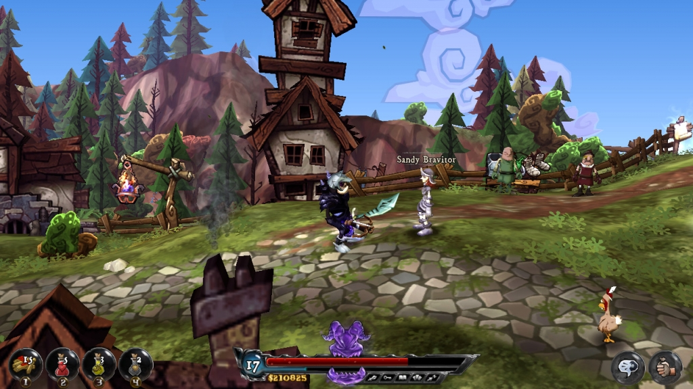
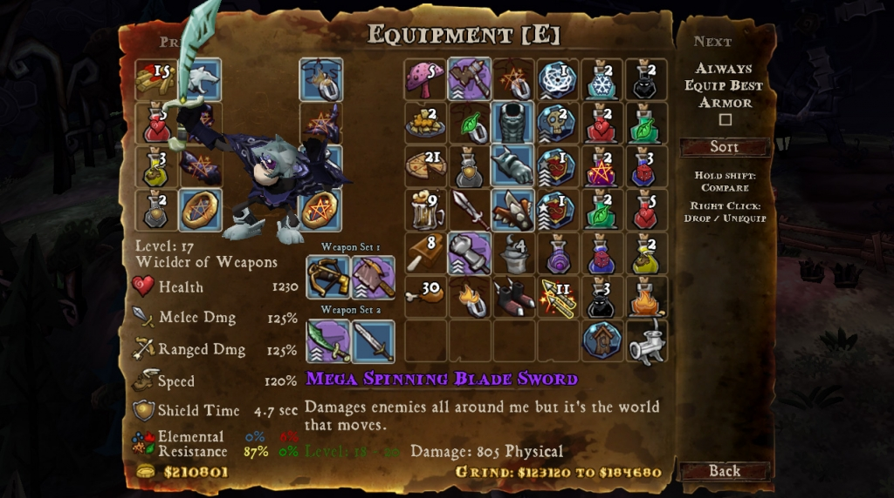
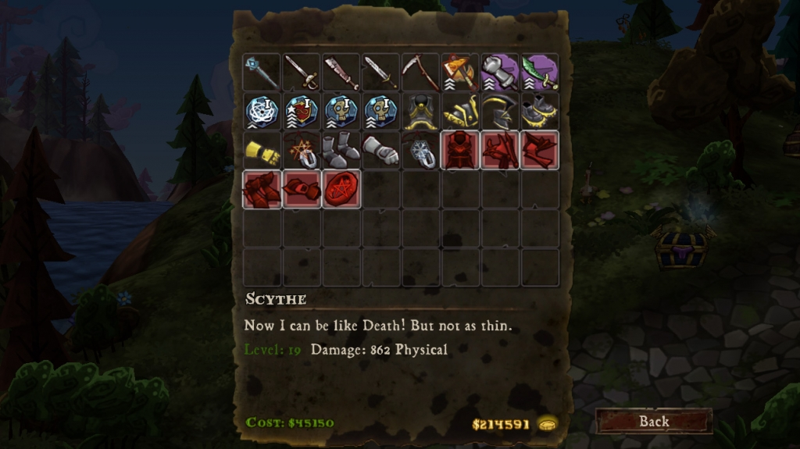
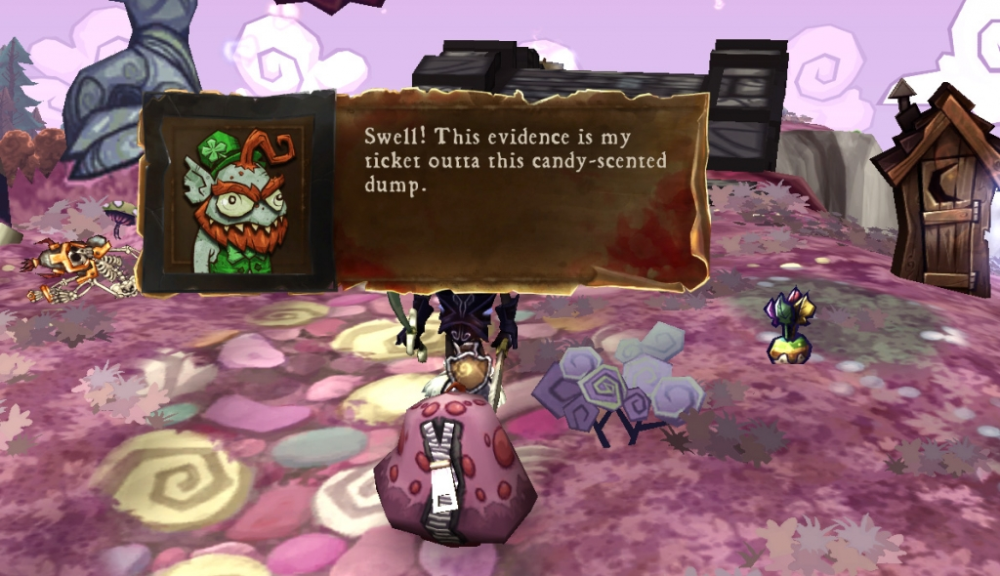
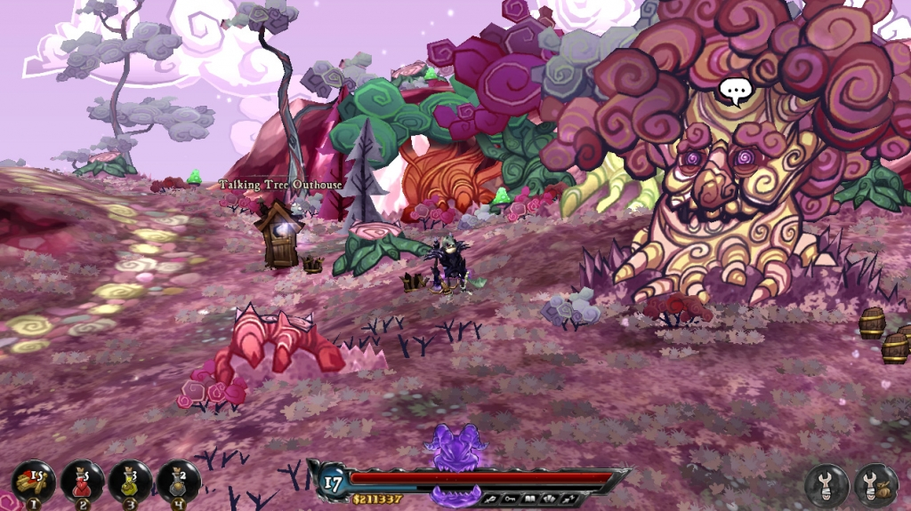
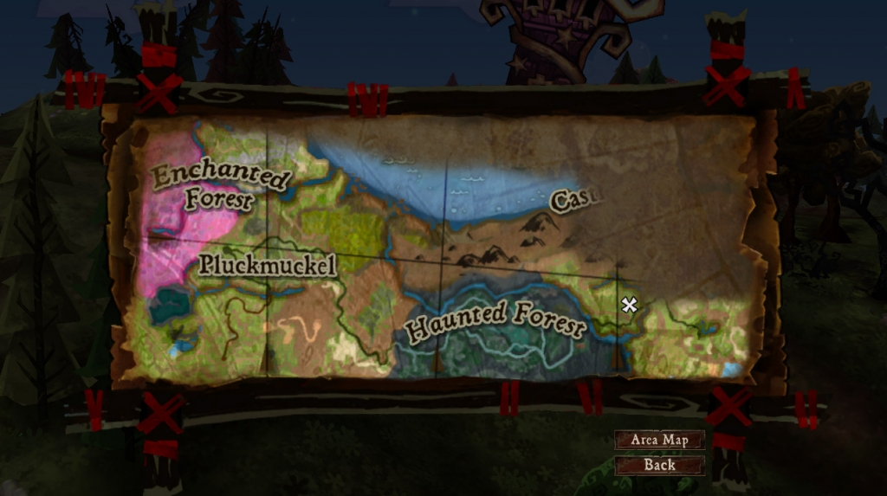
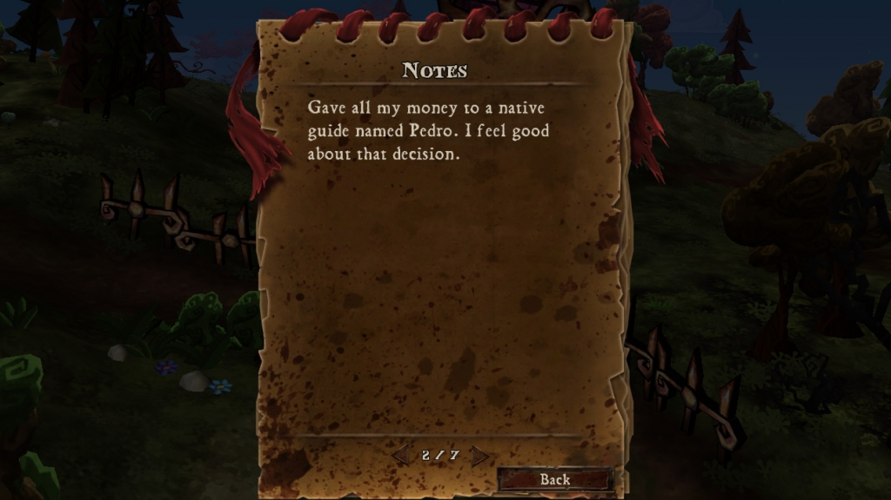
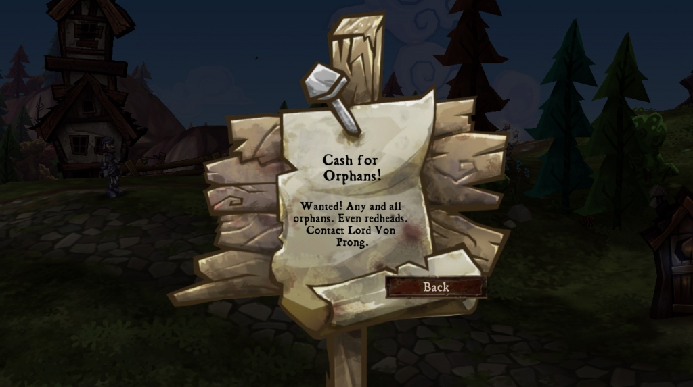
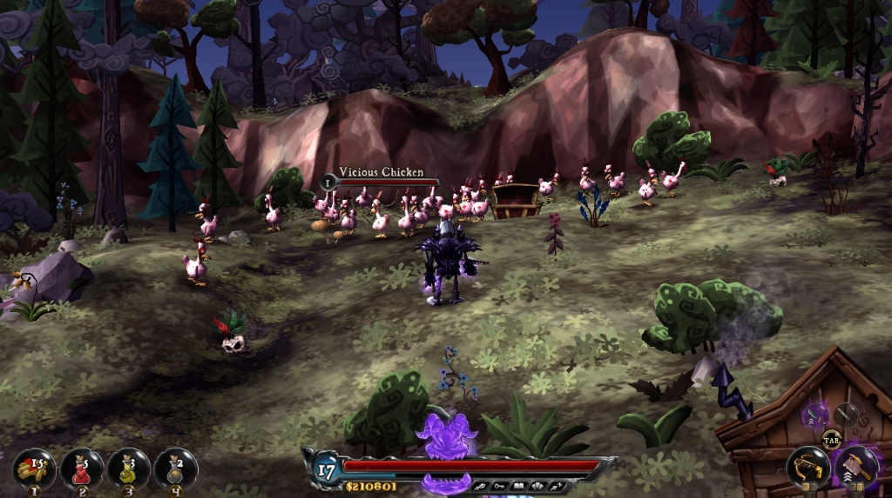

# DeathSpank
воскресенье, 21 ноября 2010 г. в 19:50:16

**DeathSpank** или же "Смертельный Шлепок" это уморительная игра и сатира на rpg-мочилово вышедшая под креативным руководством Рона Гилберта, в своё время работавшего над квестами Monkey Island и Grim Fandango и если вы в них играли и помните сюрреализм и сногсшибающую фантазию, то вам понравится и это творение.

Главный протагонист - глупый но целеустремлённый воин который хочет заполучить Артефакт (что именно это такое и с чего вдруг такое стремление нам как и самому герою неизвестно), но обстоятельства так развиваются что ему приходится пройти много сторонних квестов что-бы прокачаться и пройти всю карту.  

По пути случаются очень интересные и смешные эпизоды как то демонесса которая боится ребёнка, очень громкие монахи, пушка стеряющая петухами, жалующаяся на жизнь нечисть, дедок который хочет себе танк, мэр который продал бы сирот если бы они чего-то стоили, Индиана Джонс боящийся пещер и тп.

Вобщем отличная атмосфера, особенно когда в качестве восполнения здоровья используется картошка-фри, пицца и начос, а одежда называется например

- шлем воя (потому что в нём ничего не слышно)
- грудь горгульи (незабываемый вкус камня)
- лезвенные ботинки лезвий (придают моим ударам уничтожение промежностей)
- клеймор (если уж до смерти им не забить, то испугать до смерти можно точно)

Ко всему этому герой путешествует между локациями при помощи туалетной кабинки, ненужные вещи превращаются в деньги при помощи мясорубки, подсказки по квестам получаются из печенек-судьбы, а детишки просто закидываются в мешок что-бы не возиться с возвращением каждого.

Ещё насчёт механики - битва очень простая - можно расстреливать издалека арбалетом (в том числе и с магическими стрелами), либо вплотную рубить мечом. Некоторое оружие с фиолетовым фоном - оно даёт прирост ярости, которое по достижению уровня можно израсходовать на сильный удар. Ещё есть защита с сопротивлениями к разным типам магий, есть зелья для лечения, защиты..

Рубить кстати прийдётся странные создания вышедшие из под рук волшебника — зубастых петухов, антилоп-гиппопотамов, летающие глаза и черепа. Впрочем есть и типичные RPG'´шные орки (который пишутся на французский манер), скелеты, демоны, пауки и прочие приспешники антагониста.  

Особо стоит отметить мультипликацию Хотя карта в трёхмерном виде и кажется что вы бежите по маленькому шару как в Populous, графика многих построек выглядит плоской, а пастельные краски и нереалистичные пропорции домов и носов у персонажей лишь добавляют сказочность всего мира. Нельзя обойти и озвучку - практически все диалоги выделяются харизмой с большой концентрацией. 

См. также
- [rutracker](http://rutracker.org/forum/viewtopic.php?t=3227091)

