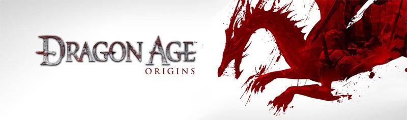
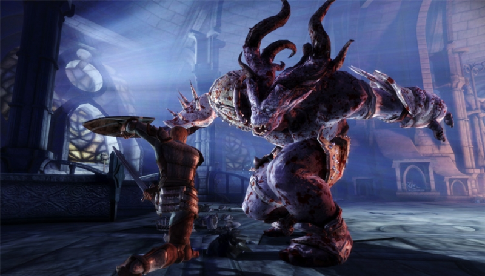
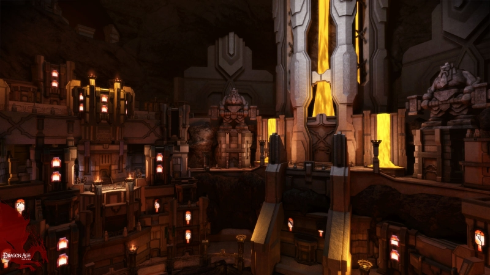
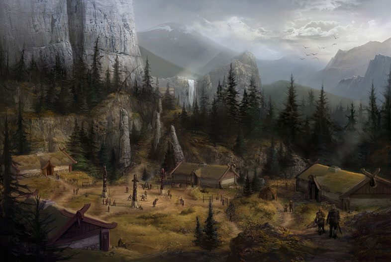
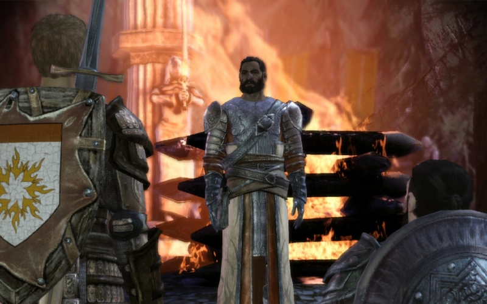
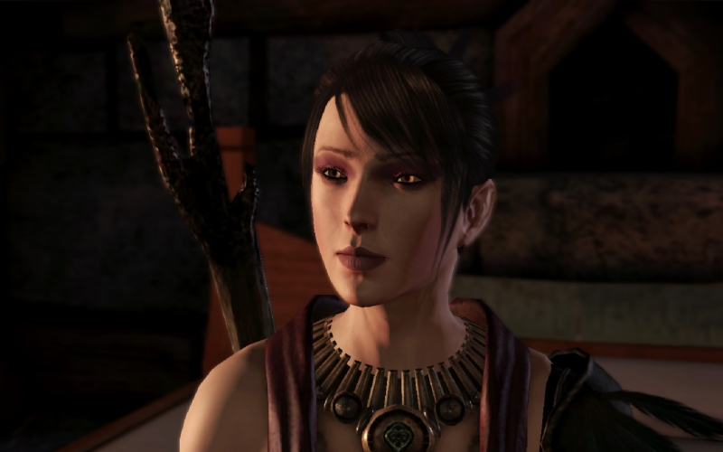
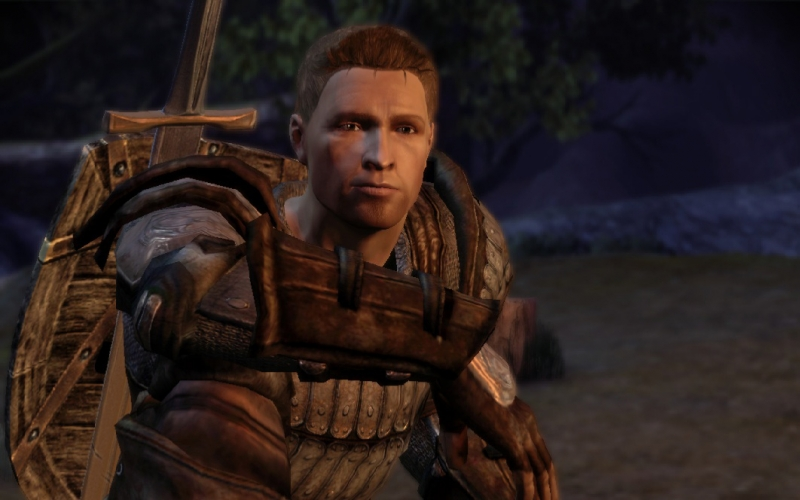

понедельник, 21 декабря 2009 г. в 10:56:49

Dragon Age - симпатишная тактическо-групповая RPG от Bioware с элементами паузы боя, эдакая смесь Neverwinter nights, Elder's Scrolls: Oblivion, Dungeon Siege, Fallout 3, Witcher. Прочувствовать можно на мини-игре [Dragon Age Journeys](http://www.dragonagejourneys.com/). Дальше возможные спойлеры..

### Сценарий

Четыреста лет **Ferelden** был в относительном мире. Но как всегда, случается неприятность - в пятый раз просыпаеися дракон-демон который подымает толпы нечисти на беззащитных людишек. В это неспокойное время вы (выберите из 3 рас, 2 соц.статусов, 3 классов с 4 специализациями) присоединяетесь  к _межправительственной комиссии по урегулированию вопросов безопасности Ферелдена_, а что-бы понятно было маленьким - к серым защитникам (**gray wardens**). И всё бы хорошо, но учитель Дункан как и король не оказываются более способными помогать вам в борьбе с **darkspawn** (чувствуете дословный перевод "нечисти" с русского?)

И вот попав в мир "большой карты" с относительным правом выбора куда же пойти, оказывается что у одних отравили дворянина и маленький маг выпустил нежить на улицы города, у других свирепствуют оборотни - воплощения мести, у третьих в самом явном виде прорвались из потустороннего "Fade" мира демон, у четвёртых спорный трон, у пятых - чума и бандитизм, у шестых - поклонение дракону-спасителю. 

Короче проблем уйма, и на разрешение их приходится думать (!), иначе спутники могут несогласиться с вами и в один неприятный день дать ножом в спину. А постоянных спутников максимум 4 - это значит надо стремиться максимально их использовать и развивать в нужном направлении. Спутники появляются по сценарию, из которых я играл самыми долговременными - тамплиер **Alistar**, маг-целитель **Wynne** и конечно маг-разрушитель **Morrigan**. Кроме "заботы" о спутниках следует думать и о том оттенке серого который игрок преследует - все пути ведут в конце к битве со злом, но все пути кажутся одинаково хороши.

Выбор из «меньшего зла» встречается постоянно — оставить ли создание големов, превращая живых существ в камни-защитники, или победить благодаря «малым жертвам» победу? Это ведь не идиллический вопрос, а вопрос военного положения, где для некоторых «всё ради победы» звучит буквально. Или насколько морально возвращать воина из мира грёз в который он сам окунулся, что-бы вернуть к безнадёжной и нерадостной действительности?

Хорошая кухня любит приправы, и у Bioware хорошие повара - мир наполнен множеством мелочей. Тут и нищие, и вороватые стражники, псевдо-христианская религиозная система с 12 апостолами и церковью восхваляющую создателя, истории рабства эльфов, рождения и смерти военной мощи гномов, демоническая иерархия, культ парагонов-предков, бордели и полу-обнажёнка (геям тоже угодили, гы), умные собаки-_mabari_ и конечно мини-игры (в угадай-а-то-зарежу, головоломку путей и тп.). Эта сценарная мелочь насыщена полноценными линиями-разветвлениями по которым хочется пройтись во второй раз уже в эгоистичном обличии и посмотреть что же будет.

---

### Тактика

Основа игры это правильная координация комманды и цепочки маг-танк (у меня соответственно 2-2) в очень разнообразных ситуациях. Например в помещениях можно задержать толпу противников воинами в дверях и сзади их поддерживать heal'ами и конусными магическими атаками, а на больших пространствах массово устроить [Sleep](http://dragonage.wikia.com/wiki/Entropy_Spells#Sleep), [Blizzard](http://dragonage.wikia.com/wiki/Primal_Spells#Blizzard) с [Tempest](http://dragonage.wikia.com/wiki/Primal_Spells#Tempest) из которых никто не выберется. Воины не такие гибкие и эффектные, а играть жуликом-rogue или стрелками я не пробовал.

В игре часто возникают безвыходные ситуации к которым приходится готовиться заранее. Например если бы завалило выход из пещеры с единственным путём через толпы врагов, но при этом никаких зелий при себе не осталось, то можно считать что вы проиграли - битвы с серъёзными боссами могут съедать до десяти бутылочек обычного или продвинутого лириума. Готовиться надо заранее обучаясь травничеству и закупкой лириумной пыли. Самые серъёзные битвы на моей памяти - High dragon, Zathrian + дикие деревья, Brood mother.

В мелких стычках если судить по уровню здоровья и урона то самые опасные это конечно маги и лучники - они долговременно влияют на ход битвы и поэтому их надо убирать сразу же - мгновенным убийством (Petrify + Stonefist). В крупных стычках самые опасные это тролли и големы - много здоровья и мало поддаются заклинаниям, против них я в основном использовал [Cone of cold](http://dragonage.wikia.com/wiki/Primal_Spells#Cone_of_Cold) и тоже Stonefist. Выбраться из лап тролля который долбит по игроку со всей дури проблематично, поэтому хилер нужен обязательно. Заклинания атаки надо выбирать больше с учётом вывода противника из битвы, поэтому прямые dps'заклинания с использованием огня не очень эффективны.

### Плюсы-минусы

Два основных минуса - очень долгая подгрузка карт и старый графический движок. Казалось бы за 8 лет можно было бы улучшить такие критичные места. После 5 часов непрерывной игры переход в большую карту города занимает 5-10 минут (~600 мб оперативки). Графический движок выглядит нормально издали, но кино-моменты заметно лажают - популярные бороды выглядят как приклеенные мочалки, которые то и дело таинственно проваливаются внутрь доспехов. Два раза замечены были и баги сценарного скрипта - при слишком быстром клацании на NPC который триггерит атаку третьих лиц, даже после битвы речь либо повторяется либо ещё хуже - убитые вдруг вновь атакуют. Говорить про [хиты локализации](http://www.youtube.com/watch?v=-PWAFma2wW4) я вообще не буду.

Плюсы - отличная озвучка и сценарная работа, практически полноценный интерактивный фильм длиной более **60 часов**. Хороший баланс - если всё правильно продумывать то способы победить всегда есть и напротив - если оставить всё на самотёк, то даже средние mob'ы убъют пару персонажей. Уровни не слишком длинные и штампованные, но и не слишком короткие что-бы почувствовать ограниченность картового мира.