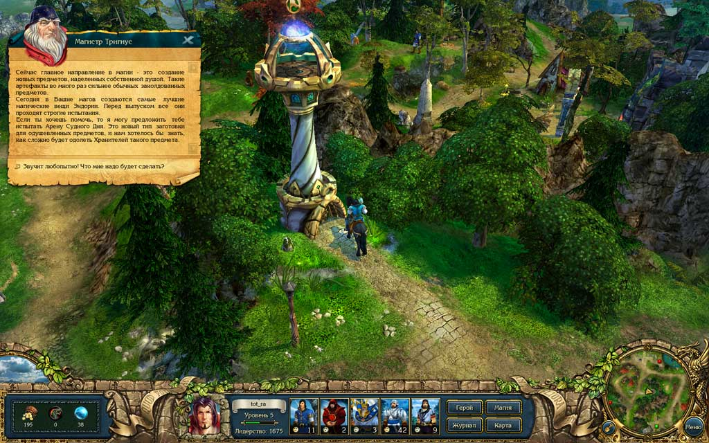
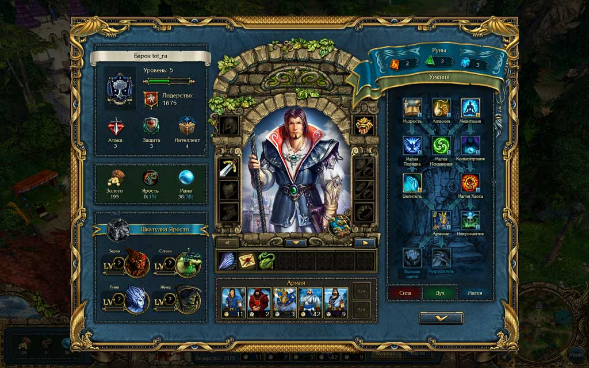
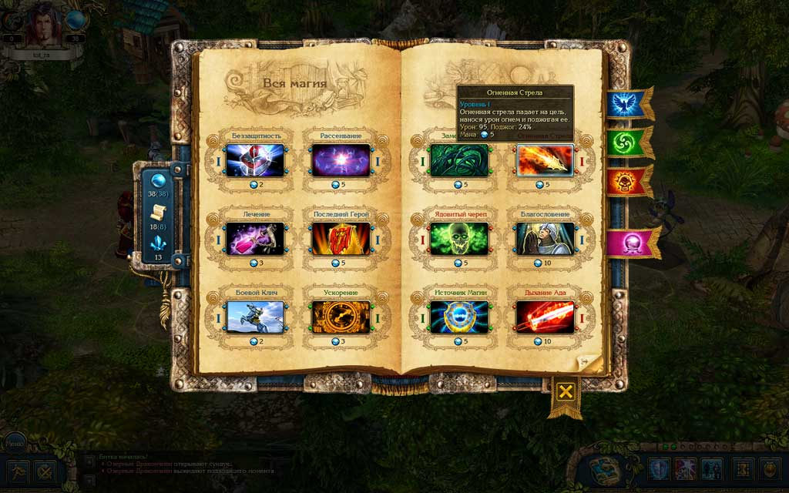
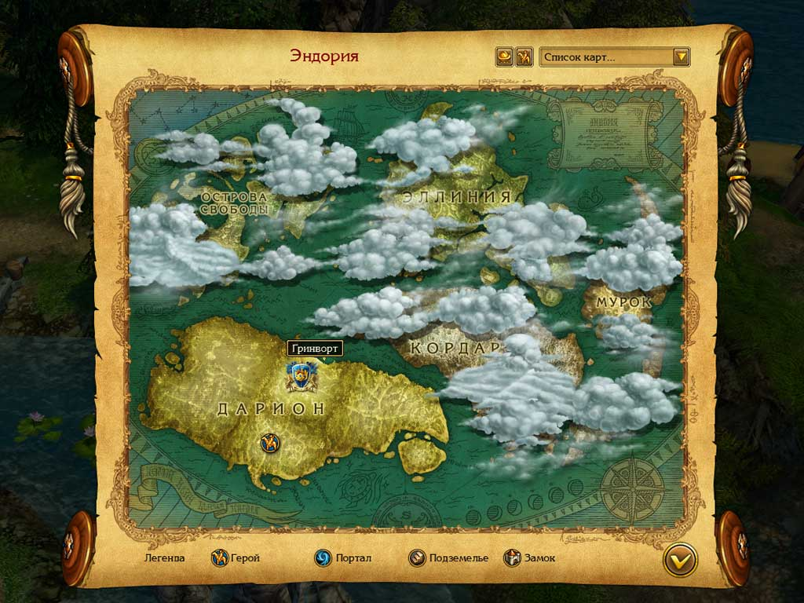

суббота, 5 июля 2008 г. в 00:22:43

Первое впечателение [от игры](http://www.kingsbounty.ru/) — клон серии Heroes of Might and Magic, добротно сделанный на русском с мультяшной 3х-мерной графикой и сказочным интерфейсом. В отличие от HOMM, игрушка более квестовая чем стратегическая, а управлять можно только одним героем, недавно вышедшим из академии на службу короля.

В игре три класса рыцарей - воин, паладин и маг и соответсвенно три основных направления развития сила, дух и магия. Дерево уровневой прокачки похоже на многие diablo-подобные rpg и не очень сложное, а вот их наполнение происходит не с опытом полученных из битв, а при помощи камешков трёх типов, которые раскиданы по карте и за которые всё-равно надо сражаться.

На деньги само собой можно купить армию, артефакты дающие бонусы атаки, защиты и интеллекта, но в то же время денег много не бывает, а если и бывает то на баланс игры это не влияет, потому что рыцарь ограничен способностью лидерства, которое повышается постепенно с опытом и в целом отображает уровень героя. Вот и получается, что надо ходить по карте выискивать наиболее выгодных противников и разрешать подходящие квесты, постоянно заботясь о наилучшем состоянии армии.

В плане войск мир достаточно смешанный - вы начинаете при дворце с жалкими крестьянами, феями и стрекозами (уже испробовав силу кавалерии при обучении). Передвигаясь между пятью континентами, вы постепенно знакомитесь с хищной флорой и фауной, расами и заклятиями. Воины не "улучшаются" как в Heroes 3, но могут иметь собственные способности, делятся на уровни в зависимости от своего здоровья, а также на расы - звери, люди, гномы, эльфы, демоны и нежить. Использование нежити с людьми может иметь плохие последствия из-за падения морали.

Задача игрока в течение всей напряжённой игры сводится к адаптации к меняющимся боевым возможностям — новая локация и постепенное изучение заклинаний вынуждает использовать более эффективных юнитов и новую тактику. Впрочем, поскольку в армии максимум 5 слотов, играя магом я выбрал тактику 3 лучника/мага - 2 нападающего.

Из магии выделено три школы (хаоса, порядка и искажения) под которые ориентируются все заклинания плюс несколько особенностей целительства и некромантства. Боевыми по прежнему остаются молния и отравление. Со стороны запредельных противников я заметил превращение в барашков (в Katauri с японским юмором подошли к делу), ласки дьявола и нечто типа инферно.

Радует что армии не растут со временем, а карта отрисована отруки — в этом смысле в тип Baldur's Gate больше видно любви, чем в Dungeon siege, какая бы разница в уровне графики не была. Я уже предвкушаю выход diablo 3 в которую я не буду играть потому что диалогов там нет, а если и будут то в чисто функциональном смысле либо с эффектными видео-вставками. Мне нравится подход Fallout'а где сценаристы показывают свой уровень создания атмосферы, и тут они не подкачали - сказка чуствуется. Детям можно порекомендовать или даже подарить, ведь защита осуществлена последним Securom'ом (который пираты криво научились обходить). Arrrg!

По теме:

- [обзор на CRPG.ru](http://www.crpg.ru/sections.php?op=viewarticle&artid=2287)
- об [особенностях семейной жизни](http://soul-n-music.livejournal.com/62770.html) в «Легенде»