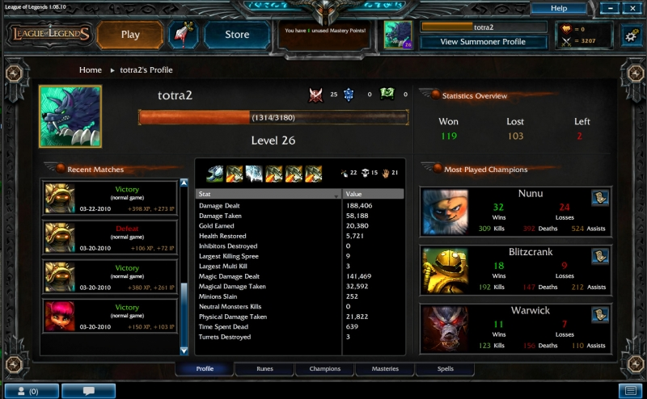
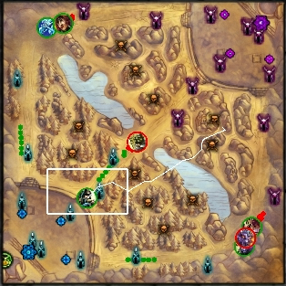
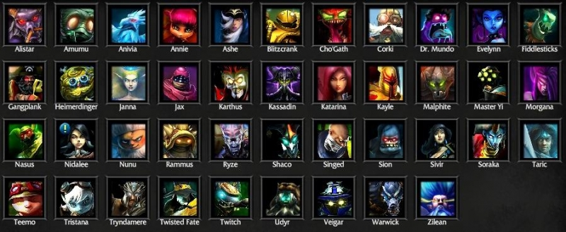

вторник, 22 сентября 2009 г. в 22:51:38

[League of legends](http://eune.leagueoflegends.com/) — это сетевая игра, двух групп игроков (по 5 или 3 человека) друг против друга. Это наследник мода Warcraft 3 DOTA, который породил ещё с десяток игр, в том числе [Demigod](http://www.demigodthegame.com/), [HoN](http://www.heroesofnewerth.com/) и будущую [Dota2](http://dota2.com/). Помоему игра вызывает привыкание даже больше чем WoW, из-за коротких битв (30-60 мин).

Игра бесплатна, живёт на продаже скинов, постоянно обновляется и получает новых персонажей. Весит в районе 600 мб + апдейты (300 мб), крутится на adobe air + directx с чем-то. Есть неоффицальный [клиент для мака](http://boompje.net/forum/index.php?action=downloads) на основе wine.

### Подготовка

Выбираете тип сетевой игры - я ниже буду рассказывать стратегию для стандартного типа "Summoners rift", который длится до часа.  Выбираем персонажа и в течение минуты  **два базовых заклинания** — (например ressurection + smite). Персонажей около тридцати, каждый со своим именем, внешним видом и **четырьмя основными заклинаниями**. Играть надо в комманде из 3х или 5 человек против аналогичной группы, поэтому при большем количестве игроков имеет смысл учитывать классы коллег, ведь тут не только воины, но и маги, лучники, воры (rogue), паладины и много других классов (в том числе такие странные как flee, haste, disabler, farmer)

### Цели

Как я уже сказал, игра состоит в битве двух комманд на квадратной карте с изометрической проекцией, но трёхмерными warcraft-мультяшно-подобными моделями. Есть база где можно воскрешаться, есть башни которые больно бьют по атакующим противникам и есть мобы, периодически появляющиеся на базе и бегущие к противнику. Между базами есть три основных дороги, захват и контроль которых и есть основная задача игроков.

Убивая мобов противника можно быстро набрать денег и опыта, подняться в уровне. С ростом уровня открывается возможность либо открыть одно из четырёх заклинаний, либо их улучшить по силе. А с ростом денег можно улучшить характеристики скорости, защиты, атаки, восстановления или объема маны и здоровья. В общем это всё очень просто и понятно, но каким-то странным образом некоторые игроки оказываются **быстрей** в наборе опыта, следовательно выше уровнем и следовательно — сильней.

### Стратегия

Процесс игры по этапам делится на три стадии  

1. До 6 уровня — герои качаются на своих линиях. В середине как правило один герой-лучник который быстро набирает уровень. Наилучшие варианты тут - Ashe или Teemo у которых очень ответсвенная задача - прокачаться и двигаться на соседние линии
2. Примерно с 6 уровня до потерь первых и/или вторых башен. На этом этапе идёт основная борьба за господство над территориями. Герои уже достаточно быстрые что-бы передвигаться между линиями и устраивать групповые атаки по 3 человека. Потеря первых башен существенно ограничивает видимость
3. Пробивание третьей башни и разрушение ингибитора. Этот этап особенно лёгок если убивается вся комманда противника. Один раз я одним Master Yi так разбил 3 башни и базу. При равных коммандах этот этап наиболее приятный (один раз мы выиграли при трёх разрушенных ингибиторах).  
    

##### Смерть

Умирать в игре очень не рекомендуется — мало того что сам игрок начинает отставать по очкам от противника (воскрешение занимает около 30 секунд в начале игры и постепенно увеличивается), так и противник получает дополнительные бонус-деньги. Поэтому даже если есть несколько хороших игроков, но один «feeder» постоянно погибает и кормит противника, игра может плохо окончиться. 

##### Роли  

Второй важный пункт — состав и развитие группы. Всего существуют следующие роли

- Танк — много жизни и брони  
    
- DPS — сильный удар, средне-мало жизней  
    
- Лучник — мало жизней, атака на расстоянии  
    
- Disabler — обездвиживает или тормозит противника  
    
- Assasin — мало жизней, прячется и добивает противника (в т.ч. убегающего)
- AOE — массово убивает мобов  
    

В идеале группа должна покрывать все роли, к тому же каждый персонаж имеет несколько ролей. Но часто можно видеть как группы составляются без танка вообще, или наоборот — без единого лучника. Как результат — либо медленные танки бегают и не могут остановить противника, либо лучники не могут ничего сделать с танком разрушающим башню, либо assasin'у приходится выполнять роль dps'а. Правильная комманда таким образов выглядит например так.. NuNu (Tank, Disabler, AOE), Master Yi (DPS), Ashe (Лучник + Disabler), Blitzcrank (Tank, AOE, Disabler), Twitch (Assasin+Archer)

##### Пара  

Партнёра надо выбирать в начале игры. Если вы disabler - то ходите с dps. Если вы танк - ходите с AOE-магом или вором. Два игрока с одинаковыми ролями на одной линии всегда хуже чем два с разными ролями. Банальные вещи - защищайте своего напарника если за ним гонятся. Ну и самое важное - если кто-то из вас умирает часто - смените или посоветуйте сменить линию и конечно следите за тем что-бы всегда кто-то качался на линии. Ситуаций когда линия пустая не должно быть, потому что так комманда теряет опыт.

##### Тактика

Засада (ganking) очень излюбленные способы борьбы как с одним противником так и с целой коммандой. В кусты можно не только забежать и ждать там врага, но и телепортироваться если там есть бомбочка teemo, купленный до этого и поставленный флаг обзора и тп. Тут конечно важно число обездвиживателей (Nunu, Ashe) и мощности DPS (Fiddlesticks, Master Yi, Annie).

Обход с фланга или тыла - вторая полезная тактика очень подходящая для Tristana и Poppy - они могут отодвинуть противника глубже к атакующим так что пути для побега станет больше. Тактика вносит существенный хаос, потому что противник не знает кого атаковать - флангующих или фронт.  

Давление - третья полезная тактика. Фактически вы максимально выкладываетесь что-бы отодвинуть противника от мобов, что-бы захватить потенциальную зону атаки благодаря кустам и что-бы отодвинуть противника от получения опыта (см. видео) - хорошие предпосылки есть у Nunu, Ashe, Sivir, Twisted Fade. При таких ситуациях полезно так же не давать противнику телепортироваться на базу, что-бы дольше держать атаку.

Фронтовое давление делается специально по всем направлениям. Долговременная атака очень выгодна если есть лекарь (Soraka/Alistar) или выдёргиватель-держатель (Blitzcrank+Ryze). Для подготовки фронтового наступления надо подготовить все линии.  

Без участия игроков мобы движутся накрывающими волнами от одной башни к другой - достаточно малейшего преимущества одной из групп над другой, поэтому надо его создать и переключить внимание противника на угрозе в центре. Если центральная атака не удалась - достаточно перейти на соседнии линии и отступая уничтожить башни. И в противоположность - если такая большая волна наступает на вас, то очень полезно иметь AOE магию что-бы быстро заработать денег.  

##### Отступление

Многие игроки не чувствуют тактической карты и когда надо отступать. Если на карте две линии мобов противника перешли середину, а в это время вы усиленно уничтожаете вторую башню на третьей линии то очевидно вы в самом опасном месте. Надо помнить сколько противников на какой линии и когда/сколько их умерло что-бы представлять себе **вероятность** что вас обойдут сзади и устроют ловушку. 

Ещё частая проблема с отступлением - слепая атака. Когда группа из 5 человек начала атаковать одну линию (_push_), потеряла по пути двух игроков и в результате оказалась 3 vs 4 и продолжает давить. В таких случаях очень велика опасность вайпа (_aced_).

Особо опасна ситуация после вайпа, когда 5 противников наступают и вот только воскресший персонаж бежит на них «остановить разрушение», не понимая что он не то что убить никого не сможет - он вообще ничего не успеет сделать даже под башней. Под башней один игрок может максимально выстоять против 2-3 противников.  

### В сумме

Игрушка с виду очень простая. Это не гигантский эпос напичканный квестами, но и не примитивная аркада на флеше. Ребята в [Riot games](http://www.riotgames.com/) отлично подошли к дизайну — красивая графика, с виду простая подача информация и в то же время не пугающая при глубоком погружении в игру. Удобный интерфейс и отлаженная сетевая игра.

Для того что-бы сделать игру более продолжительной чем просто аркада «сели, поиграли, забыли», процесс агрегации от побед расширен статистикой открывающей дополнительных персонажей. LoL оказалась значительно удобней чем Demigod именно отказом от неудобной трёхмерной камер.