# Skyrim
воскресенье, 20 ноября 2011 г. в 23:50:22

[Skyrim](http://store.steampowered.com/app/72850/) это уже пятая ролевая игра из эпичной серии [TES](http://www.elderscrolls.com/) от [Bethesda](http://www.bethsoft.com/eng/games/games_skyrim.html). Для незнакомых с серией, напомню что дело происходит на планете Нирн c основным континентом Тамриэль с множеством животных, рас, языков; во время, по духу очень напоминающему распад Римской империи и начало раннего средневековья. Но прежде, немного космологии..

### Немного истории

Вначале был порядок (Anu) и хаос (Sithis), которые родили восемь высших духов (aedra) и тьму низших духов (daedra). Первый из них (Akatosh) создал время, а Lorkhan создал планету и связал себя с ней через своё сердце в виде действующего вулкана красной горы в Morrowind. Так закончилась эра рассвета и началась новая хронология, состоящая из трёх эпох (3 тыс, 900 и 430 лет соответсвенно).

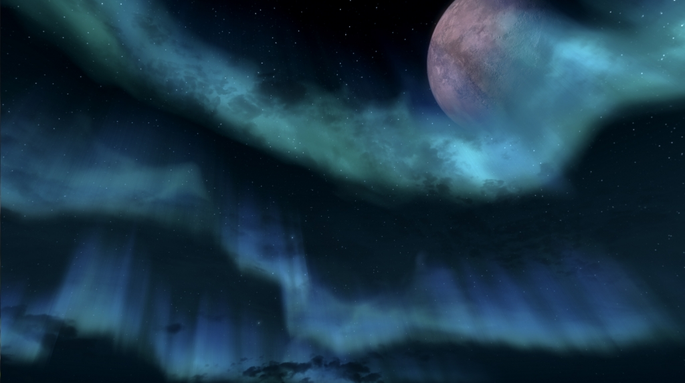

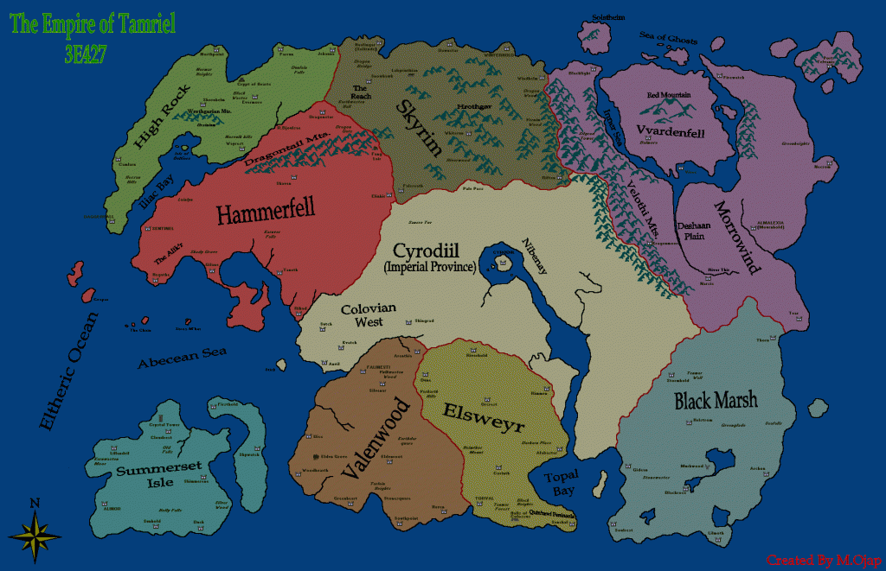

Наиболее значительным в истории этого мира становится создание человеческой империи со столицей Cyrodiil в конце второй эпохи первым императором Tiber Septim'ом, который в дальнейшем почитается наравне с другими aedra, как Talos - дух войны и власти.

Первые две игры (Arena и Daggerfall) были сделаны в псевдо 3D со случайно генерируемым контентом и не заслуживают внимания. Прорывом стал Morrowind, отличившийся графикой, проработанностью мира и постепенной загрузкой локаций. В Morrowind основной сюжет разрешался битвой героя с полубессмертным Dagoth Urом, получающим энергию из сердца вулкана.

Сюжет Oblivion происходил через несколько лет после Morrowind, в конце третьей эпохи, когда культисты Mythic Dawn убивают императора и почти всех наследников, открывая врата в низшие миры. Герой борется с культом и daedra-принцами. В результате Mehrunes Dagon изгоняется новым воплощением Akatoshа и врата закрываются.

И теперь мы подходим к Skyrim - событиям четвёртой эпохи, через двести лет после смерти последнего императора. Империя значительно слабеет под ударами нового фашистского государства Thalmor-эльфов (Aldmeri dominion), захватывающих столицу империи и вынуждающих заключение мира с запрещением культа Talosа. 

В это время в северной провинции Skyrim, убивают наместника и возникает восстание некоторых мэров (Yarlов). Мятежники (Stormcloaks) хотят свободного почитания единственного обожествлённого человека (Talosа) и независимости от империи. Среди этой национальной суеты вдруг появляется дракон.

### Сюжет

Мы в очередной раз играем роль избранного, покорителя драконов (Dovakiin), ведущего свой род от самого Akatoshа с начала первой эпохи. И конечно мы должны спасти мир, на этот раз от пробудившегося дракона (Alduin), который постоянно порождает новых драконов. 

Спасшись от казни, мы имеем полную свободу действий - пойти в город Whiterun и пройти основную ветку квестов осознания своих возможностей используя Голос (Thuum), или пойти по политическим веткам сражаясь за империю или мятежников.. или же вступить в гильдию воров, тайное братство, колледж магов или братство компаньонов. Любителям географических открытий припасено множество посёлков и пещер  древних гномов, снежных эльфов, нордических скелетов. Изучение пещер и убийство драконов всячески способствует становлению Голоса.

Честно говоря, мне не понравилось начало. Драконы и викинги? Что за популизм.. сначала Dragon age и Cataclysm в World of Warcraft, такими шагами шестая версия будет называться Elsweyr с расой кошек (Kajiit).. ведь все любят [Puss in boots](http://www.imdb.com/title/tt0448694/). [Рекорд скоростного прохождения](http://www.bethblog.com/index.php/2011/10/13/jeff-vs-sam-ii-the-skyrim-speedrun/) игры занимает два часа.

### Мир и движок

Skyrim достойный наследник Morrowind и Oblivion. Весь мир сделан вручную, состоит примерно 300 уникальных локаций, из которых 120 подземелий. Все NPC озвучены более чем 70 актёрами (по сравнению с 12 актёрами в Oblivion).

Движок (creation engine) взятый из Fallout выглядит хорошо, особенно завораживают открытые ландшафты и система погоды и освещения. Лица (особенно эльфов) выглядят кривовато, то же касается угольности близких объектов и текстур - видимо сказывается необходимость считаться с консолями. Анимация персонажей тоже неплохая, особенно драконов - сказывается использование motion capture. Бой выглядит реалистично - если вы бъёте мечём стражника, то он действительно защищается щитом от меча в нужном месте. Помогает и эффектная анимация критических ударов.

Bethesda сильно фокусируются на мифологию и литературную достоверность всего мира - отсюда такая одержимость в написании сотен внутриигровых книг, рассказывающих об истории мира. Мне это показалось слишком большим перекосом, ведь я только одну книгу прочитал (можете почитать на iPad сборник всех книг в epub-формате ниже, 1 мб = 1500 страниц !)

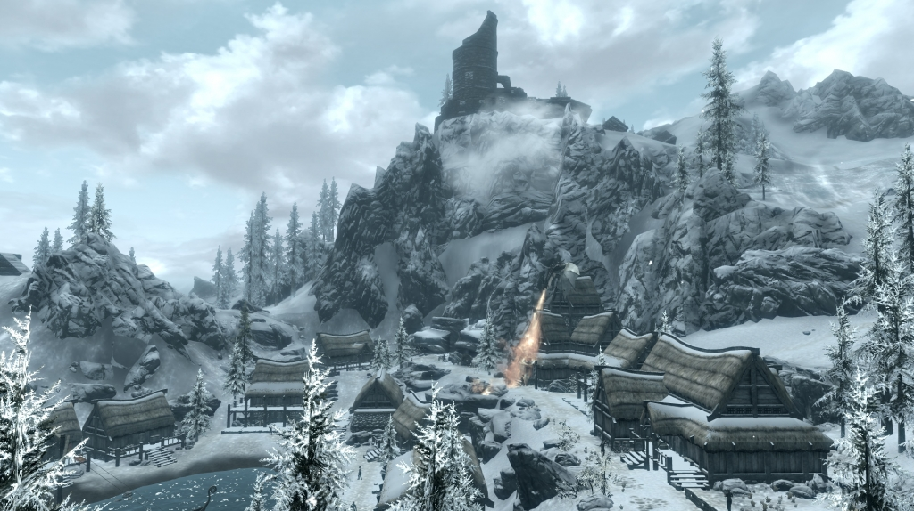

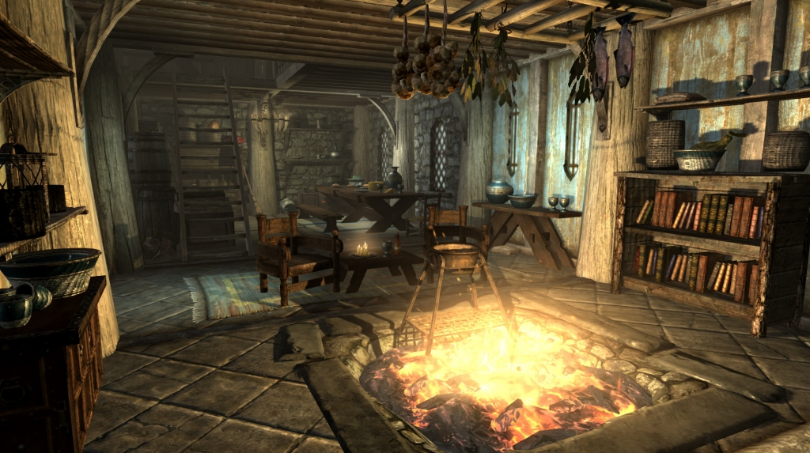

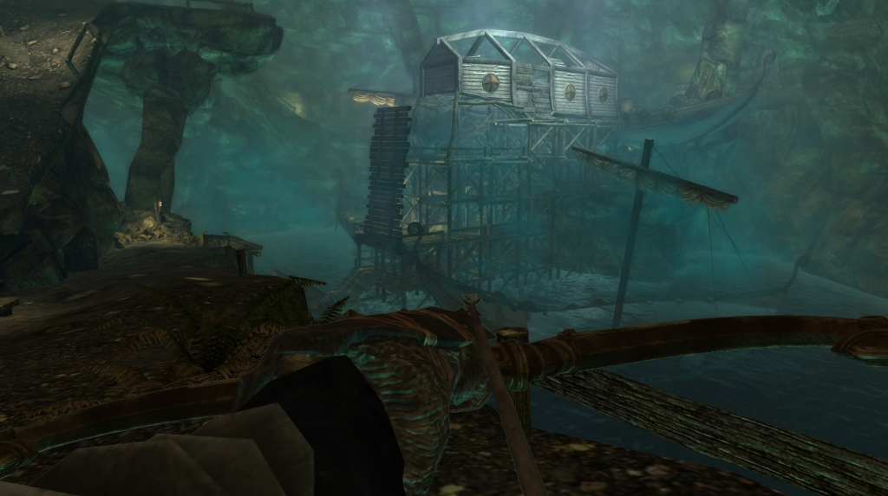

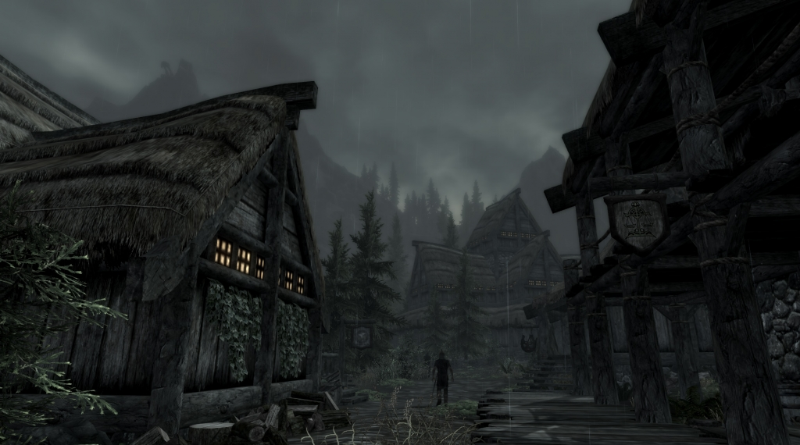

#### "Реализм"

Реализм не богат, и видимо дизайнеры на этом не заморачивались. Можно убить животное и приготовить себе еду в котелке, но это не практично потому что есть заклинания и лекарства. Так же можно накопать руды, выплавить слиток металла и выковать оружие, которое в свою очередь усилить (enchant) душами поверженных врагов - но из-за быстрого levelup-а оно может устареть. Надо понимать что это не Minecraft - объекты не разрушаемы и ключевые NPC бессмертные..  

Все здания и пещеры по прежнему отдельные локации, скорей всего потому что если всё объединить, то всё может настолько усложниться с физикой или скриптами что кто-то наверняка застрянет или умрёт где не надо. Погода никак на вас не влияет - от ветра медленней никто не идёт, дорога не становится болотом после дождя, да даже в болоте скорость движения такая же. А если одеть 40-килограммовую железную броню? Да, выносливость будет хуже, но плавать всё-равно можно. И голым можно в горах при пурге гулять без проблем со здоровьем.

Как я уже сказал, бой реалистичен и попадание стрелы в голову или шею довольно критичны, тем не менее попавшая на охоте в оленя стрела не приведёт к смертельной кровопотере, хотя огонь и яд дают дополнительный урон с течением времени. Заскриптованность сюжетных диалогов тоже проблема - вы приходите к царю, слушаете его речь и каждый раз покуда вы не сделаете что-то с квестом, вы будете слышать одно и тоже. Таким моментам надо учиться у Assasin's creed,  и анимации отталкивания людей тоже.

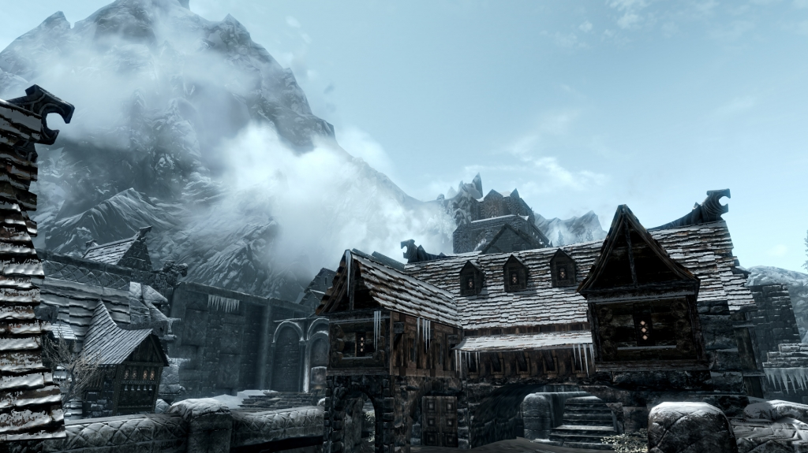

Тем не менее, нельзя не отметить волшебную атмосферу. Квесты выдаются не машинально, а с эмоциональным диалогом и в отличие от небольшого количества сгенерированных квестов, основные квесты сделаны добротно а не просто "сбегай принеси". Одни подразумевают расследование убийства, другие дают группу помощников для экскурсии по пещере, третьи мгновенно требуют выбора из неочевидных и не дихотомических вариантов. 

Многие ключевые достижения игрока смачно комментируются прохожими мол "так, это ты новый студент колледжа магов" или "я вижу ты с двуручным оружием ходишь, уважаю". Заходя в таверну и обращаясь к прохожему можно узнать что он местный повар, или рудокоп из местной шахты. И наверняка с большинством персонажей связан не один квест.

### Развитие персонажа

Все 10 рас и частично их бонусы мигрировали из прошлых игр. Основное изменение - исчез явный выбор классов и как следствие, развитие персонажа стало более гибким. Основных направления по прежнему три - воин, маг и вор/убийца. Получение опыта ускоряется особенными мегалитами, разбросанными по всей карте. При получении опыта можно получить +10 здоровья, маны или выносливости и +1 способность из Созвездий.

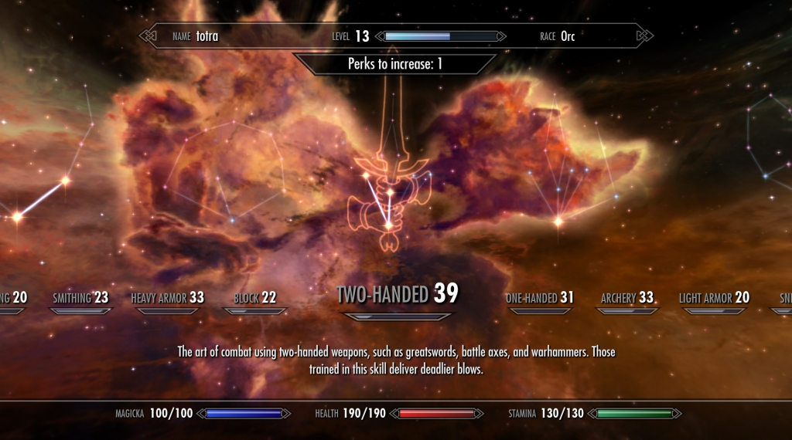

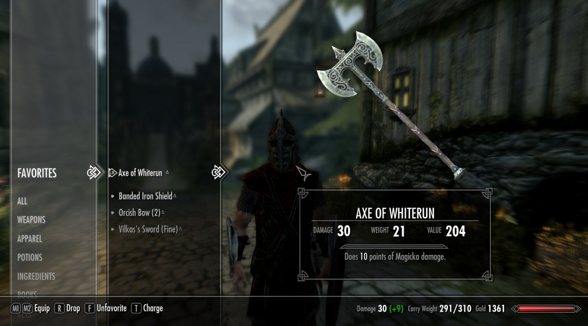

Сам я поиграл лишь крохотную часть игры (30 часов), выбрав варвара-орка и вложившись в тяжёлые доспехи и двуручное оружие, но из-за недостатка денег ударился в линию за гильдию воров, получив ключ скелета и прокачав sneak и archery. В конце концов я заметил что хотя я и в состоянии забить с десяток охранников, или завалить дракона, это даётся не так легко как хотелось бы и я сильно завишу от лекарств (и следовательно алхимии или воровства), в то же время мана как ресурс практически никак не задействована и переключаться на heal в бою уже неэффективно. Развитие не удалось - отчасти из-за той гибкости которую даёт игра.

В продолжение проблемы с развитием - стрельба из лука и sneak очень важна в случаях когда есть армия которую можно перестрелять издали, но переключаться между режимами полный pain in the ass. Получается что надо либо стрелять уже в тяжёлых доспехах, надеясь что тебя не заметят, либо же постоянно менять одежду, что крайне неудобно из-за UI. Да, есть favorites и возможность цифрами переключать предметы, но всю магию и инвентарь, к ним не привяжешь.

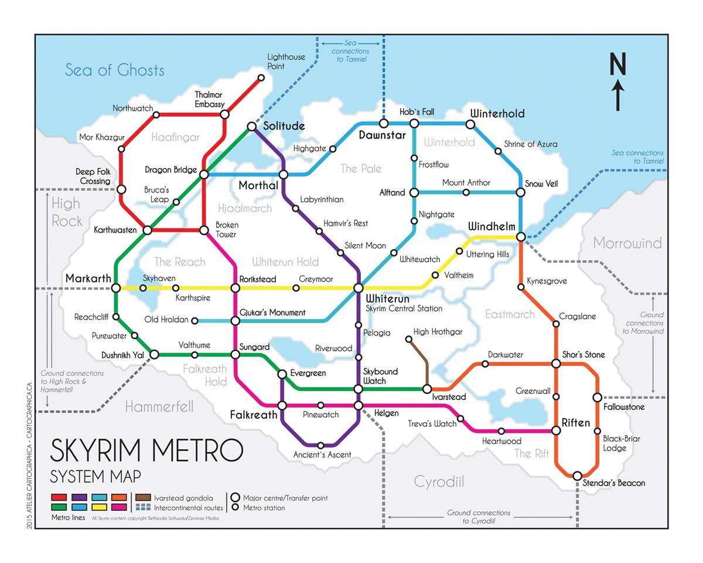

Как вариант, для безопасной ranged-игры можно нанять компаньона (в частности викинга умеющего призывать волка) и [изучить conjuration](http://www.youtube.com/watch?v=hAtWOvVdNhs). Проблема в том, что необходимо обязательно специализироваться на чём-то одном, поскольку рост любых навыков в конечном итоге повышает ваш общий level, от которого зависит как доступное повсюду оружие, так и их урон и развитость врагов, поэтому размазывая опыт по всем характеристикам, вы на самом деле ухудшаете свой урон.

Начав заново и прокачав мага, я смог добиться громадного урона. Во первых у меня телохранитель с heavy-armor и поглощающим здоровье топором. Во-вторых я призываю огненных атронафтов как бесплатные fireball-пушки. В третьих, из ключевых квестов ко мне присоединились персонажи и вместо того что-бы продолжить этот квест и отпустить их, я гуляю по миру вместе с ними как с бессмертными компаньонами. В итоге я хожу не один, а вшестером и уже смог завалить одновременно нападающих двух драконов с мамонтом и гигантом впридачу.

### Баги

Багов в игре очень много, можно сказать это неприятная черта всей серии. Наиболее эпичной рекламы багов в Skyrim чем возможности обкрадывать жителей просто [одев им ведро на голову](http://www.youtube.com/watch?v=rt5aUdijAN8), не придумать. С обнаружением противника связана и вторая неестественность - можно засадить кому-нибудь стрелу в задницу, и он скажет что-то типа "наверно мне это показалось". 

Но самая большая проблема которая коснётся любого желающего пройти игру самостоятельно (на PC)  - основная сюжетная линия сломана на персонаже Esbern - у него отсутсвует озвучка и он не открывает дверь, хотя всё для этого выполнено, приходится [вручную исправлять положение](http://www.uesp.net/wiki/Skyrim:Esbern), поскольку патчей ещё нет.

Если разбирать по существу.. то нельзя не заметить проблемы с физикой и камерой:

- сильно ускоряющиеся предметы за счёт столкновений, и как следствие - [неестественные полёты животных](http://www.youtube.com/watch?v=n2HXy3PA6os) и [трупов](http://www.youtube.com/watch?v=aRB2EVXOQuI), [застрявшие драконы](http://www.youtube.com/watch?v=xajuFskr_sw). Например можно с разбега ногой поднять телегу на два метра в воздух, а мамонты те сами собой в воздух взлетают.  
    
- застревающие в дверях и между камней персонажи, в том числе ушедшие под землю
- прозрачная вода при плавании и изменении камеры с воздуха на землю

Хвалёный "Radiant quest" заключающийся в том что живые существа реагируют на окружающую обстановку порой приводит к интересным куръёзам. Например у меня как я уже написал, несколько помощников.  Один раз в битве наколдованный атронах одного помощника случайно файрболлом попадает во второго помощника.. и возникает резня. Другой раз на меня ополчилась деревня за прижареную курицу, чего бессмертные NPC мне не простили.

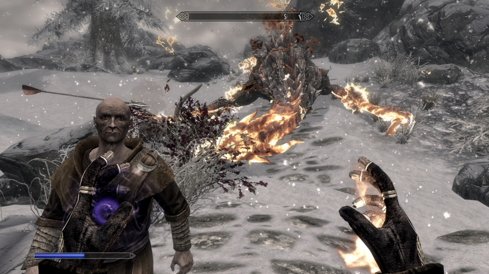

##### Бесплатный level-up

- [Частично бесконечная мана](http://www.youtube.com/watch?v=c-jUZjQJM0g) при снятии и одевании зачарованной одежды
- [illusion](http://www.youtube.com/watch?v=SRIKgSr0FRA), [archery](http://www.youtube.com/watch?v=Yj8zoJhEb10) за счёт кражи денег у тренера
- [conjuration](http://www.youtube.com/watch?v=-WkNQsg_W4Q), sneak за счёт недоступности противников
- [restoration](http://www.youtube.com/watch?v=Pt9AHVFRTpE) за счёт шторма
- [illusion](http://www.youtube.com/watch?v=8h0gz25kumg) за счёт направленных на себя заклинаний при отсутствии противников с управлением временем
- [destruction](http://www.youtube.com/watch?v=LMHpROEZNFE) и [restoration](http://www.youtube.com/watch?v=8h0gz25kumg) за счёт атаки бессмертного, неатакующего NPC, [компаньонов](http://www.youtube.com/watch?v=1GZSWLvsXJk)
- наконец [бесконечный XP](http://www.youtube.com/watch?v=_3uMzAlt1BI) в магии

##### Нарушенная экономика

- бесконечных предметов - [стрел](http://www.youtube.com/watch?v=JTdGcGJ6s1E), [книг](http://www.youtube.com/watch?v=SFVwuu9XxCc) 
- ожидание [товара и крафтинг](http://www.youtube.com/watch?v=NO0Q_VKzdZg)
- [замедление времени и задержка](http://www.youtube.com/watch?v=kyqgE3UUKgM) при вычете денег при покупке дома

### Вывод

Практически все критики ставят игре 95/100 и конечно только 5% из них посвящена именно багам, потому что объём всего мира настолько велик, что он затмевает все недостатки движка и игрового дизайна в деталях экономики и битвы. Это одна из тех редких игр, которые делаются долго, коллективно и с любовью и так же долго играются и осознаются. Ведь это не просто тупая резня врагов в туннеле, это прежде всего открытый виртуальный мир с нелинейной историей, которую невозможно передать ни книгой, ни фильмом из-за всей той интерактивности которая предоставляется игроку, и через этот виртуальный мир мы можем проецировать реальность, глядя на себя со стороны, задумываясь о жизни со всеми её проявлениями.

Несмотря на некоторые баги с движком, это игра в которую непременно стоит окунуться. А особые фанаты могут поставить моды улучшающие текстуры дерева и камня в архитектуре и на природе, монеты, брони, воды, неба, вплоть до голых моделей женщин и мужиков. Всё ради великого искусства.