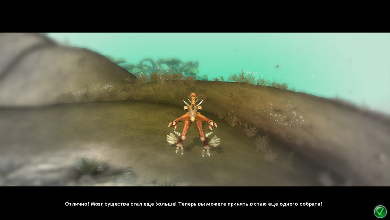
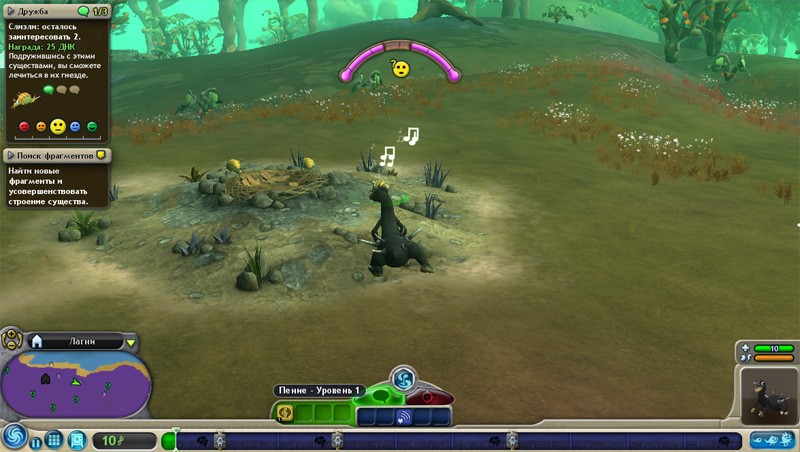

## Spore - симулятор жизни

воскресенье, 14 сентября 2008 г. в 11:09:42

_Что наша жизнь? Игра!_

Недавно вышедшая игра от создателей Sims наверняка станет хитом, потому что жизнями управлять любят практически все и похожие игры уже были отмечены популярностью - Sims, Black and White, Populous: the beginning, Civilization, Galactic civilizations. Весь шарм игры в том, что вы сами делаете живых существ начиная с протоклетки до огромных цивилизация.

В игре есть пять этапов - клетка, животное, племя, цивилизация и космос; Однако реально для нас их три - животная жизнь, разумная и наше будущее. Надо понимать что играть вероятно будут и дети и недалёкие люди, поэтому игра максимально проста, что естественно с реальностью не вяжется. В плане времени периоды распределяются практически поровну, в зависимости от того как вы играете.

### Зверюги

Жизнь по сути это перераспределение _энергии_ из физического мира в биосферу и обратно, а каждое существо стремится приспособиться максимально свой источник энергии перерабатывать. Простейшие клетки могут жить в нереальных температурных, радиационных, световых и химических условиях и всё-равно питаться, размножаться и эволюционировать. Отбросим тут самые древние сине-зелёные водоросли, которые практически вечные и эволюционировать им некуда. Плавать в океане тоже скучно - до свидания плезиозавры, киты и дельфины.

Наша клетка в Spore - должна питаться либо растениями либо животными клетками с помощью челюстей. Не понятно почему разработчики не указали зависимость пищевой цепочки от этого выбора, т.е. количество получаемой энергии. Ведь с такой логикой и клетки растений могли бы стать разумными. Я выбрал только животные челюсти, нацепил жгутики, шипы и поплыл поедать, размножаться, уворачиваться от огромных организмов.

Выход на поверхность и превращение в животного очень простое - надо просто добавить лапы. Тут же появляется позвоночник, видимо превращение в многоклеточных произошло само собой. Утолщая позвоночник можно играться с формой тела - сделать как картошку или завить проблем не составит.

По мере истребления животных в округе и защите своего гнезда, клетка со жгутиками и ногами постепенно превращается если не в тиранозавра, то хотя бы в велоцирапторов. Так же как и с клеткой можно покупать органы на заработанные ДНК-очки. Очки зарабатываются выполнением заданий типа съедения соседней стаи, перенесения гнезда своей стаи на другое место или забиением особо крупных заблудившихся "брахиозавров". Имена животных и вообще всяких устройств генерируется случайно.

---

### Племена

Кульминацией этого наиболее продолжительного этапа становится увеличение размера мозга, охота стаей и как итог - появлением разума. Появление разума как и появление жизни для учёных составляет большой интерес и на это счёт есть много гипотез. Истина наверно где-то посередине - совокупность размеров животного и мозга, стадности, развитости конечностей предопределяет начало использования искуственных инструментов, огня и тп.

К сожалению на стадии животного небыло таких интересных особенностей как зависимость экосистемы и пирамиды пищевой цепи. А ведь именно она ограничивает хищников от излишней "хищности". Вырезать всех просто нельзя из-за того что эволюция оказывается в игре достаточно быстрой, а в режиме племени мирно пасущиеся животные быстро рождаются на пустом месте.

Режим племени как и режим цивилизации практически не отличается - надо воевать с соседними племенами топорами, копьями, факелами, танками, крейсерами и самолётами, либо пытаться их покорить культурно дудочками, флейтами, религией и экономикой. Эти два режима "мирности" племени и цивилизации идут вместе с эволюцией из плотоядности, травоядности или всеядности которую вы выбрали.

Как поклонник клингонов я всех перерезал, устроив ядерную войну под конец - на планете Велик настал мир

### Космос

Выход в космос в игре вызван так же смешанными факторами - любопытство, колонизация, поиск ресурсов. Первые же полёты сталкивают со внеземной жизнью, которая как и нации на Земле занимаются своими делами - торговлей, религией и войной.

Заработок денег подразумевается за счёт продажи "пряности" которые вырабатывают колонии. Нарвавшись на религиозных чудиков я случайно стрельнул по базе и в итоге они завязали войну. Поскольку расстояние перелёта между звёздами ограничено, а корабль имеет ограниченный запас энергии, то летая по фактически двумерной галактике смог подружиться с торговцами.

Поначалу всё даже шло успешно, но основав четыре колонии я со временем познакомился с военной расой и уж с двумя противниками пришлось совсем худо. Несбалансированность игры где я даже получив второй корабль союзника должен сражаться против десятка кораблей противника вызывает злость - Master of Orion по крайней мере чётко показывал зависимость технологий, терраформируемости планеты, население, особенности расы а тут - аркада. Летай да уворачивайся.

### Настоящий космос  

Если жизнь и разум были такими огромными шагами, то наверняка должен быть ещё один шаг в трансцендентность. Например переход в андроидную информационную стадию жизни, в матрицу, или управление временем, звёздами, гравитацией. Вообще так же как трудно представить как создавать огонь будучи животным, так же трудно думать о третьем шаге будучи человеком

То чему научила меня игра, так тому что наврядли встреча с инопланетянами может быть мирной и дружелюбной. Идея о том что достаточно разумное существо достигшее космоса непременно будет исповедовать добро, справедливость и может даже невмешательство в дела неразвитых цивилизация очень критикуется многими фантастами.

Серия "звёзды - холодные игрущки" у Стругацких например повествует о функциональном разделении рас в Галактической республике - одни хорошие математики, другие хорошие военные, пилоты

По теме:

- [Дима Смирнов о Spore](http://nudnik.ru/entry/3593)