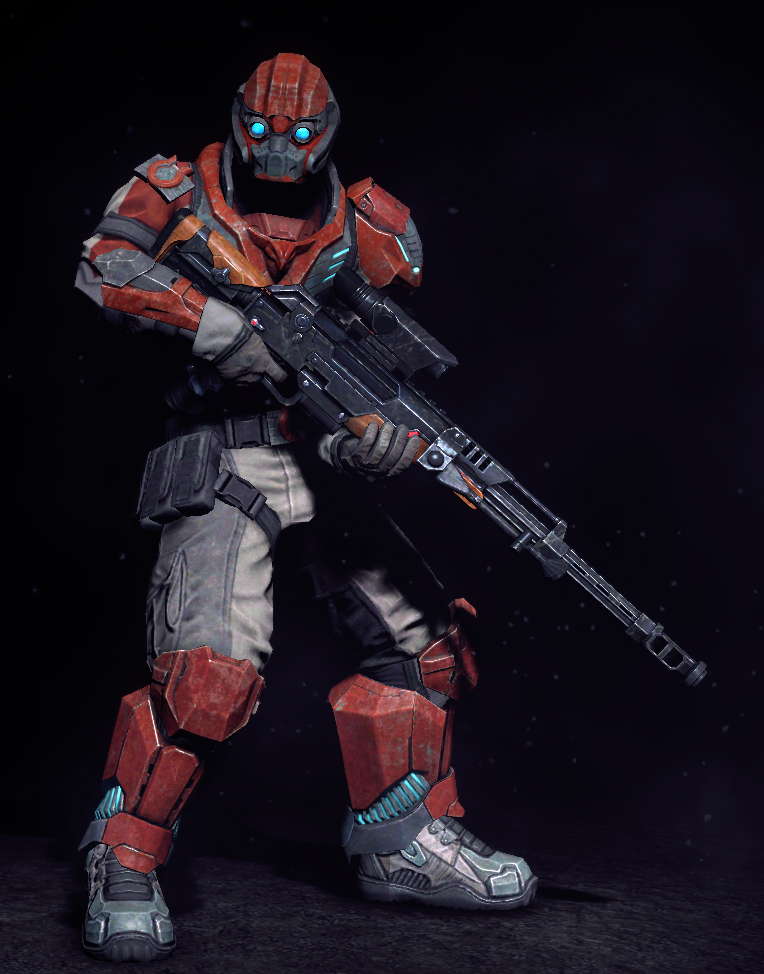

# Tribes ascend
воскресенье, 3 июня 2012 г. в 17:37:33

[Tribes: Ascend](https://account.hirezstudios.com/tribesascend/) это бесплатная сетевая стрелялка от HiRez studios на движке от Unreal с моделью платной прокачки, подобно World of Tanks и League of Legends. В большинстве режимов игры участвуют две группы бойцов по 16 игроков в каждой (т.н. Blood Eagle и Diamond Sword) на одной из ~[10 карт](http://www.tribesascendwiki.com/Maps)

### Механика

В отличие от серий Call of Duty и Crysis, каждый игрок оснащён jetpack-ом который позволяет летать (правая кнопка мыши) тратя энергию и скользить по земле (пробелом). Из-за этого, карта довольно огромные и просто бегать не имеет смысла - вместо этого надо учитывать рельеф и ускоряться за счёт падения на пологую область. 

Оружие тоже в большинстве своём не мгновенное - пули и снаряды летят так медленно, что противник с полным энергией jetpack'ом может быстро уйти от попадания.

### Классы и режимы

Из-за наличия энергии на полёт и оружия логично вытекает и градация по классам. Лёгкие классы, подобно автомобилям, быстро двигаются и разгоняются, но слабо защищены. В противоположность им - тяжёлые классы хорошо защищены и вооружены миномётами или пулемётами, но не созданы для погоней. 

---

Я играл в основном в два режима игры - deathmatch и захват флага. В первом надо перестрелять как можно больше противников, при этом если своя комманда владеет переходящим флагом, то за убийство дают два очка. Всего у комманд 100 жизней, кто первый обнулит противника - тот победитель. В режиме захвата флага надо с базы противника захватить флаг и донести на свою базу. Базы защищены туррелями, флаг может защищаться минами и силовыми полями. Внутри базы генератор, отключив который можно обесточить защиту.

**Pathfinder** - лёгкий класс, создан в общем для быстрых полётов и захвата флага в режиме Capture the Flag. Учитывая что всего надо захватить 5 флагов, большое число знающих своё дело игроков могут легко вынести противника со счётом 5:0. Мне нравится им иногда попрыгать по горкам, но прям так захватить и доставить флаг на базу почти никогда не получается.

**Sentinel** - снайпер тут довольно бесполезный класс. Прицелиться им по движущимся игрокам крайне сложно, да и попадание отнимает только 300 пунктов жизни что для миномётчика с 2500 вообще пустяк. А учитывая что самому приходится оставаться на месте при этом, можно легко стать жертвой пробегающего солдата.

**Infiltrator** - может становиться невидимым, что очень зачётно на базе противника. Проблема в том что на это быстро тратится энергия и где-то за 30 секунд она кончится, а если при этом летать то и вообще за 10. Узи-подобное оружие у него слабенькое, а подрывать я ещё не научился с ним. Тем не менее он очень быстр и гибок как в атаке так и в защите.

**Soldier** - создан для открытого поля между двумя базами. В идеале они должны подстреливать обессиленных скаутов и возвращать флаг и по возможности издали снимать тяжёлых противников и снайперов.

Technician - по запасу энергии сравним со скаутом (прыгает так же хорошо), а по автомату - с солдатом. Обычно он используется в двух настройках оружия - защите флага либо в защите и ремонте генератора.

Raider - усиленный солдат. Вместо дробовика с одним зарядом - три гранаты. Неприятный при столкновении.

Juggernaut - мой любимый миномётчик. Используется как для защиты генератора, для уничтожения защиты противника издалека и для прорыва пути к генератору. Хорош для уничтожения большого скопление народу на раз.

**Brute** - хороший защитник генератора из-за своего ближнего боя в закрытых помещениях. Неплохо уничтожает технику противника. Я его открыл, но особо не играю.

**Doombringer** - идеальный защитник флага. В наличие есть силовое поле, о которое разбиваются слепые скауты и издали может убивать наводящейся ракетой высоко парящих скаутов, а пулемётом - подлетающих. У меня с ним обычно проблема с кончающимися патронами и попаданием.

Используемость классов напрямую зависит от режимов игры и предпочтения в стиле. Кроме того надо понимать что сначала открыты только три класса и надо скрипя зубами выбирать что хочется - попробовать себя в новом стиле, или инвестировать в апгрейд существующего класса.  

### Тактика

Я люблю играть в защитном режиме миномётчиком и пулемётчиком, потому что ещё не постиг всех тонкостей игры. Но вот несколько наблюдений..

1. **Не забирайте флаг** если вы это не умеете (или слишком медленные). Просто потому что pathfinder'ы специально заранее разгоняются что-бы быстро схватить флаг и унестись как можно дальше от разгоняющихся противников, а если до этого какой-то танк начнёт забирать флаг и умрёт через 10 метров в неудобном ущелье, то потеряется время
2. Не возвращайте свой флаг если он оказался в труднодоступном месте. Вы получите немножко очков, но проиграете во времени в целом.
3. Не тусите на базе с флагом, если у обоих комманд флаг. Лучше всего либо кружить по карте на большой скорости. У генератора тоже не самое безопасное место.
4. Следите за энергией - не атакуйте если у вас её мало и не используйте jetpack если вы падаете (это только вредит скорости). Кроме того можно использовать энергетическое оружие что-бы разогнаться
5. Infiltrator благодаря невидимости может безопасно чинить туррели

### Вывод

Итого имеем - красивый дизайн уровней и игроков, правильно сделанную плавной кривую вхождения (например начинающие играют с начинающими), уникальную механику, перспективы роста в дополнительных скинах и оружии, высокий уровень подсаживаемости. 

Из неприятных моментов - открыть всех персонажей (по 10-15k XP) займёт порядка 40 часов или же денюжка, а открыть одно оружие для одного класса (100 XP) - фактически столько же (!) что довольно странно.

У меня от игры в шутеры после получаса игры начинает болеть голова, а учитывая что ближний бой тут всячески стимулируется, головокружение и расстройство от мгновенной смерти тут предостаточно, особенно когда до этого скачешь по всей карте. Поэтому - попробуйте и дальше уже на любителя unreal.

