## Eclipse
среда, 9 мая 2012 г. в 21:58:47

Поиграли в финскую настольную игру Eclipse, эдакую смесь Cosmic Encounter, Twilight Imperium и Endeavor. Играть могут до шести человек и в зависимости от опыта, занимает от 30 до 60 минут на человека. Мы играли впятером с двумя новичками четыре часа.

Все играют за одну из 7 видов космическую цивилизацию (впрочем за людей могут играть несколько человек). Цель игры - к концу девятого хода набрать максимальное количество победных очков, т.е. найти свою оптимальную стратегию в сложившихся обстоятельствах. 

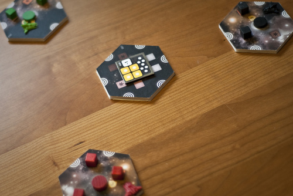

В начале игры устанавливается карта галактики, состоящая из шестиугольников которые представляют из себя звёздные системы которые можно осваивать через чревоточины пространства-времени. В центре галактики и как правило к прилегающих областях находятся остатки **древних** мощных кораблей.

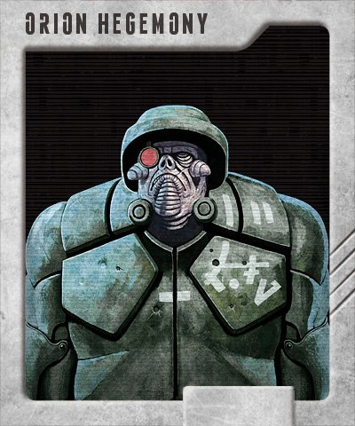

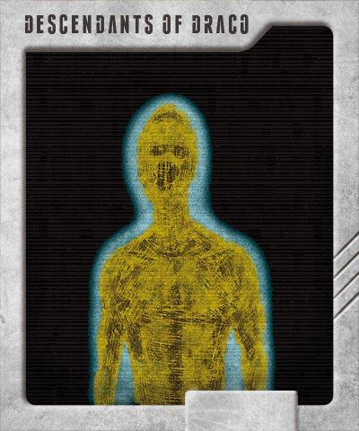

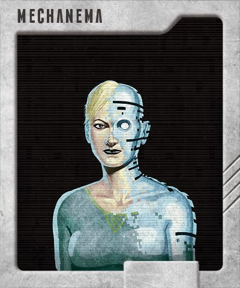

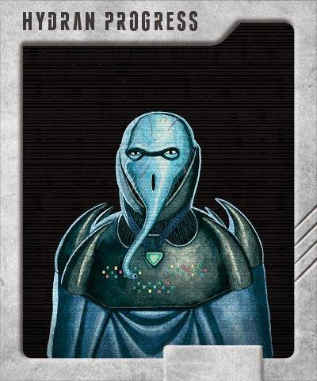

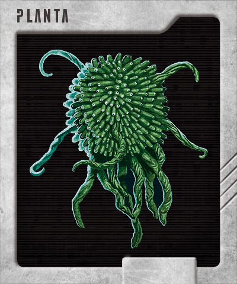

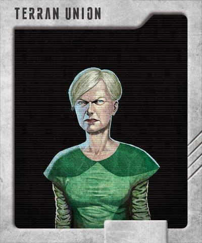

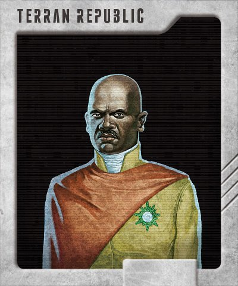

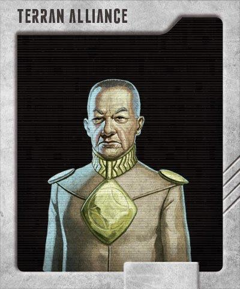

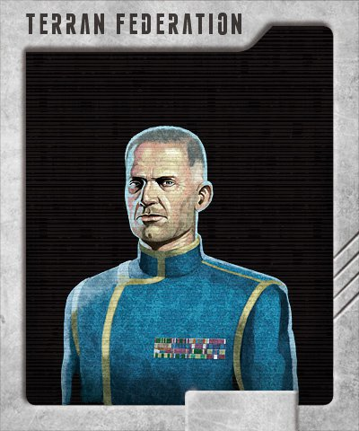

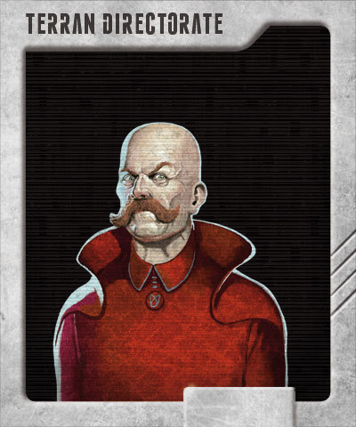

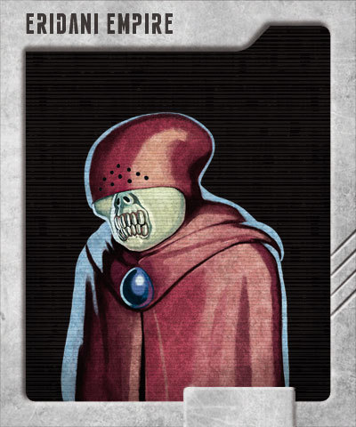

Сразу надо сказать что универсальной стратегии тут нет. В течение одного хода, все игроки по кругу совершают действия, покуда им хватает на это ресурсов. На каждое действие тратится фишка хода (располагаются на карте управления в нижнем ряду). Каждая такая фишка открывает постоянно увеличивающееся число требуемых денег.

Действий шесть типов - 

1. explore (открывает новую область)
2. influence (ставит в эту область центр управления)
3. research (изучение технологии, тратится ресурс науки)
4. upgrade (улучшение корабля изученными технологиями)
5. build (постройка кораблей)
6. move (передвижение кораблей)

### Процесс

На первых порах игры необходима **экспансия** для захвата ресурсов (всего их три типа) которые есть в звёздных системах. Например для открытия и занятия соседнего тайла необходимо три фишки - на Explore, на Influence и на фишку внутри системы которые будут произведены в два действия +  колонизационные корабли для занятия планет. Чем больше игрок совершает действий, тем больше денег будет вычтено в конце хода. Управление большим числом систем вносит некий тормоз в скорость развития - фишкек на действия становится мало.

Деньги, как и два других ресурса - науку и индустрию можно получать с контролируемых планет. Наука понятное дело тратится на изучение технологий, а индустрия - на строительство кораблей. 

После экспансии игроки упираются либо друг в друга, либо в корабли древних, либо в упомянутое ограничение ресурсов - есть довольно скудные системы на краю галактики, которые даже не стоит колонизировать. К третьему-четвёртому ходу идёт гонка научных открытий, строительства первых кораблей и военные походы.

Воевать, даже терпя поражение может быть полезным - это даёт как победные очки так и выгодные технологии или ресурсы, не говоря уже о богатых системах возле центра. К этому же времени строятся первые договора о ненападении (+1 любой ресурс) и поскольку открываемые тайлы соединяются между собой перемычками, то можно строить вокруг себя пространство так, что-бы отгородится от соседей, либо наоборот сделать прямой путь для ударных групп.

Вторая половина игры это развитие своих преимуществ, и максимальное усложнение жизнь окружающим. Желательно прокачать науку - без неё нельзя получить сильные боевые корабли, а следовательно нельзя даже нормально обороняться.

Типичный ход выглядит так - на первом круге обычно изучаются технологии, потом делаются апгрейды, потом по необходимости строятся корабли, передвигаются в атаку, наконец после окончания хода идёт битва, после чего - перерасчёт ресурсов.

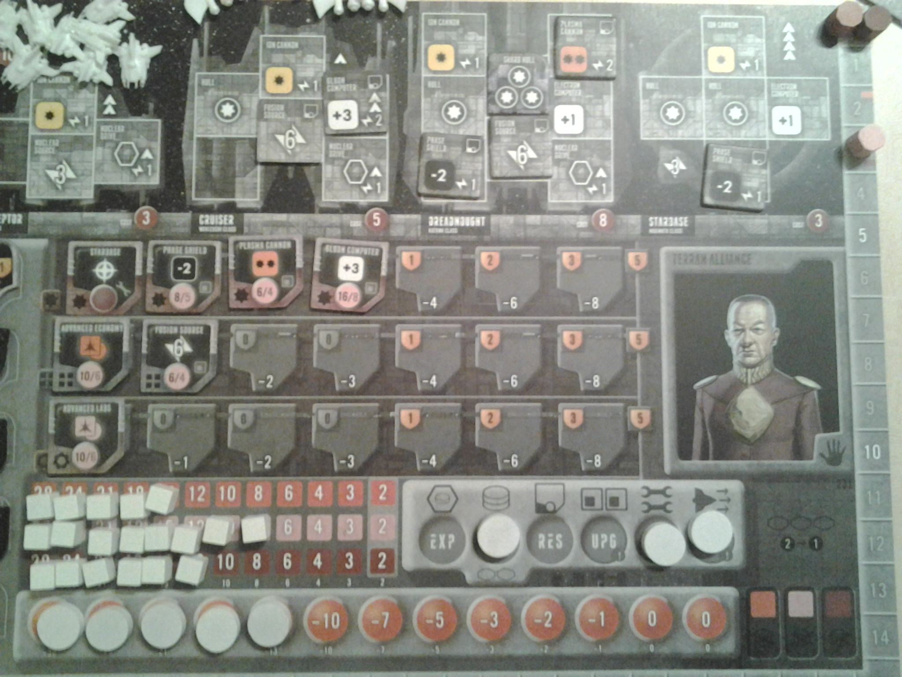

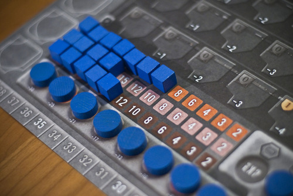

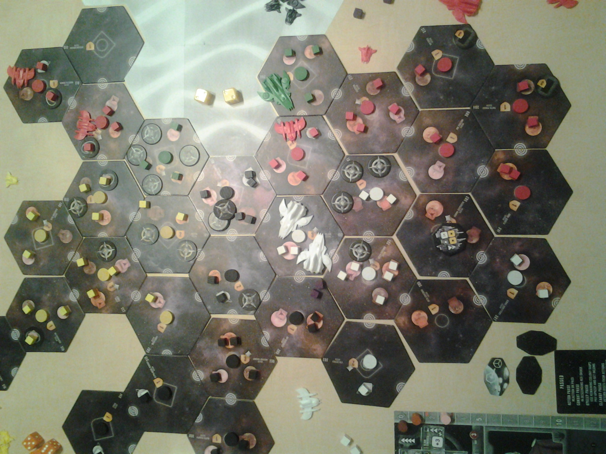

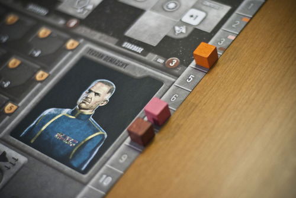

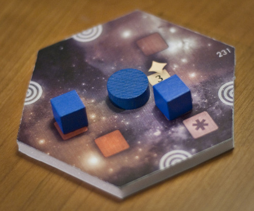

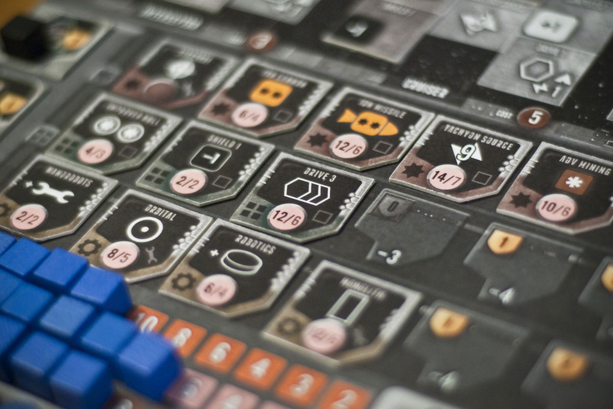

### Хаос и управление

Весь процесс довольно хаотичен. Во-первых технологии которые хочется получить часто не остаётся, для этого надо либо заранее копить науку, либо раньше завершать ход (первый завершивший начинает следующий ход). Во-вторых хаотичны территории - может сказываться нехватка научных или индустриальных планет - опять же надо либо вкладываться в мирное русло улучшения инфраструктуры, либо идти войной. 

В-третьих непредсказуемы битвы. Можно тремя средними кораблями атаковать одного древнего и проиграть, потому что исход битвы решается выпадением кубиков. Чем лучше технологии корабля - тем больше кубиков или тем лучше условия победы на них.

Наконец в-четвёртых, непредсказуемая политика. Вы можете быть в хороших дипломатических отношениях, но чуть вы отвели слишком далеко свои корабли, оставили систему с +3 победными пунктами и массой ресурсов незащищёнными, как вам могут всадить нож в спину бывшие союзники.

Это была моя первая игра и было довольно сложно наладить конвейер research-upgrade-build постоянно отбиваясь от трёх противников. Как заключение - она определённо не в топе моих любимых игр из-за требований к мышлению. Я просто чувствовал себя **перегруженным объёмом и числом решений** которые необходимо предпринять и учитывать.. 

Master of Orion II : Battle at Antares - культовая компьютерная игра девяностых, включала 13 рас, управление экспансией, проектирование кораблей, изучение технологий, дипломатию

Просто к примеру - если вы планируете атаковать противника то необходимо сначала посмотреть на его уровень кораблей, учесть сколько он может их построить, какие апгрейды он может сделать, как лучше подойти с апгрейдом своих кораблей, хватит ли вам на это ресурсов, хватит ли на это электроэнергии генераторов, имеет ли смысл вкладываться в приоритет по атаке (т.е. что-бы я атаковал первым и надеяться что с первым залпом всё будет окончено), либо в прочность своих кораблей, либо в силу атаки, хватит ли число ходов, не нападёт ли на меня в то время как я буду занят атакой другой сосед.. и тп.

Таким образом игра очень напоминает Master of Orion, но поскольку весь учёт надо вести вручную, то микроменеджмент новичку в тягость. В то же время без этого, нельзя представить уже реальную политику - перемирия, предательства, месть..

См. также

- [Первые впечатления Александра Белякова](http://boardgameblog.ru/2012/03/19/%D0%BF%D0%B5%D1%80%D0%B2%D1%8B%D0%B5-%D0%B2%D0%BF%D0%B5%D1%87%D0%B0%D1%82%D0%BB%D0%B5%D0%BD%D0%B8%D1%8F-eclipse/)