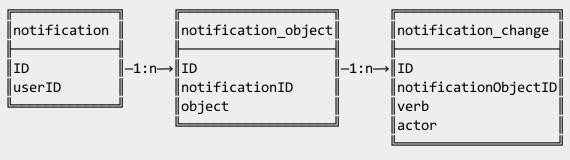

пятница, 13 июля 2012 г. в 09:02:22

Оповещения (notification) как правило о чём-то ( _object_  = существительное = событие, дружба) что изменяется ( _verb_  = глагол = добавлено, запрошено) кем-то ( _actor_  = другим пользователем, системой) и кому-то показывается (userID = пользователю, группе, компании). По сути это модель естественного языка - на этом же основаны [триплеты RDF](http://www.w3.org/2007/03/rdf_concepts_ru/Overview.html#section-triples).

Вот нормализованная структура данных, хотя я использовал Mongo.

Оповещать надо конкретных пользователей, поэтому тут зависимость от userID. Тоесть если надо оповестить 100 пользователей, надо сгенерировать 100 оповещений. Табличка посередине - для группировки по существительному, что-бы можно было сказать  "У вас  **3** новых запроса дружбы ". Третья табличка - что-бы можно было сказать " James Bond  достиг новых высот  в альпинизме ". Имея такую схему, можно делать и переводимые предложения.

Но поскольку объект о котором я рассказываю (дружба, событие..) описывается только как ID, вы должны сами присоединить нужную информацию. Это не так тривиально, поскольку там могут быть динамически штуки, например..

 пользователь X  переименовал  событие "свадьба" в "день рождения"

Поскольку эти события должны генерироваться в реальном времени для активных пользователей, то я бы прикрутил их к nodejs + socket.io. А для всего остального есть API соц. сетей ([vk](http://vk.com/pages.php?o=-1&p=secure.sendNotification), [одноклассники](http://dev.odnoklassniki.ru/wiki/display/ok/REST+API+-+notifications.sendSimple)), телефонов ([APNS](http://dev.odnoklassniki.ru/wiki/display/ok/REST+API+-+notifications.sendSimple), [C2DM](https://developers.google.com/android/c2dm/)), хостинга ([Amazon SNS](http://aws.amazon.com/sns/)) и браузера ([HTML5 Notifications](http://www.html5rocks.com/en/tutorials/notifications/quick/))