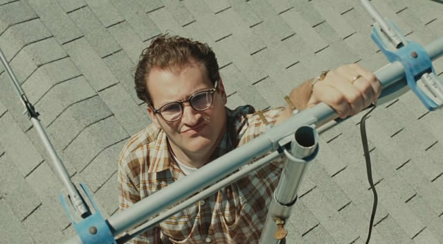

воскресенье, 7 марта 2010 г. в 02:18:08

Жизненный и в то же время многозначительный фильм. Можно сказать что фильм о профессоре математической физики из семидесятых у которого куча всяких проблем или же о евреях - ведь фильм о еврейской семье, школе и раввинах. Но если копать глубже то фильм о мировоззрении или даже.. **Восприятии** — с большой буквы.

Ларри — рациональный и пожалуй слишком серьёзный человек, со своими проблемами. Но он начинает замечать **знаки**. Ведь именно так Бог говорит с людьми. Неважно событие - важно что человек **чувствует** что это знак. Ларри попал в аварию и так же сделал любовник его жены. Знак.

В середине фильма Ларри беседует с Сайем о том что математика — самая что ли не настоящая рациональность. Проблема в том что теория вероятности самая хаотичная её часть. И именно так определяются знаки — это ценимая получателем информация среди фонового шума (это сцена с антенной).  

Брат Ларри - немного чокнутый-гений пытается обрабатывать весь шум вселенной и пишет «Mentaculus» - карту вероятностей вселенной. Правда безуспешно, поскольку ему самому нужна помощь, потому что он более потерян чем Ларри.

«Спасите меня» — такой знак находит ортодонт Ли и теряет сон. Он всячески пытается интерпретировать и получить ответ на неизвестный вопрос. Но не получив никаких доказательств он теряет веру в знак и живёт «нормальной жизнью дальше».  

Вопросы возникают ежедневно и ответы посетители пытаются получить у раввинов, как у психологов. А как тут ответишь, когда тут столько неопределённостей? Вот и раввин Маршак выглядит как господь — сидит в кабинете и «думает». А между тем он не может как-то существенно повлиять на действия обкурившегося мальчика или проблемы Ларри. 

Я думаю Ларри это прототип поколения 20 века, когда на науку возлагались гигантские надежды, но которые мало что развивали внутри, в этике и социологии. Как раз пример брата-гения говорит об обратном. И косвенно это подтверждает телефонный разговор «но я же ничего не делал!».  

Торнадо, врач, подкуп, ничего не делание — все эти сценарные точки так и тянет провести как аналогии с торой, мировоззрением евреев не принявших спасение христианства, современным поколением ожидающую смертельную воронку конца света, на внутреннюю коррупцию духа, даже на экологические последствия.  

Советую посмотреть, [подумать](http://www.runewsweek.ru/culture/32785/) о преддверии новой эры, расслабиться и увидеть знаки для себя.
