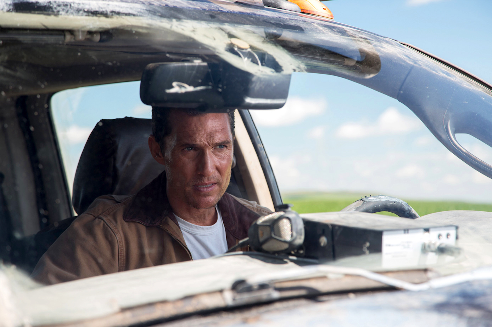
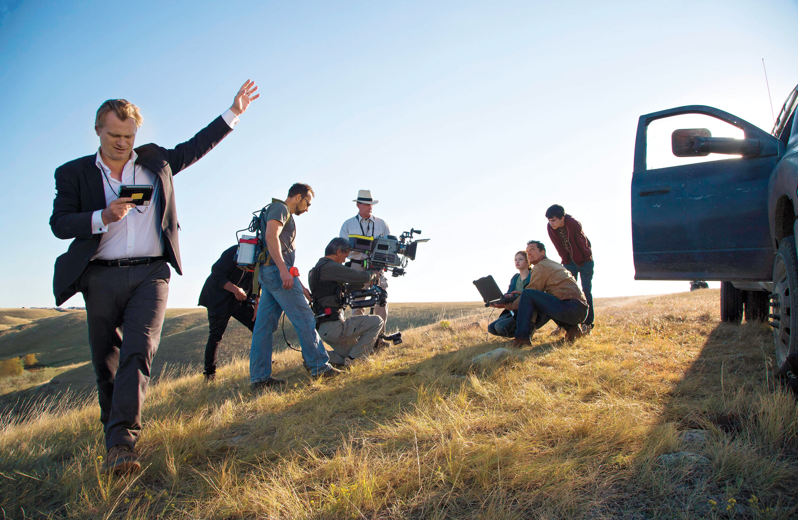
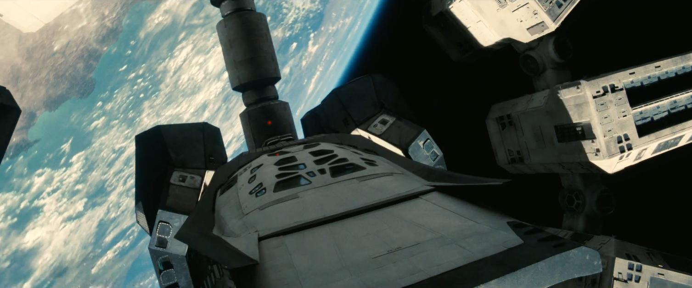
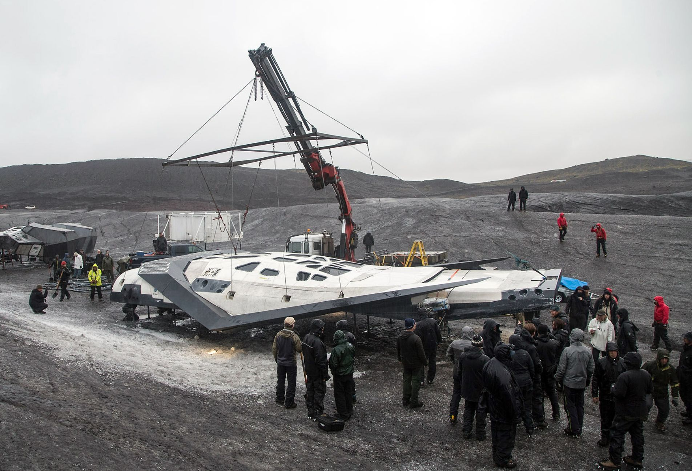
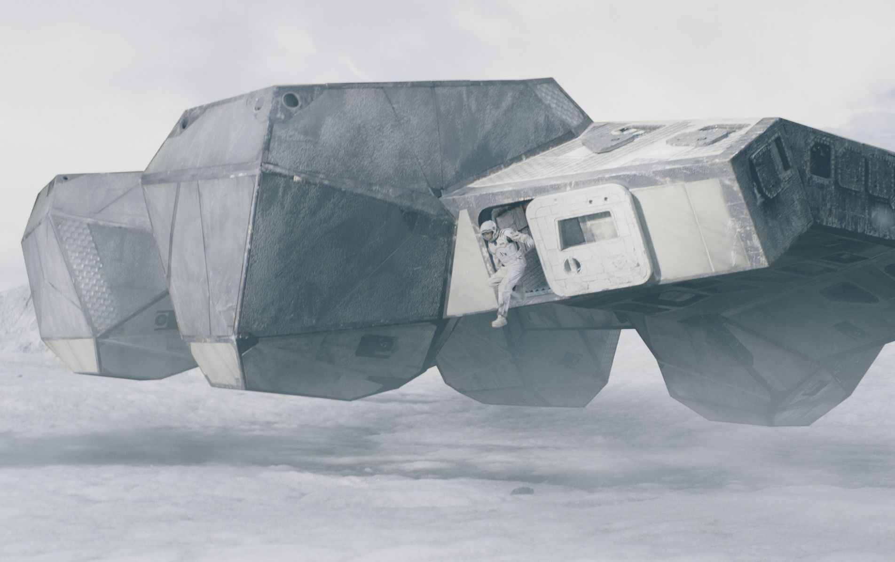
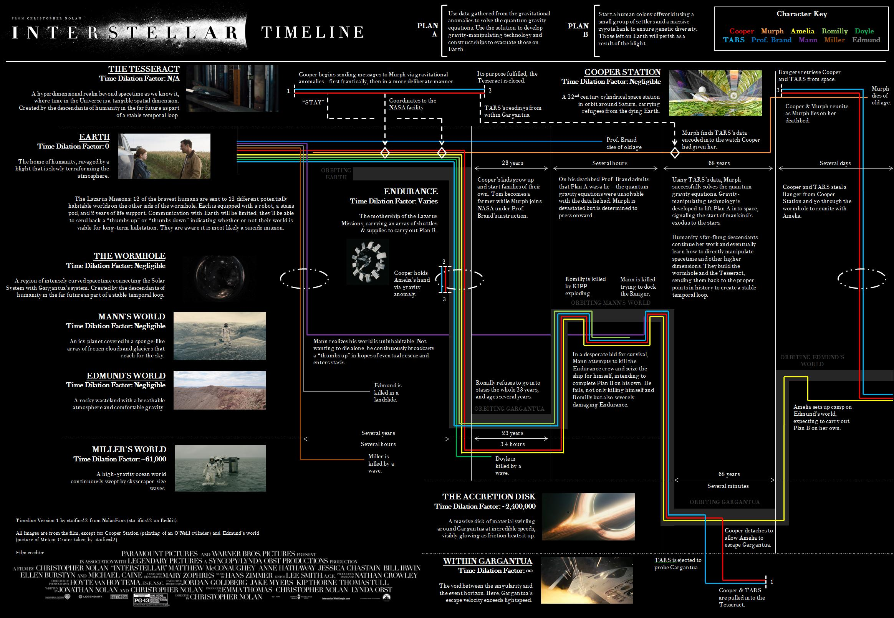

среда, 12 ноября 2014 г. в 17:42:06

[Interstellar](http://www.imdb.com/title/tt0816692/), новый фильм Кристофера Нолана эпичен, масштабен, грандиозен и со своими чёрными дырами. В сущности фильм затрагивает три темы — любовь и эгоизм, судьбу человечества, время и смерть. Хорошо балансирует между космической одиссеей и опытом-чувствами, которые становятся большей ценностью для нашего общества. По качеству:

- Хороший набор актёров
- Отличный визуальный ряд
- Классная, атмосферная музыка Ханса Циммера
- Закрученный сюжет, хоть и со своими неровностями
- Продуманная научная тема

Обязательно посмотрите, а теперь честность на 100% и сплошь спойлеры..

### Любовь и эгоизм

Чувства папы и дочки — единственное что трогало меня и чему я сопереживал. Философски получается что именно их любовь и взаимопонимание сквозь время и пространство, спасло человечество. Любовь напрямую связывается с гравитацией, фундаментальной силой связывающей Вселенную. Жаль что фильм Gravity уже занял такое название.

> — Love is the one thing that transcends time and space

Первый момент когда я всплакнул пришёлся на расставание дочки и вылёт. Я вспоминал свою дочку. Может поэтому из актёров, мне больше запомнилась молодая Мёрфи и «Что может случится, обязательно случится». Второй момент - возвращение с планеты Миллера и просмотр событий 20ти лет. Это страшно и больно, потерять то как растут твои дети.

Эгоизм тут тоже повсюду — болезни растений, пылевые бури, напрямую говорят о климатическом кризисе, настолько серъёзном, что человечество голодает, армии не существует и, казалось бы единственно верный, научно-технологический выход, многими даже не рассматривается, о чём так философски рассуждает тесть главного героя.

> — Ты родился на 40 лет поздней или на 40 лет раньше своего времени

Мы с девушкой спорили — было ли эгоизмом _решение Купера участвовать в полёте_. С одной стороны всё человечество, с другой - семья. Морально сложный выбор, который можно интерпретировать как нежелание заниматься своими детьми, эгоизмом ради приключений или славы.

---

### Человечество

Если у нас всё так плохо с климатом из-за сжигания ископаемых энергоресурсов, ядерных войн, воинов-роботов, орбитальных бомб, био- и нано- оружия.. то Что нас может ждать в космосе, где этих ресурсов по доступности ещё меньше? Ведь поэтому никто в космос и не летит, кроме редких инвесторов, приглядывающихся к золотым астероидам да гелие на Луне.

Подходим к поворотному моменту. **План Б** о генетической репродукции как средству колонизации, ведь идеален. Старое, ветхозаветное человечество умирает, транспортировать старые предрассудки в новую систему невыгодно как экономически, так и идеологически. Управление заселения новых планет можно доверить роботам. Они долговечны, способны следить за социальным развитием на протяжении нескольких поколений, а экономически — нет ограничений по ускорению корабля, не нужна система жизнеобеспечения и гравитации.

Единственная проблема в том, что роботов начнут боготворить и когда последние в итоге сломаются, всё наследие человечества о далёкой Земле забудется. Может такая же **техногенная панспермия** произошла и на нашей планете.

Наконец, что вынудит человечество к межзвёздной колонизации? Только ли гибель всего вида необходима, или мы вполне способны перешагнуть через суровые физиологические дисфункции вызванные нестандартной гравитацией, сменой времени суток, ограничений в пространстве, еде, социальным контактам. Именно сейчас [Elon Musk следит](http://www.spacex.com/) за тем как готовится пилотируемая миссия на Марс с созданием там постоянной колонии.

#### Недочёты

Но не эти идеи зовут Купера обратно, а дочка. Это, вместе с трусом-Манном, близостью чёрной дыры, выбора планеты возле неё, полётом внутрь чёрной дыры, тессеракт.. вобщем это было для меня **нереалистично и пафосно**. Просто я вижу насколько космонавты и гики неэмоциональны, и именно поэтому такие драматические повороты событий кажутся странными. В [Red Planet](http://www.imdb.com/title/tt0199753/) такие же глюки были.  

К счастью тут обошлись без сумасшедших роботов и инопланетян. Тем не менее есть проблема с ходом повествования, выбивающая из колеи «а это ещё к чему было?». Это объясняется немного временной петлёй тессеракта, но претензии и вопросы по прежнему остаются.

- Как такой маленький корабль побывал на двух планетах без ракетного ускорителя, хотя с Земли улетал с двумя ступенями?
- Из-за чего конкретно возникли проблемы с едой и почему учёные с этим не могли справиться? А в теплицах не пробовали выращивать? А на Луне? А жить с хорошими воздушными фильтрами?
- Откуда NASA берёт финансирование, если она оффициально закрыта?
- Почему другие страны не участвуют в космической миссии и «Лазарь» проходит под флагом США, а не всего человечества?
- Зачем им источник энергии из дрона, если им и так всего хватает, кроме еды?
- Почему гениальному пилоту NASA надо на пальцах обьяснять что такое чревоточина в трёхмерном пространстве перед тем как в неё залететь?
- Почему взрослая женщина, профессионал, доктор наук, Брэнд срывается в желании увидеть своего парня?
- Почему Мерф, будучи взрослой по прежнему обижена на отца? И почему при этом следует по его стопам?
- Как Купер вдруг появился возле Сатурна и выжил. И почему он не появился тогда сразу на станции?
- Если Купер может управлять гравитацией так что в состоянии сдвигать книги и создавать аномалии, то зачем использовать Морзе в часах, а не напрямую манипулировать пространством? Взял бы карандаш и написал дочке формулу.
- Как путешествие через чревоточину и в чёрную дыру не разорвало корабль [гравитационными волнами](http://polymus.ru/ru/pop-science/news/interstellar-spetseffekty-po-nauke/)? Насчёт планеты с волнами [может и есть обьяснения](http://ikjyotsinghkohli24.wordpress.com/2014/11/07/on-the-science-of-interstellar/)..
- Почему Майкл Кейн не стареет в течение всего фильма?
- Если сообщения с Земли достигают Endurance сквозь чревоточину, то что мешало послать автоматические зонды к планетам и автоматически исследовать планеты, хотя-бы с орбиты?
- Почему в концовке Мёрф так отсылает Купера? Почему такая странная реакция всех внуков на своего прадеда? Не больно ли ему осознавать что он бросил свою дочь ради этих безразличных родственников?
- Почему Купер так легко улетает к Брэнд, которая просто коллега? Он же стремился обратно. Как он умудряется украсть космический корабль на такой станции, это ведь как у NASA увести ракету.
- Наконец, временной парадокс — если «трансцендентные люди» создали тессеракт и чревоточины что-бы спасти себя, то они тоже были спасены в своё время собою же из будущего, а те - тоже собою.. и так до бесконечности, что противоречит причинно-следственному закону

> Mysteries of [#Interstellar](https://twitter.com/hashtag/Interstellar?src=hash): Can’t imagine a future where escaping Earth via wormhole is a better plan than just fixing Earth.  
> — Neil deGrasse Tyson (@neiltyson) [11 ноября 2014](https://twitter.com/neiltyson/status/532243423948840960)

### Время и смерть

Расстроил Майкл «[Альфред](http://www.imdb.com/title/tt0468569/)» Кейн. Сдаёт позиции. Умер профессор - и ладно. Может быть дело в монтаже, в потоке повествования, или то что у нас кино на 15 минут останавливалось из-за технической ошибки, но профессор был никакой. А вот John «[Соломон](http://www.imdb.com/title/tt0115082/)» Lithgow наоборот порадовал, хотя его смерти не показали.

Очень радует к космосу, времени и пространству подошли с научным советником. Это [релятивистское замедление времени](http://www.wikiwand.com/ru/%D0%A0%D0%B5%D0%BB%D1%8F%D1%82%D0%B8%D0%B2%D0%B8%D1%81%D1%82%D1%81%D0%BA%D0%BE%D0%B5_%D0%B7%D0%B0%D0%BC%D0%B5%D0%B4%D0%BB%D0%B5%D0%BD%D0%B8%D0%B5_%D0%B2%D1%80%D0%B5%D0%BC%D0%B5%D0%BD%D0%B8) вместе с индивидуальными паузами в виде заморозки, связанные с полётом, старостью или болезнью ещё сильней поднимают страх неминуемой смерти, а вместе с ней настоящих ценностей.

Какие странности возникают, когда родитель внешне становится младше своих детей. Словно «[Мумия](http://www.imdb.com/title/tt0120616/)» просыпается, но в современном сеттинге и с научным объяснением всех этих магических регенеративных способностей.

Наконец фильм задаётся ведь сингулярностью как пространства так и человечества. Мы в итоге становимся каким-то образом вневременным видом. Может мы становимся такими **после своей смерти**? Это обьяснило бы одновременно и мистику с душами умерших и связало бы тему с религией. Или может нам надо стремиться к трансцендентности каким-то другим способом, может коллективно улететь в чёрную дыру? Ведь «чужие» стоящие за тессерактом это «мы», «боги». Я же говорил что это о любви и эгоизме. Любви к себе как к виду, а планета - пускай крутится, мы полетим дальше.