воскресенье, 29 апреля 2012 г. в 18:13:43

Начал составлять свой [рейтинг фильмов на flickchart](http://www.flickchart.com/tot_ra) и естественным образом столкнулся с новыми фильмами, в том числе классикой, которую ещё не видел.

"Таксист" с Робертом Де Ниро 1976 года один из них. Отличный нуар-фильм Мартина Скорсезе и мне как интроверту, любящему копаться в себе и критиковать других очень интересен. Главный герой, Трэвис - **одинок** и потерян. У него бессонница, депрессия и паранойя. 
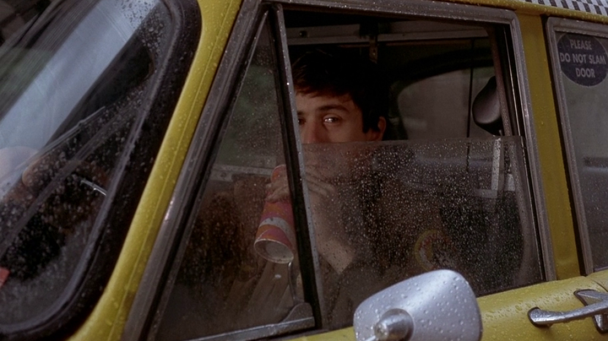

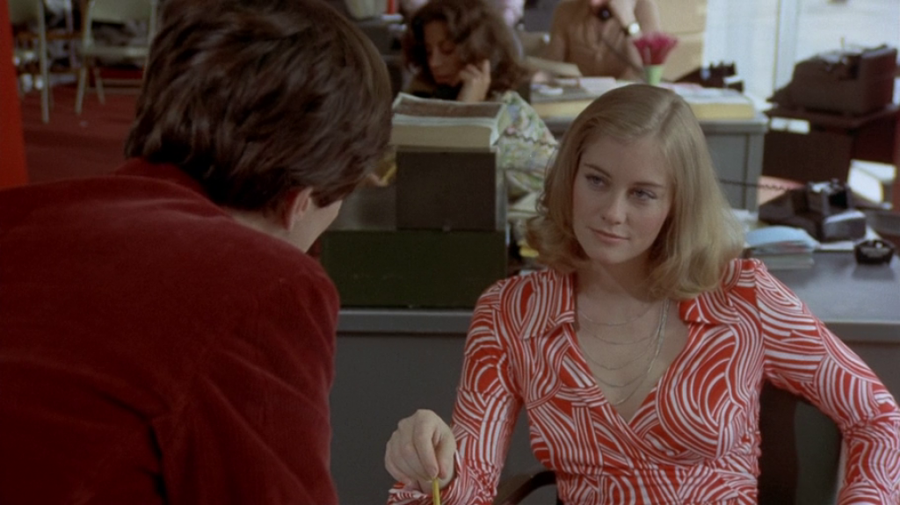

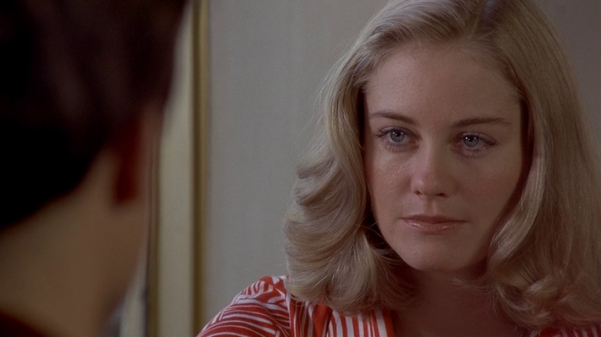

По ночам он работает таксистом. Именно в это время, как сороконожки, выползают потаённые пороки общества, воплощающиеся в проститутках и сутенёрах, убийцах и бандах подростков. И хотя он ездит по всему городу, он как будто в туннеле, где он лишь наблюдатель, как зритель порно-фильмов с затуманенным взором, с водой стекающей по стеклу, а управляет всем пассажир сзади.

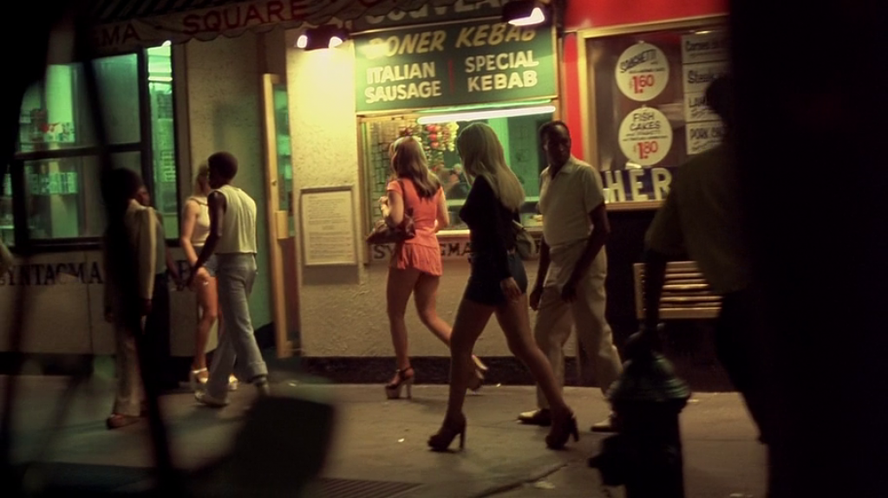

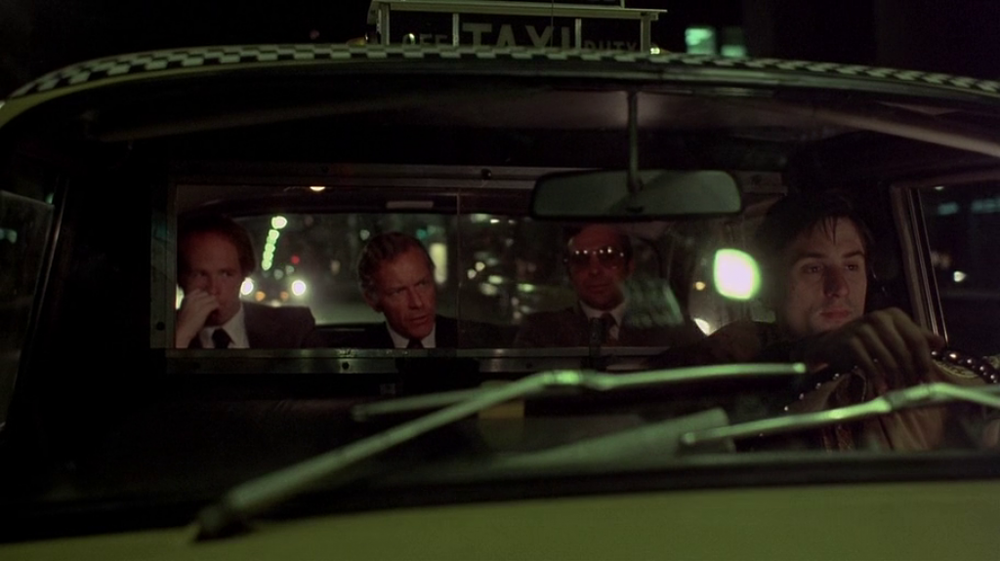

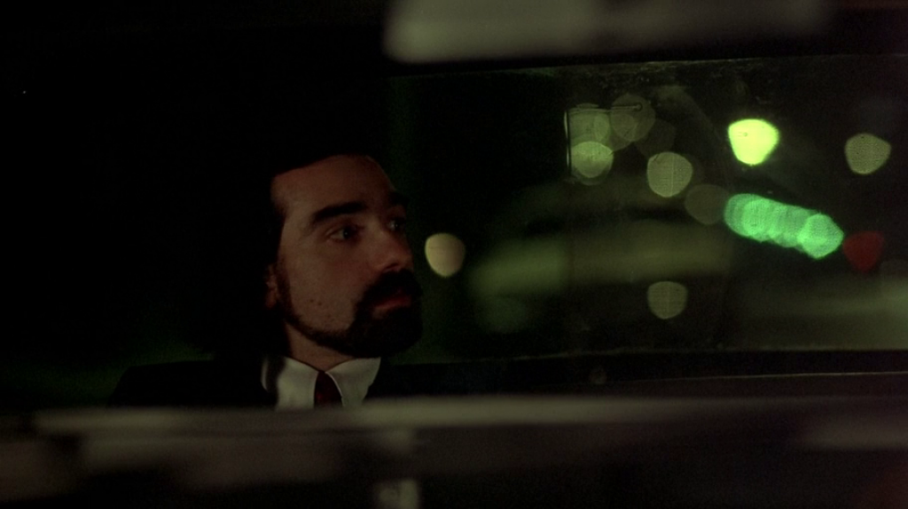

Трэвис не хочет заниматься самокопанием, поэтому он ищет других людей, на которых можно положиться - он знакомится с Бетси, работающей в политическом штабе сенатора и даже с самим сенатором, но последний слишком далёк от проблем улицы. 

---

В одну из поездок, символично выглядят полученные 20 долларов от сутенёра. Как будто изолированный корпусом машины, внутренний мир этого наблюдателя был пробит, подкуплен, одурманен и заражён теми же нечистотами.
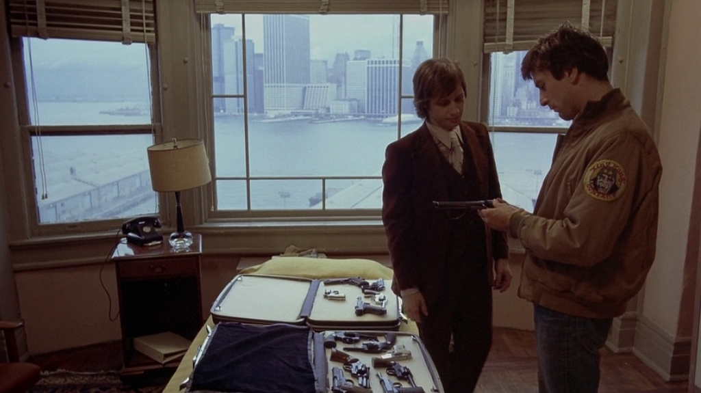

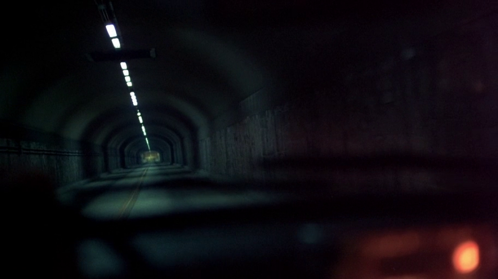
С Бетси просто неловкая история получается, но это предсказуемо потому что по её же словам, она работает на "промывание мозгов", а следовательно она тоже грешна. Впрочем участие женского фактора, подталкивает его к самоорганизации, укреплении внутреннего авторитета, увеличении требований как от себя, так и от окружающей среды. Причём радикально.

На фоне этой внутренней эволюции идёт политическая кампания и всё что видет зритель не случайно. Символично обсуждение ударения в девизе "We are the people". Можно сделать ударение на первое слово - тогда **мы** люди, а вокруг - чернь, которая должна быть очищена. На втором слове мы будем говорить о процессе, что мы боремся за то что-бы быть людьми. Наконец, люди - это правда те, кем мы хотим быть? Теми грешниками без разбора, не стремясь к чему-то выше? Говорить на выборной речи об инфляции и вероятности победить? Смириться со своей грешностью?
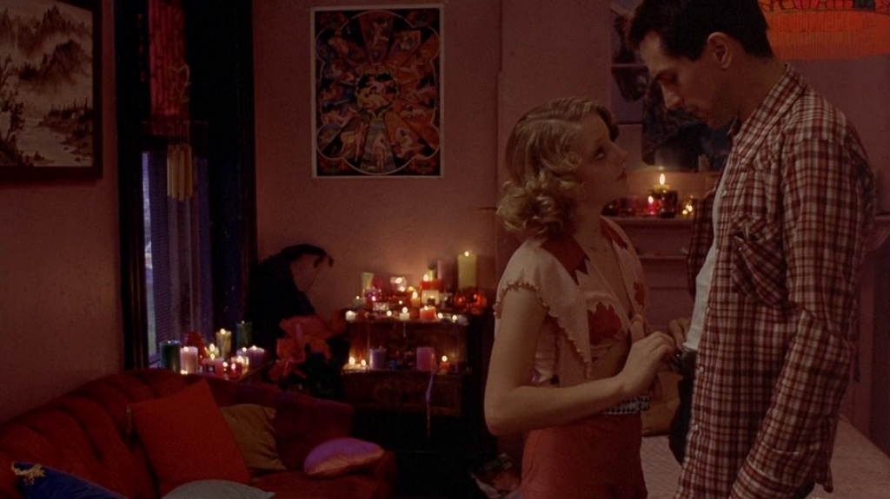

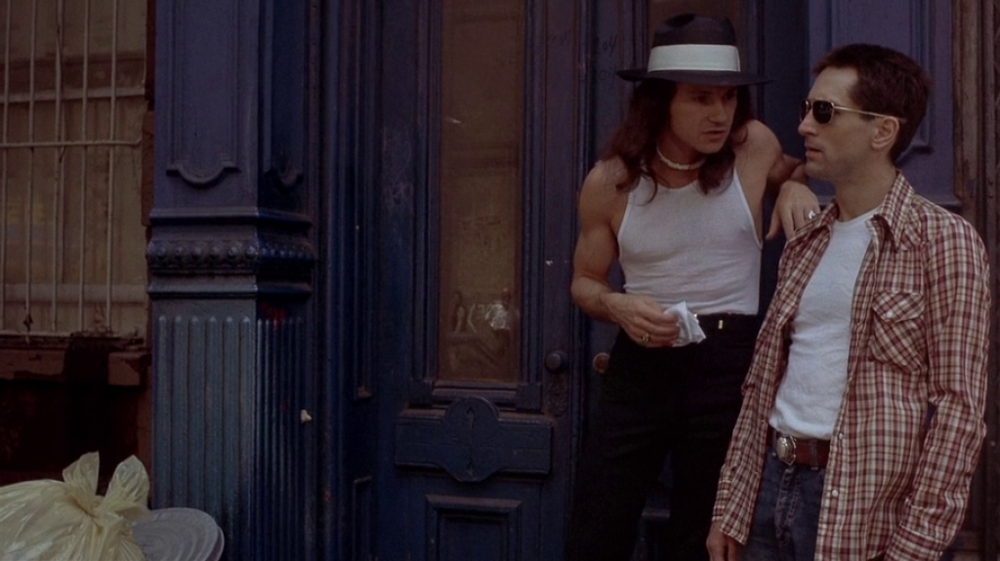

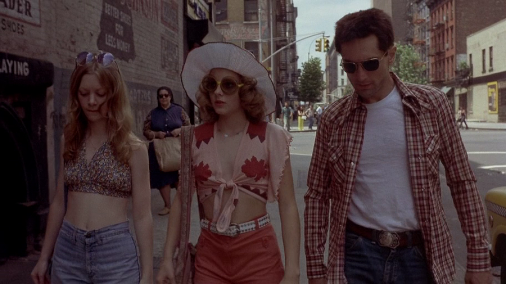

Продолжая ту историю с сутенёром, Трэвис встречает юную проститутку Айрис, которая вроде как хотела завязать. Он пытается уговорить её на это, как будто от этого зависит его внутренний мир. Грязные деньги возвращаются.

Понятно что кульминация фильма может быть пессимистической - и дейстивтельно, кто ответсвеннен за всё что вокруг творится раз не сенатор, или может вся концовка на самом деле просто больная фантазия? Может быть реалистичной - это ведь всего лишь поездка со взрослением и то как все себя ведут влияет на неё. А может быть оптимистичной, что если вырвать сорняки, то плоды станут здоровей.

Это хороший фильм, потому что он одновременно находится во всех состояниях и каждый видит то что хочет увидеть - именно поэтому последнее взаимодействие в фильме - это зеркало. Именно заглянув в себя, зритель видит ту концовку, которая вышла

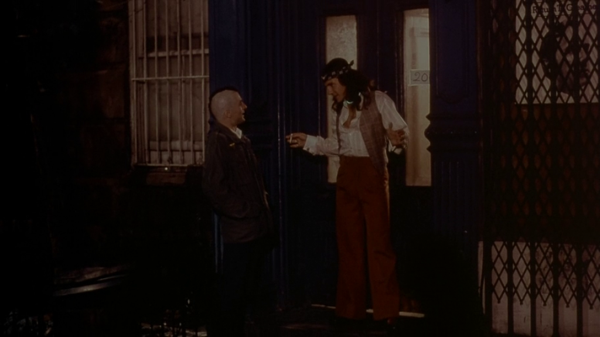

