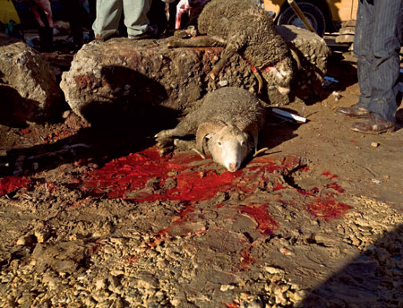
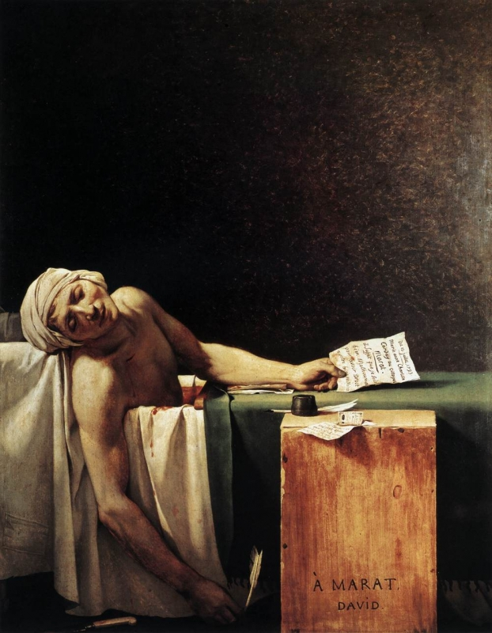

# Избранность
воскресенье, 7 февраля 2010 г. в 00:06:19

> Избранность — атрибут скромности

**Избранность** происходит от славянского «берѫ», близко к «бремя» и англ. «burden» со смыслами ношы, рождения, награды. Тоесть получается что избранный это человек рождённый впереди своего времени, острие всего общества и его будущее. Впрочем всегда возникает вопрос.. если избран, то **кем**? Для какой **цели**? А что будет **после** её достижения?

Христос пожалуй самый известный избранный на всей планете с целью сообщения евангелия. Впрочем и до и после было множество пророков больших и малых, множество судей и царей, мудрецов и целителей. И ведь наверняка они с детства считали себя _особенными_. Но что там один человек.. целые правительства и народы пророчили себя избранными — евреи, нацисты, США. Свои миссии — связь с Богом, господство рейха, распространение свободы.  

Я уж не говорю про тему избранности к которой аппелируют в литературе и кино — Нео (свобода от машин), Скайуокер (свобода от диктатуры), Поттер (свобода от крови). А уж в компьютерных играх избранные все — каждый призван спасти мир от вселенского зла, убивая избранных таких же как он. Абсурд, но кто откажется быть особенным?

### Жертва и память
Так или иначе, избранный практически всегда должен умереть как **жертва**. Нельзя же выбрать из стада худших овец надеясь что судьба мира от этого успокоится. Но не стоит путать смысл намеренной жертвы и случайной смерти. Они очень близки для общества, и порой как-будто ожидаются — раз _звезда_, значит умрёшь молодым (Миронов, Гагарин, Кобейн, Цой), как-будто охотники путешествуют во времени и убивают их что-бы те не испортили ничего в будующем. Но всё-таки это разные вещи.  

Случайность конечно нельзя исключить из Божьего промысла и «тайного желания общества» — Кеннеди, Мартин Лютер Кинг, царская семья Романовых... все погибли как жертвы своего времени. И знаменовали собой новую эпоху в сознании людей. Но это случайные жертвы — «революция пожирает своих детей».

Намеренная жертва напротив, связана с полуосознаваемой **виной** общества, со сложившимися обстоятельствами. Объект жертвы должен искупить вину перед судьбой, исправить ошибку. Не явно разумеется — жертва это **отпечаток в памяти**, как чёрно-жёлтое сочетание цвета в природе. «Мы, советский народ, приносим в жертву 25 миллионов человек потому что ошибались когда думали о мировом пролетариате, великой революции и подготовке к массовой войне». Да и Цусима — жертва империализма. Просто напоминание поколениям, что это плохой путь развития, делайте по-другому.

Жертва конечно может быть и вынужденной — кто знает, может и некоторые _теракты_ проводятся спец-службами в качестве **повода**.. как то делалось во время зимней войны или при захвате Польшы нацистами. Эдак уколишь себя, а потом не стыдно противнику кости переломать.

  

### Альтруизм  

Подумать только — живёт какой-нибудь ацтек, знает и ждёт когда его принесут в жертву богам! Драма не в том что он умрёт, а в том что умрёт раньше, как какой-нибудь мусульманский «свидетель веры» за свободу Палестины. И он не убежит, а будет жить только ради этого дня, а скажешь что боги отказались от его жертвы — и у него всё мироздание рухнет.. как так? а зачем тогда я?  

Связь жертвы и избранности настолько сильна, что люди идут и хотят _самопожертвования_ ради того что-бы показать свою особенность. Смотришь так иной фильм с героями, выходишь на улицу и всё тускло и никому не нужна жертва. А спасёт героически какой-нибудь негр упавшего на ж/д пути ребёнка и думаешь.. «повезло ему, смог проявить себя» и тут же одёргиваешь себя.  

Практически все священные писания перед собой ставят одну цель — **баланс** человека и общества. Эго и сверх-я если хотите. Избранный по природе **не может** быть эгоистом, соответсвенно он кроткий, покорный, смиренный перед обществом, но парадоксально упорный в достижении своей **миссии**. Хорошие примеры этих качеств и воплощения древних инстинктов среди детей— «Повелитель мух», напоминающий о языческом Вельзевуле и советское кино «Чучело».

### Связь  

Вторая главная характеристика избранного —абсолютная уверенность в своей правоте. Эта черта может вытворять такие творческие чудеса и так угнетать закостенелых врагов, что для правильного ориентирования в жизни приходится ощущать сверхъестественное — чтение знаков по самым малейшим движениям духа. Жанна д'Арк например, или практически любой юный пианист-вундеркинд, или любой знаменитый правитель избежавший как по волшебству десятки покушений.  

Третья важная составляющая избранности как я уже замечал — судьба, предопределённость. Врядли мы узнаем природу времени, однако всякий избранный идёт по заранее продуманному пути. Для кого-то кажется его путь просто совпадением, для кого-то — мистикой

