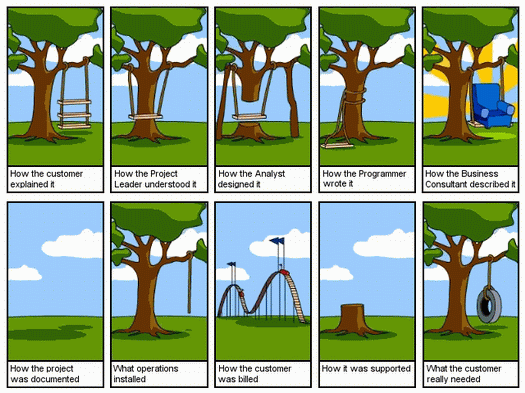

воскресенье, 18 марта 2007 г. в 01:04:09

Несомненно в мире множество фирм в каждой из которых принят некий обычай как проект надо делать, а для этого созданы всевозможные процессы развития проекта типа [waterfall](http://en.wikipedia.org/wiki/Waterfall_model), [spiral](http://en.wikipedia.org/wiki/Spiral_model), [RUP](http://en.wikipedia.org/wiki/Unified_Process) и тд.

Попробую изложить, как на моём опыте обычно ведётся IT-проект (CMS, CRM, intranet, custom-инфосистема) или как бы этого хотелось в идеале.

### Общение с клиентом

Как правило самая важная техническая часть это узнать разделы проекта, что-бы примерно понять насколько он сложен. В остальном клиенту вешают лапшу на уши, что-бы он остался доволен переговорами и согласился на договор. Показывают как работает фирма, показывают портфолио и слеланные работы. Намечают следующую встречу, где уже более детально всё прорабатывается

### Раннее проектирование

Управляющий проектом создаёт [техническое задание](http://www.antula.ru/tz-examples_1.htm) того, что хочет клиент. 

- Может помочь использование brain-storm методики при разговором с клиентом, запись в [MindMeister](http://www.mindmeister.com/), [MindManager](http://www.mindjet.com/eu/), [Freemind](http://v-kostin.blogspot.com/2007/10/mind-maps-freemind.html), что-бы как можно подробней зарисовать пожелания.
- Нельзя использовать неопределённости размера, времени, пользователей
- Нельзя выдумывать новые понятия, не определив их заранее.

---

### Архитектурный анализ

Что-бы понять процессы в нужной системе, проводится нормализация регистров и их соединения, т.е. того что в будующем станет таблицами БД. Делается прототипный макет экранов будующего приложения. При этом помогают UML диаграммы из [MS Visio](http://en.wikipedia.org/wiki/Microsoft_Visio), [Visual paradigm](http://www.visual-paradigm.com/download/) , [OmniGraffle](http://www.omnigroup.com/applications/omnigraffle/).

Аналитик просматривая техническое задание составляет анализ системы с точки зрения программиста - какие части системы надо разработать, какая структура меню/модулей, какие примерно будут множества данных (на основе которых будут созданы таблицы БД), какие части уже реализованы.

Самая важная цель - сказать сколько займёт по времени проект, соответсвенно сколько он стоит. На этой стадии можно начать создавать план проекта в [MS Project](https://kurapov.ee/article/plan_microsoft_project/) с учётом свободных рук.

### Дизайн интерфейса

Если на анализе фирма сэкономила (как правило так и случается), то весь груз ложится на управляющего проекта, или что ещё обыкновенно - на программиста и дизайнера. Прототип интерфейсов в этом случае играет большую роль.

Часто для сайтов под ключ или для стартапов красивый дизайн пропускается, разработка сразу идёт к функциональной части.

### Программирование

Если проект идёт по чёрному сценарию и программисту приходит только техническое задание без деталей и руководство настаивает на такой дешивизне, то разработку после установки платформы как правило начинают со структуры меню или авторизации пользователей.

Как правило в этой фазе приходит и запоздавший дизайн, после установки которого встаёт вопрос по безопасности и пункты ТЗ просматриваются более детально:

- Есть ли отдельные пользователи, группы, привилегии? Надо ли их реализовывать дополнительно в платформе?
- Особые требования к безопасности/скорости/нагрузке?

К этому моменту костяк работает и работа переходит до уникальных частей сайта, которые надо писать с нуля

### Отдельные модули  

При огромных БД или если проект вероятно будет развиваться в будующем, то полезно создать визуальную диаграмму, показывающую связи таблиц. Для этого используются [mysql workbench](http://dev.mysql.com/downloads/gui-tools/) , [DB designer](http://fabforce.net/dbdesigner4/), [Open Sys Architect](http://www.codebydesign.com/SystemArchitect/downloads/), [DB viz](http://dbvis.org/products/dbvis/)

Дополнительные наработки занимают как правило 50-70% от всего времени разработки и нуждаются в хорошей отладке и документировании. Эти работы так-же сильно разнятся в техническом плане и имеют большой коэффициент риска

### Отладка

На этом шаге очень полезно вести учёт прогресса мелких задач. В этом вам помогут как системы ведения баг-учётов - Bugzilla, [Trac](http://trac.edgewall.org/), [Mantis](http://www.mantisbt.org/) так и банальная таблица багов в Excel со своими статусами и приоритетами. Очень важно иметь человека проверяющего задания программиста — разделение задач в этом плане играет хорошее дело, доводя качество продукта до совершенства. При этом программист не будет чуствовать что он делает чужую работу, критикуя дизайнера — за него это сделает тестер (QA-engineer)

### Версионность и документация

Если проект достаточно велик, что имеет смысл вести историю его развития, то используется [SVN](http://en.wikipedia.org/wiki/Subversion_(software)) -система, где подобно FTP сохраняются все изменения в файлах проекта. [Документирование](https://kurapov.ee/article/project_documentation/) в свою очередь делается достаточно редко