понедельник, 21 ноября 2022 г. в 00:34:12


Картинка с dgraph.io

Программисты любят хорошие истории, поэтому надеюсь что пятилетний путь к композитному API с помощью GraphQL в боевой среде (на пике выдающей 110 запросов в секунду при 100мс задержке) будет интересен.

[Если вы спешите, проскрольте ниже к _урокам_ и гляньте на открытый код [graphql-schema-registry](https://github.com/pipedrive/graphql-schema-registry)]

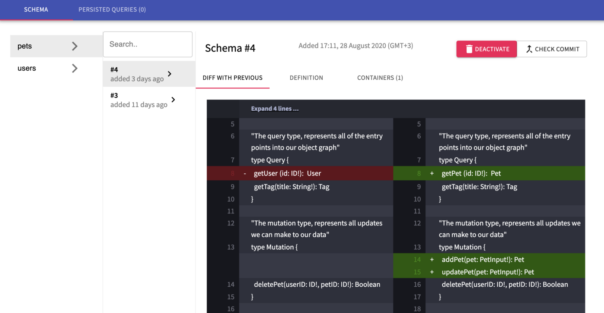

schema registry с примером тестовой схемы

## Задача

Годами, [Pipedrive](https://www.pipedrive.com/) (которому в начале 2020 стукнуло уже 10 лет), давал публичный [REST API](https://developers.pipedrive.com/docs/api/v1/) где были и недокументированные пути для нашего веб приложения. Один из них /users/self, который изначально задумывался для загрузки информации о пользователе, нормально с течением времени стал грузить все что надо для первой загрузки страницы, доходя до 30 разных типов сущностей. Сам он выдавался PHP монолитом, который по натуре синхронный. Мы [пытались его распараллелить](https://medium.com/pipedrive-engineering/how-two-developers-accelerated-php-monolith-in-pipedrive-df8a18bc2d8a), но неудачно.
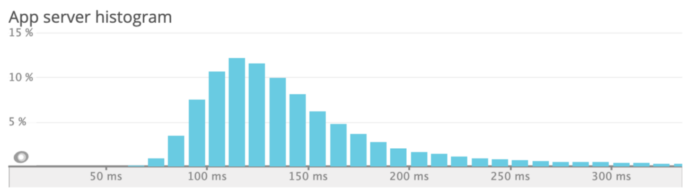
/users/self распределение задержки для оставшегося траффика

С точки зрения поддержки, каждое новое изменение все больше усложняло код и никто не хотел владеть этой огромной функцией.

## Прототип с прямым доступом к БД

Давайте вернемся назад в прошлое, когда наши разработчики стали экспериментировать с graphql.

Года 3-4 назад, в команде разработки [рынка приложений](https://marketplace.pipedrive.com/), я услышал от [Паши](https://twitter.com/bashmach), нашего фулл-стек разработчика новенькие для меня термины - [elixir](https://elixir-lang.org/) и graphql. Он участвовал в тестовом проекте в котором напрямую работал с MySQL и выдавал основные сущности Pipedrive по /graphql.

На локальной машине работало прекрасно, но это не масштабировалось на весь код, потому что функционал - не обычный CRUD, а весь монолит переписывать никто не хотел.

## Прототип со склейкой

Переносимся в 2019, когда я заметил еще один тестовый репозиторий от другого коллеги, который стал использовать GraphQL stitching с определением сущностей с помощью [graphql-compose](https://github.com/graphql-compose/graphql-compose) и резолверами которые делали запрос уже к нашему REST API. Как можете представить, это уже было значительным улучшением, потому что нам не надо было переопределять всю бизнес-логику и graphql становился просто приятной оберткой.

Из недостатков этого решения:

- **Производительность**. Небыло [dataloader](https://github.com/graphql/dataloader)'а, поэтому был риск N+1 сетевых запросов. Небыло ограничения сложности запроса и какого-либо промежуточного кеширования.
    
- **Управление схемой**. При склейке типов, мы определяли все сущности в одном репозитории, отдельно от самих сервисов которые этими даннами владеют. Это усложняло деплой - приходилось бы писать обратно-совместимые изменения, что-бы избегать несовпадения схемы и функций.
    

## Подготовка

В Октябре 2019, я стал готовиться к [миссии](https://www.youtube.com/watch?v=ekKp-tA0A9k), которая превратила бы прошлое решение в рабочее с помощью Apollo федерации, которая [вышла чуть ранее](https://www.apollographql.com/blog/apollo-federation-f260cf525d21/) в этом же году. Кроме того, результат приземлился бы в команде _Core_, которая стала бы поддерживать его в долгосрочной перспективе.

## Сбор ожиданий разработчиков

В компании некоторые разработчики были довольно скептичны и предлагали построить свое решение просто склеивая запросы воедино, отправляя по POST и надеясь на свой gateway который будет распараллеливать обработку.

Другие считали что graphql еще слишком сырой что-бы использовать в жизни и лучше подождать. Третьи предлагали рассмотреть альтернативы, типа Protobuf и Thrift, а в качестве транспорта рассмотреть [GRPC](https://grpc.io/), [OData](https://www.odata.org/).

Четвертые напротив, на полном ходу писали graphql под одиночные сервисы (insights, teams) и выкатывали в лайв, однако не могли повторно использовать сущности (например User). В [Праге](https://www.pipedrive.com/en/jobs/czech-republic) ребята написали все на typescript + [relay](https://relay.dev/) на фронтенде, который нам еще предстоит [перенести в федерацию](https://github.com/apollographql/apollo-server/issues/3159).

Изучать новую технологию было круто.

Строгий, само-документирующийся API для фронтендеров? Глобально определяемые сущности уменьшающие дублирование и улучшающие прозрачность и владение среди всех команд? Gateway который автоматом делает под-запросы и между сервисами без избыточной выборки? Ухх.

Впрочем, я знал что нам понадобится управлять схемой как-то динамически, что-бы не полагаться на захардкоженые значения и видеть что происходит. Нечно типа [Confluent’s schema-registry](https://docs.confluent.io/current/schema-registry/index.html) или [Atlassian’s Braid](https://bitbucket.org/atlassian/graphql-braid/src/master/), но они либо под Кафку делались, либо на Java, которую мы не хотели поддерживать.

## План

Я выступил с инженерной миссией у которой было 3 цели:

- Уменьшение первичной загрузки страницы (_воронка продаж_) на 15%. Достижимо если заменить некоторые REST запросы в один /graphql
    
- Уменьшение траффика на 30%. Достижимо если перенести загрузку всех _сделок для воронки продаж_ в graphql и спрашивать меньше свойств.
    
- Использовать строгую типизацию (что-бы фронтендерам надо было писать меньше кода в [защитном стиля](https://en.wikipedia.org/wiki/Defensive_programming))
    

Мне повезло, [трое разработчиков](https://github.com/pipedrive/graphql-schema-registry#honorable-mentions) присоединились к миссии, в т.ч. автор прототипа.

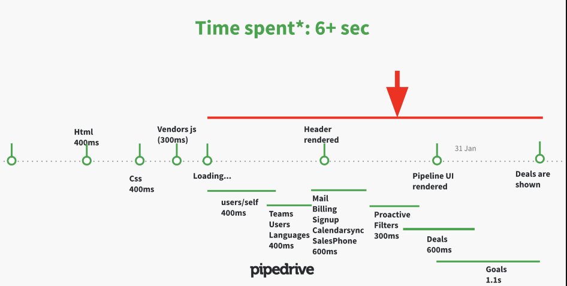

Сетевые запросы по мере загрузки веб-приложения

Изначальный план по сервисам выглядел так:
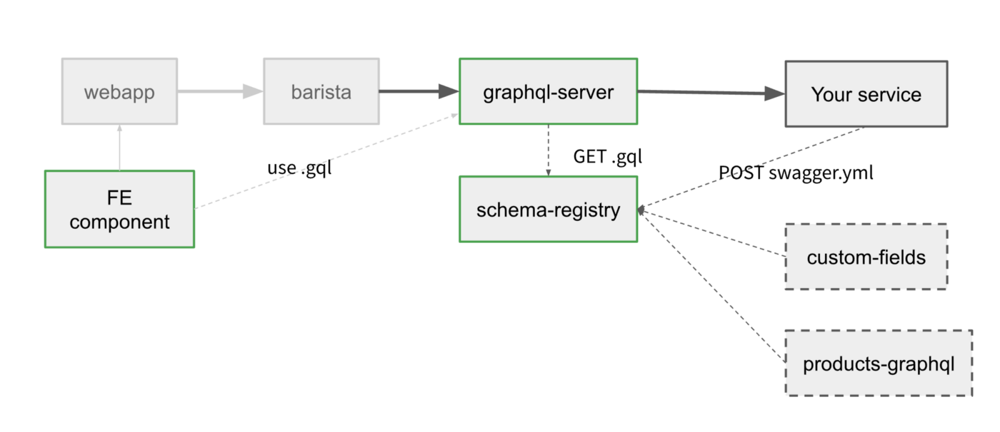

Сервисы над которыми предстояло бы работать

Тут schema-registry был бы общим сервисом, который мог бы хранить схему любого типа, получая на входе что вы в него кинете (swagger, typescript, graphql, avro, proto). На выходе он мог бы так же выдавать что вы хотите.

Gateway периодически опрашивал бы schema-registry и вызывал бы уже сервисы которые владеют данными согласно запросу и схеме. В свою очередь frontend компоненты могли бы скачивать актуальную схему для autocomplete и самих запросов.

На деле впрочем, мы сделали только поддержку graphql формата, потому что для федерации его было достаточно, а время как обычно быстро закончилось.

## Итоги

Главную цель по замене /users/self в веб-приложении мы сделали в течение первых двух недель ? (ничоси!). А вот полировка всего решения что-бы оно быстро и надежно работало, заняло все оставшееся время.

К концу миссии (в феврале 2020), мы каким-то чудом достигли 13% ускорения первой загрузки страницы и 25% ускорения при повторной загрузке (из-за добавленного кеширования), согласно синтетическому UI тесту который мы гоняли на [Datadog](https://www.datadoghq.com/).

Уменьшить трафик нам не удалось, потому что мы не достигли рефакторинга вида воронки продаж - там все еще REST.

Что-бы ускорить добавление сервисов в федерацию другими командами (у нас 600+ человек), мы записали обучающие видео что-бы все были в курсе как оно все работает вместе. После окончания миссии IOS- и Android- клиенты тоже мигрировали на graphql и в целом были рады.

## Выученные уроки

Глядя на дневник миссии из этих 60 дней, могу выделить наибольшие трудности что-бы вам было бы попроще

## Управляйте своей схемой

> _Могли бы мы построить это сами? Возможно, но это не было бы так отполировано.  
> _[_Mark Stuart, Paypal Engineering_](https://medium.com/paypal-engineering/scaling-graphql-at-paypal-b5b5ac098810)

В течение первых пары дней я попробовал [Apollo studio](https://studio.apollographql.com/) и их [инструментарий](https://www.apollographql.com/docs/studio/schema-checks/#the-check-process) для терминала по проверке схемы. Сервис прекрасный и работает из коробки с минимальными настройками gateway.


Написанный нами инструментарий для валидации схемы

Однако несмотря на все фишки этого облачного сервиса, я посчитал что для такого важного дела как маршрутизация траффика было бы опрометчиво полагаться на сторонний сервис из-за рисков для жизнеспособности нашего дела, несмотря на богатый функционал и сколько-то выгодные расценки. Поэтому мы написали свой сервис с минимально нужным функционалом и теперь отправили его в opensource -  [**graphql-schema-registry**](https://github.com/pipedrive/graphql-schema-registry) .

Вторая причина была в том что-бы следовать модели [распределенной архитектруры датацентров](https://medium.com/pipedrive-engineering/tanker-the-story-of-multi-dc-customer-data-migration-framework-ad842c2c6b9c) Pipedrive. У нас нет центрального датацентра, каждый DC самодостаточен. Это дает нам как более высокую надежность, так и способность открывать новые датацентры в Китае, России, Иране или на Марсе ?

## Версионируйте свою схему

Федеративная схема и graphql gateway очень хрупкие. Если у вас появится конфликт имен у типов или неверная ссылка между типами в одном из сервисов, то gateway может этого не пережить.

По умолчанию, gateway напрямую [опрашивает все сервисы](https://www.apollographql.com/docs/apollo-server/federation/introduction/#gateway-example) касательно их схемы, поэтому достаточно одного из сервисов с ошибкой что-бы поломать всем трафик. Apollo studio решает это посредством проверки схемы еще до деплоя и отказе если видит какой-то конфликт.

Проверка совместимости схем правильный подход, но конкретное решение у Apollo зависит от их внутреннего состояния, т.к. они хранят правильную склеенную схему на данный момент. Это делает [протокол регистрации](https://www.apollographql.com/docs/studio/schema/schema-reporting-protocol/#protocol-sequence) сложным и [зависящим от времени](https://www.apollographql.com/docs/studio/schema/schema-reporting/#rolling-deploys-with-schema-reporting).

Мы же напротив, связали версии микросервисов (генерируемые на основе хешей докер-образов) со схемой. Микросервисы регистрируют уже в ходе своей работы и делают это один раз без [последующих повторений](https://www.apollographql.com/docs/studio/schema/schema-reporting/#rolling-deploys-with-schema-reporting). Gateway делает выборку всех федерированных сервисов из [консула](https://www.consul.io/) и спрашивает schema-registry составить схему /schema/compose , предоставляя их версии.

Если schema-registry видит что предоставленные версии несовместимы, она откатывается на прошлые версии
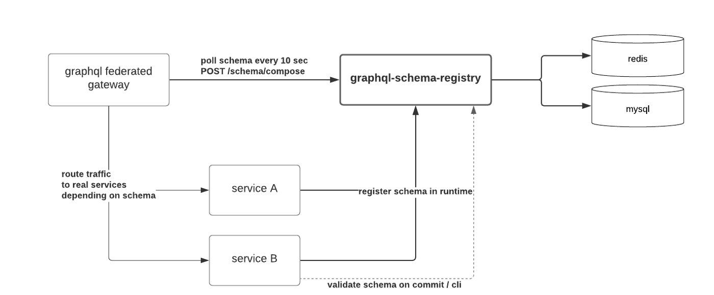
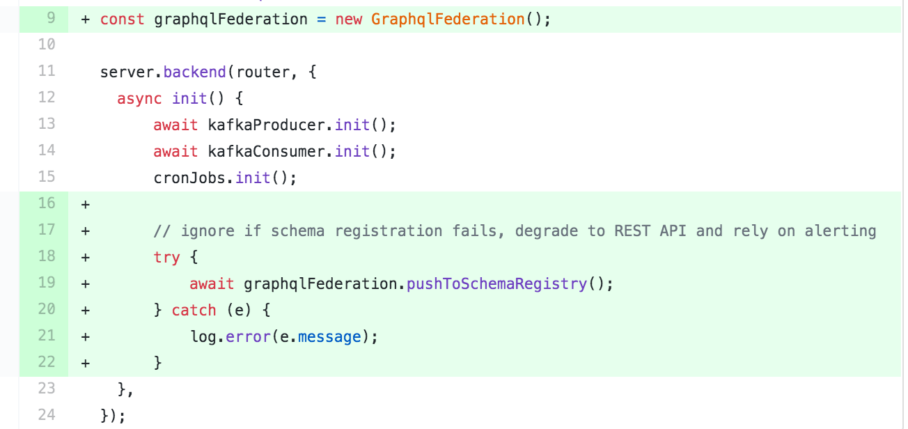

Регистрация схемы при старте сервиса

Микросервисы могут выдавать как REST так и Graphql API, поэтому мы используем оповещения тревоги при неудачной регистрации схемы, оставляя при этом работу REST.

## Определение схемы на основе REST не просто

Поскольку я не знал как лучше перенести схему из нашего REST в graphql, я сначала попробовал [openapi-to-graphql](https://github.com/IBM/openapi-to-graphql), нормально наша документация на тот момент не имела детального описания запросов и ответов.

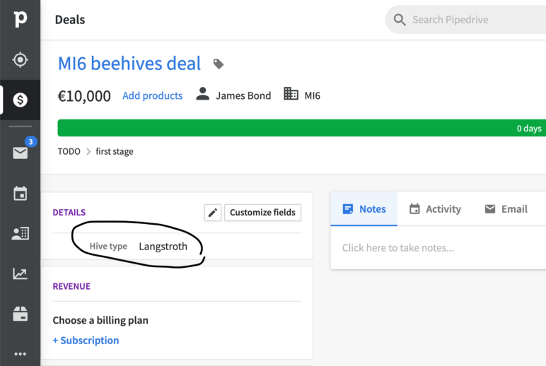
Спрашивать у каждой команды что-бы они написали бы ее, очевидно заняло бы уйму времени, поэтому мы определили основные сущности сами ? просто глядя на ответ при разных REST запросах.

В дальнейшем это нам аукнулось, так как оказалось что REST API иногда зависит от того кто делает запрос, либо зависит от внутреннего состояния и логики.
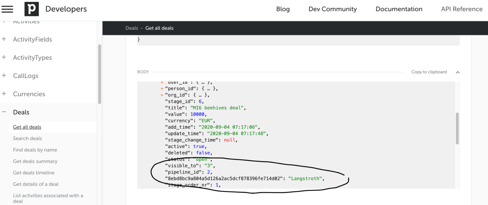

Например после настраиваемые _поля данных_ меняют REST API в зависимости от пользователя. Если его добавить к сделке, то он оно будет выдаваться с ключем-хешем на уровне deal.pipeline_id. С федеративным graphql, динамическая схема невозможно, поэтому нам пришлось передвигать эти настраиваемые поля в отдельный список

Другая проблема это стиль наименований в json-ответе. Мы хотели поддерживать верблюжийСтиль, но почти весь REST отвечал нам в змеином_стиле, пришлось пока остаться на смешанном.

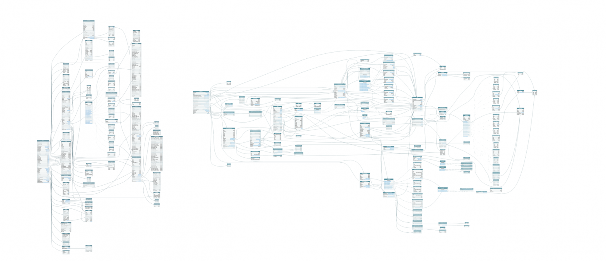

федеративный граф данных Pipedrive (слева) с 2 сервисами (из 539) и еще-не-федеративный граф сервиса leads (справа)

## CQRS и кеш

Модель данных в Pipedrive не может полагаться на простой TTL-кеш.

Например, когда инженер поддержки создает глобальное оповещение о предстоящем техническом обслуживании приложения из нашей админки, он ожидает что сообщение будет сразу же видно пользователям. Эти глобальные оповещения могут быть адресованы как всем пользователям, так и конкретным компаниям и индивидуальным людям. Чистить такой кеш приходится используя 3 разных ключа.

Что-бы делать параллельные запросы к PHP-монолиту, мы написали сервис на nodejs (назвали его monograph), который кеширует все что отвечает монолит в memcached. Этот кеш надо чистить из монолита в зависимости от бизнес-логики. Это немного антипаттерн, потому что кеш получается общим для разных сервисов и сильно их связывает.


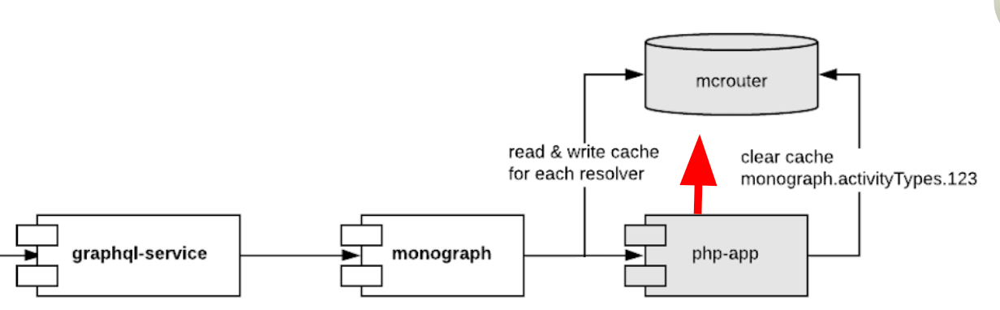

Тут можно заметить [CQRS pattern](https://martinfowler.com/bliki/CQRS.html). Впрочем, такой кеш позволяет ускорять 80% запросов и дает итоговую среднюю задержку такую же как и у монолита.

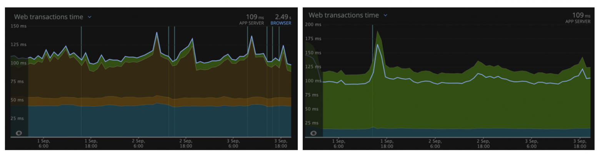

Время средней задержки ответа монолита (слева) и graphql gateway (справа) в регионе US на основе NewRelic

Еще одна сложность - язык пользователя. Как только он меняется, нам надо чистить уйму разных сущностей - от типов активности до того какие настройки должны быть при показе гугл карт. И что еще хуже - язык уже управляется не в монолите, а был вынесен в отдельный сервис _identity_. Связывать его с общим кешем очень не хотелось.

Identity владеет данными пользователей, поэтому мы сделали так что он кидает событие через kafka, которое ловит monograph и чистит все нужные кеши. Тут есть недостаток, что событие приходит с задержкой (может максимум 1 сек), поэтому чистка кеша происходит не мгновенно. Нормально это не критично, потому что пользователь не так быстро уходит со страницы что-бы сделать повторный запрос к бекенду и заметить что в кешах еще старый язык.

## Следите за производительностью

Производительность была главной целью и для этого нам пришлось хорошо прокачаться в знании APM и выслеживании распределенных запросов между микросервисами что-бы определить самые медленные места. Мы на тот момент использовали Datadog и он хорошо себя зарекомендовал.

Для ускорения, мы кешировали все 30 параллельных запросов в memcached. Но по ходу дела возникали проблемы. Например на картинке слева видно что некоторые резолверы делают запрос в memcached и получают ответ за 10мс, а другие тупят, словно жду своей очереди выростая до 220мс. Как оказалось, это было из-за того что я использовал один и тот же хост [mcrouter](https://github.com/facebook/mcrouter). Как только я стал их ротировать, мемкеш стал отдавать все за 20мс максимум.

Что-бы уменьшить количество этих сетевых запросов к мемкешу, мы склеили его в один используя [getMulti](https://github.com/3rd-Eden/memcached#public-methods) функцию. Получается что несмотря на то что все resolver'ы выполняются независимо, они блочатся на 5мс с помощью debounce и склеиваются воедино.

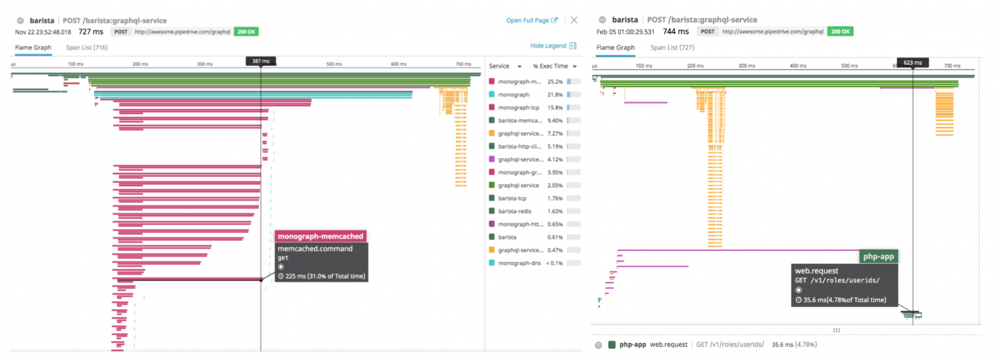

На картинке справа видна другая проблема. Эти желтые линии это налог graphql gateway на приведение данных к строгому типу. Причем чем больше данных вы гоняете через сервис, тем дольше будет эта фаза выполнятся.


Вобщем по ходу миссии постоянно приходилось мониторить какие же запросы нам надо еще закешировать и под конец стало бесить что скажем 28 из 30 запросов прекрасно кешируются, а оставшиеся два мало того что отвечают целых 500мс, так их еще и невозможно легко закешировать.

Нам пришлось вынести их в отдельный graphql запрос, который делается после первого /graphql запроса на инициализацю страницы. Так что сейчас мы на деле делаем уже порядка 3-5 независимых запросов, в зависимости от тайминга фронтенда (там тоже debounce зависящий от параллельной подгрузки FE компонентов)

## Не следите за производительностью

Казалось бы полностью противоположный урок, но на деле это значит что в лайв-среде вам лучше отключить мониторинг приложения (APM) и [tracing:true](https://www.apollographql.com/docs/apollo-server/api/apollo-server/#apolloserver), если вы используете их.

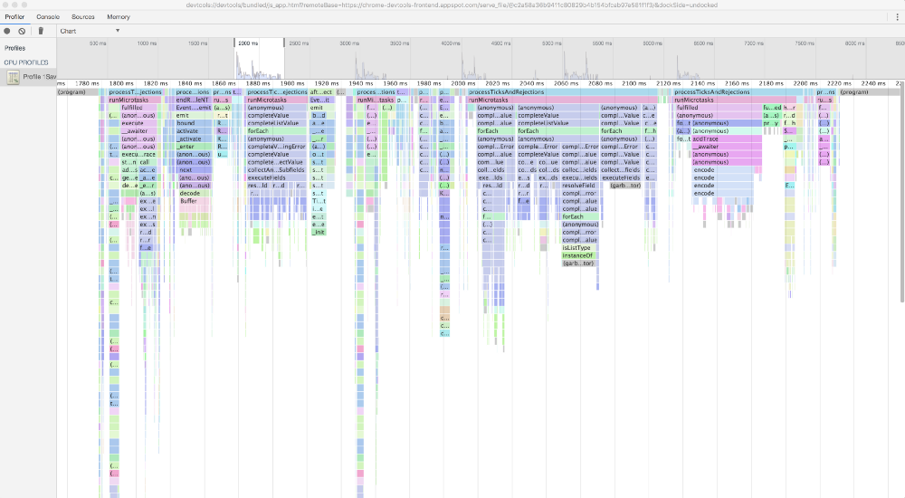

Отключение отслеживания у нас ускорило среднюю задержку в два раза с 700мс до 300мс для нашей тестовой компании. Насколько я понимаю, причина крылась в функциях которые замеряют время (типа performance.now()), которые необходимы для замера каждого резолвера.

Мы делали профайлинг graphql gateway с помощью  [Chrome DevTools](https://medium.com/@paul_irish/debugging-node-js-nightlies-with-chrome-devtools-7c4a1b95ae27), но так просто вызов этих мелких функций, раскиданных повсюду не заметишь.

[Бен тут](https://www.youtube.com/watch?v=VnG7ej56lWw) делал замеры и тоже пришел к этому.

## Попробуйте ранний запрос

На фронтенде, время создания graphql запроса для нас оказалось сложновато. Я хотел передвинуть первый /graphql как можно раньше (даже до загрузки всего кода в vendors.js) в графике сетевых запросов. Мы смогли это сделать, но веб-приложение из-за этого стало значительно сложней.

Что-бы делать запрос вам понадобится [graphql клиент](https://github.com/apollographql/apollo-client) и парсинг [gql литералов](https://github.com/apollographql/graphql-tag) для определения самого запроса. Дальше его надо либо выдавать в отдельном bundle, либо отказываться от всех удобств и использовтать сырой [fetch](https://developer.mozilla.org/en-US/docs/Web/API/Fetch_API/Using_Fetch). Даже если делать сырой запрос, дальше надо что-то делать с ответом - распределять данные по моделям либо сохранять в глобальную переменную. Вобщем мы решили отказаться от этого и надеяться на server-side-rendering и [service workers](https://medium.com/samsung-internet-dev/a-beginners-guide-to-service-workers-f76abf1960f6) в будущем.
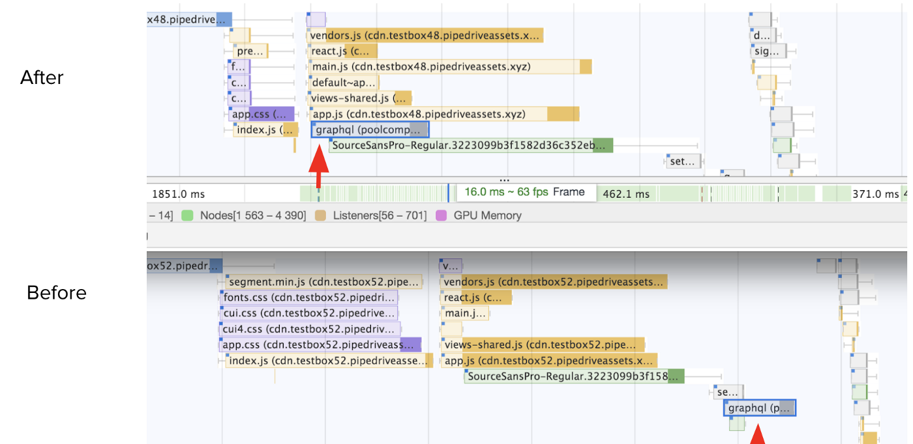

Перенос /graphql запроса левей

## Оценивайте сложность запроса

Чем graphql примечателен, так это то что тут можно оценивать насколько больно запрос клиента будет бить по инфраструктуре не делая при этом еще никакой работы. Для оценки сложности надо указывать цену внутри самой схемы с помощью директив, а дальше делать саму проверку при получении запроса и отклонять его если сложность слишком велика, подобно нашему [rate limit](https://pipedrive.readme.io/docs/core-api-concepts-rate-limiting) на частоту запросов.

Сначала мы попробовали [graphql-cost-analysis](https://github.com/pa-bru/graphql-cost-analysis) библиотеку, но в итоге написали свою, поскольку захотели больше фич - множителях при выдаче списков данных, вложенности и рекурсии, а так же определении типов влияния на инфраструктуру (сетевой запрос, БД, CPU, работа с файлами). Тут сложней всего оказалось внедрять поддержку своей директивы в gateway и schema-registry. Надеюсь мы нашу библиотеку тоже опубликуем.

## У схемы много лиц

Работать со схемой в js/typescript на низком уровне порой мучительно. Это начинаешь понимать когда пробуешь интегрировать существующий graphql сервис в федерацию.

Например настройки [koa-graphql](https://github.com/graphql-community/koa-graphql#options) и [apollo-server-koa](https://www.apollographql.com/docs/apollo-server/v1/servers/koa/) ожидают что вы создадите вложенный объект  [**GraphQLSchema**](https://github.com/graphql/graphql-js#using-graphqljs)  который включает и сами резолверы. Но федеративный apollo/server [хочет схему и резолверы отдельно](https://www.apollographql.com/docs/apollo-server/federation/implementing-services/#generating-a-federated-schema):

```
buildFederatedSchema([{typeDefs, resolvers}])
```

В другом случае, как я уже писал, вам захочется определить схему с помощью [gql литерала](https://github.com/apollographql/graphql-tag), или сохранить схему в schema.graphql файл, а когда вам надо будетделать проход по всей схеме для оценки сложности, понадобится [ASTNode](https://github.com/graphql/graphql-js/blob/master/src/language/ast.js) (и функции [parse](https://github.com/graphql/graphql-js/blob/d4c82e0849318d045107321c6655c1a5da37b798/src/language/parser.d.ts#L58) / [buildASTSchema](https://github.com/graphql/graphql-js/blob/dd0297302800347a20a192624ba6373ee86836a3/src/utilities/buildASTSchema.js#L121))

## Плавная canary деплой

Во время миссии мы выкатывали изменения сначала всем разработчикам что-бы отследить очевидные ошибки.

Под конец миссии в феврале, мы выкатили graphql только на 100 компаний-"везунчиков". Дальше мы медленно выкатывали их до 1000 компаний, потом 1%, 10%, 30%, 50% и наконец в июне выкатили всем.

Деплоили мы просто используя логику деления company ID без остатка. В дополнение, у нас было несколько настроек - кому еще включать, кому не включить никогда и рубильник выключающий graphql сразу у всех на фронтенде. Было очень полезно во время инцидентов сразу избавиться от подозрений что это все из-за нового graphql и упростить дебаг.

Учитывая насколько большие изменения мы делали, это был хороший опыт быстро получить обратную связь, найти баги (с кешированием), при этом снизив риски для большинства пользователей.

## Надежды и мечты

Что-бы достичь всех плюшек от того что graphql может нам дать, надо еще много что поменять - добавить мутации, подписки, массовые операции на уровне федерации. Все это требует работы с командами и евангелизм что-бы увеличить количество федерируемых сервисов.

Как только наш graphql API станет стабильным и достаточным для использования любыми пользователями, его можно выкатить в качестве второй версии нашего API. Для публикации впрочем понадобятся еще директивы для ограничения доступа к сущностям согласно [OAuth видимости](https://oauth.net/2/scope/) (для приложений из рынка) и согласно нашим [продуктам](https://www.pipedrive.com/en/pricing).

В самой schema-registry надо добавить отслеживание клиентов, связать ее gateway для получения аналитики трафика что-бы проще было понять какие поля можно удалять, надо добавить фильтрацию и подсветку сущностей в зависимости от директив цены и видимости, валидировать именование, хранить постоянные запросы (persisted query), публиковать историю изменений итоговой схемы для сторонних разработчиков.

Кроме того, поскольку у нас есть сервисы на go, еще непонятно как стоит делать внутренний трафик - стоит ли использовать GRPC из-за скорости и надежности, либо использовать независимые graphql эндпоинты, либо ставить централизованный внутренний gateway. Если GRPC лучше только из-за его бинарности, может мы можем написать библиотечку которая тоже упакует graphql данные с помощью [msgpack](https://msgpack.org/)?

Что касается внешнего мира, надеюсь Apollo со своим [проектом Constellation](https://www.youtube.com/watch?v=MvHzOwdLb_o) ускорят обработку запроса на Rust что-бы небыло этих 10% налога на производительность и смогут федерировать graphql сервисы без серьезных изменений последних.

Вобщем прекрасное время что-бы наслаждаться разработкой где уйма сложности!
