среда, 4 апреля 2012 г. в 21:02:30

Лет пять назад, когда я ещё в армии был, купил я себе дешёвенький лаптоп Toshiba satellite. По уровню развития можно сказать что 128 мб оперативки позволяли запускать максимум Windows XP. Время шло, он хорошо отслужил мне в университете в качестве доступа в интернет и записной книжки.

Продавать лаптоп смысла нет - за два года он теряет в цене чуть ли не в десять раз. Поэтому я его решил поставить в качестве домашнего сервера на кухне, что-бы не шуметь. Подключил к нему такой же старенький внешний диск на 300 гб, поставил utorrent, открыл web-доступ, настроил пересылку портов на рутере, поставил dyndns и лёгенький фтп-сервер и вуаля - можно с любого места добавить что-то на загрузку.

Единственная проблема - слишком шумный уж оказался лаптоп.. я его уже и переворачивал и что только не делал. Пришлось разобрать и почистить кулер - собственно отсюда и статья. Но сравнивая в дальнейшем внутреннюю структуру с такими эталонами технического искуссва  как Apple Mac Book и [Dell Latitude](http://kurapov.name/rus/technology/gadgets/dell_latitude_e6400), нельзя не смотреть на эту конструкцию осуждающе..

Прежде всего сзади снимаются основные панельки для доступа к памяти. Я наверно минут десять пытался силой разорвать этот кирпич, потому что он нивкакую не хотел открываться, даже клавиатуру погнул.. потому что не заметил одного винтика. После этого клавиатура легко достаётся, снимаются хрупкие соединения

И находим видеокарту. Раскручиваем кулер и чистим эту многолетнюю прослойку пыли, мешающей охлаждению.

Теперь остаётся всего-лишь собрать всё в обратном порядке так, что-бы всё заново заработало. Если у вас вдруг чёрный экран, проверьте на месте ли оперативка. У меня правда после сборки осталось с десяток винтиков...

Мораль разработчикам - делайте важную область продукта **удобной для поддержки**, даже если это происходит редко. Внутрь Dell можно попасть отвинтив один винт (!).

Мораль потребителям - используйте и берегите свои вещи, даже если они технически устарели. Просто найдите новую область для использования. А ещё лучше - продумайте на будущее весь цикл утилизации.

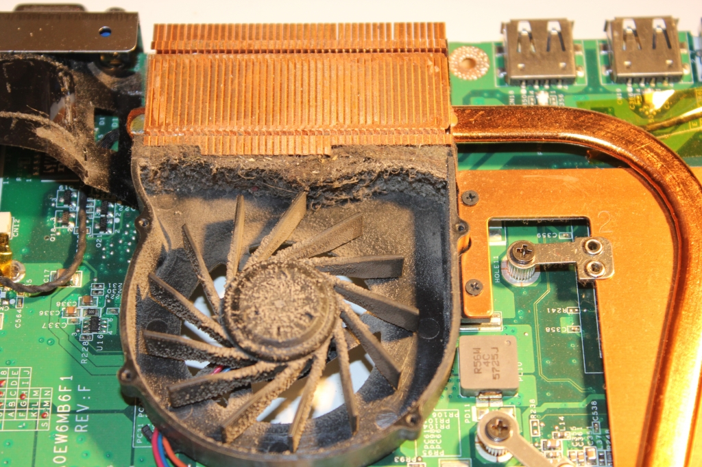
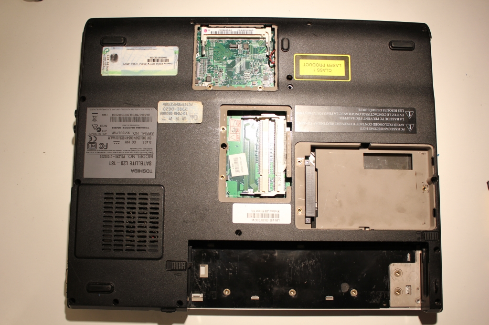
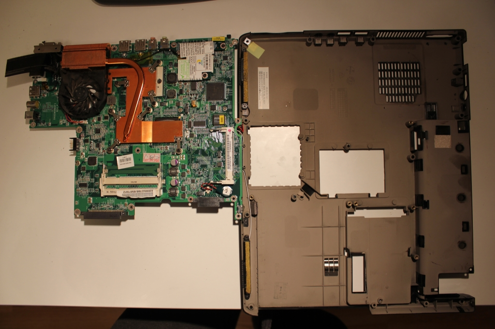
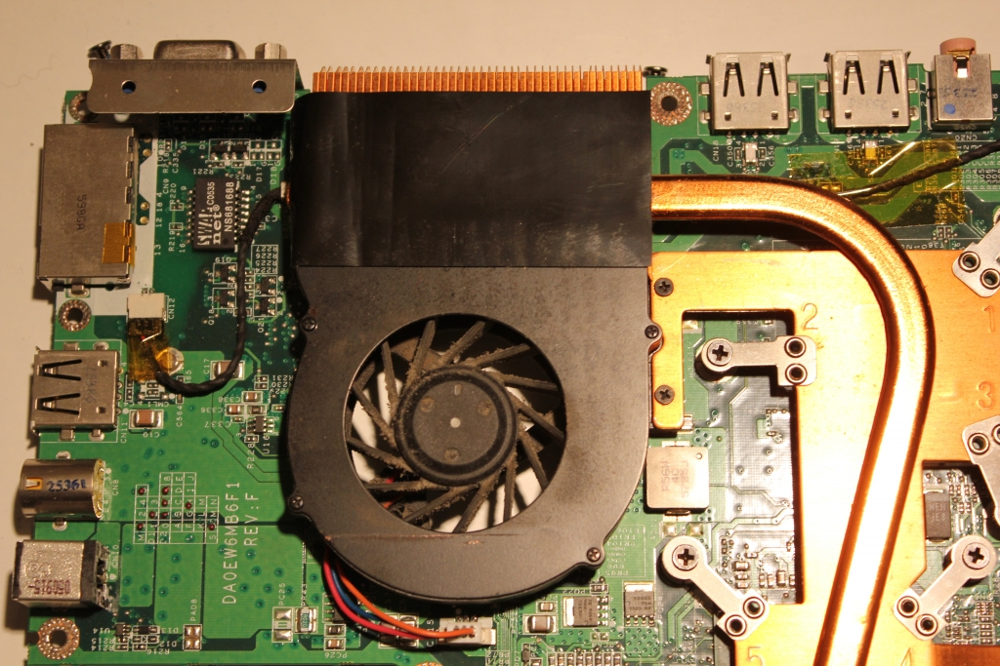
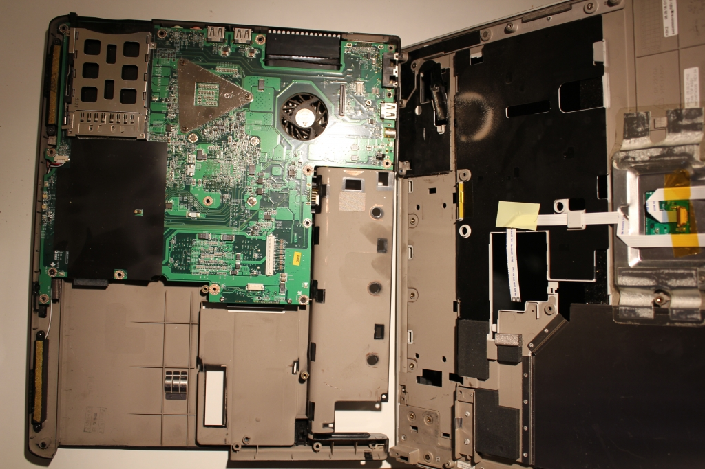
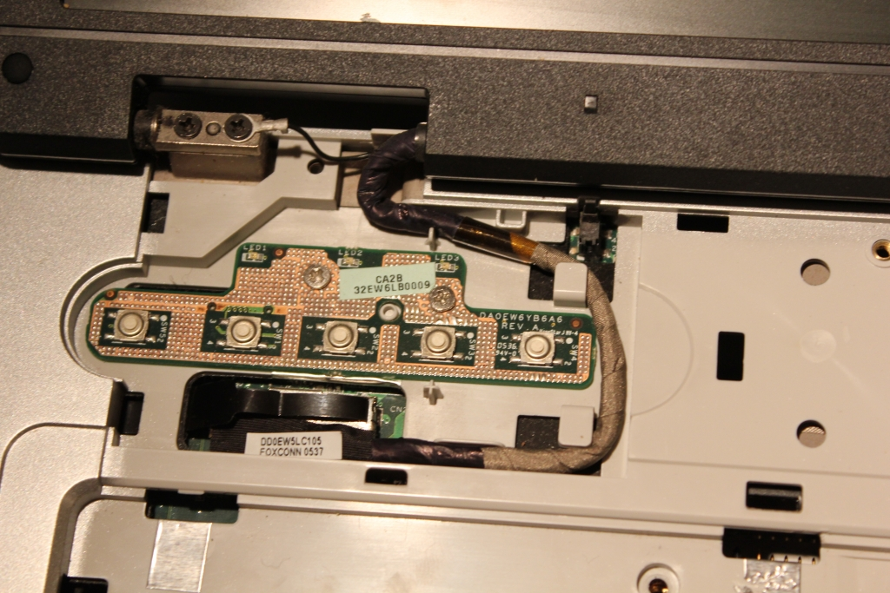
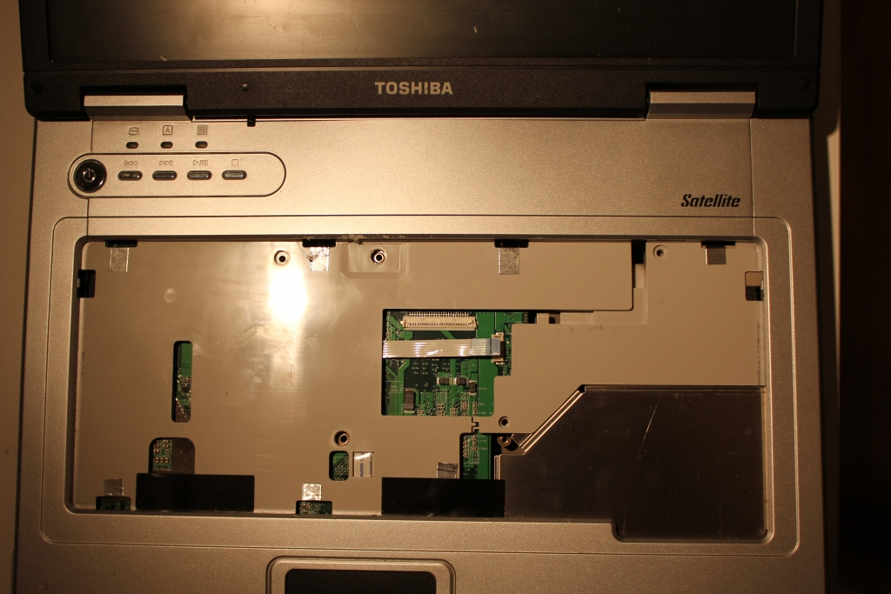
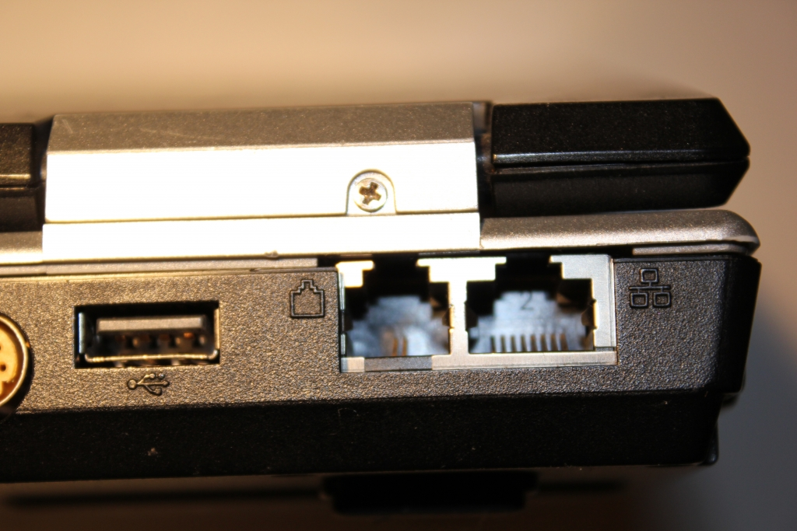
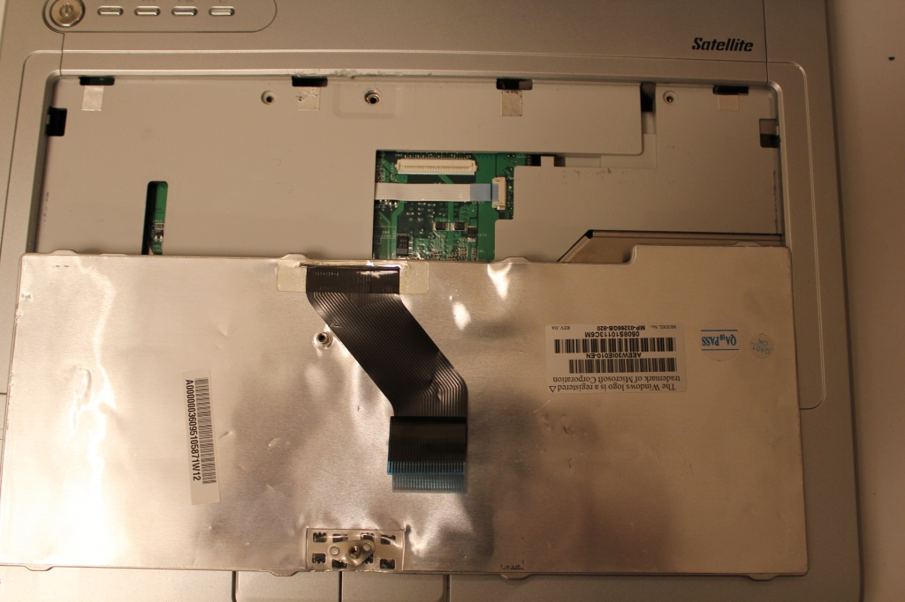
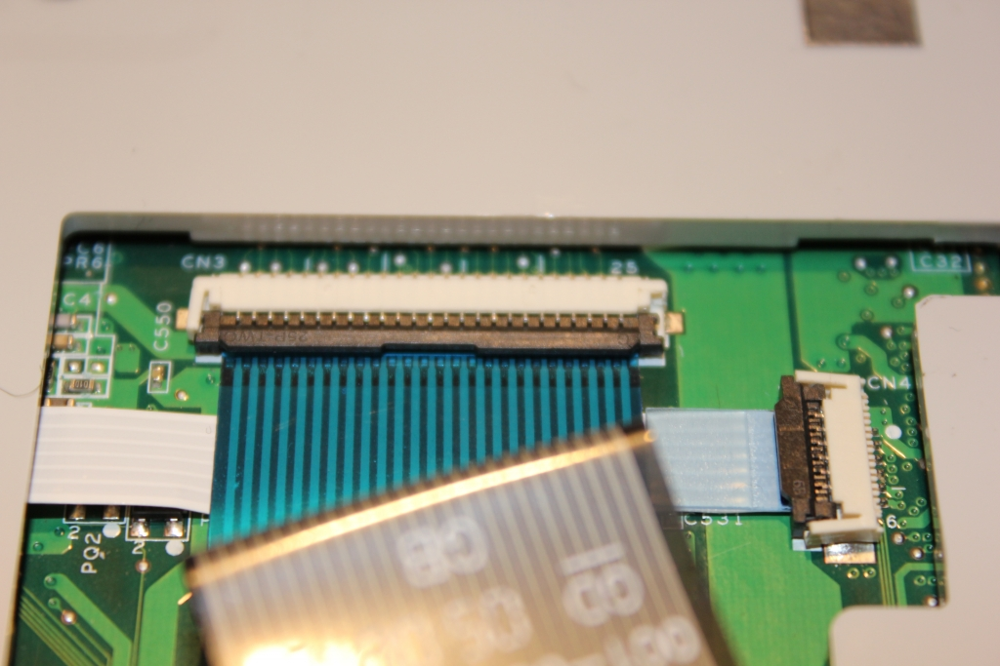
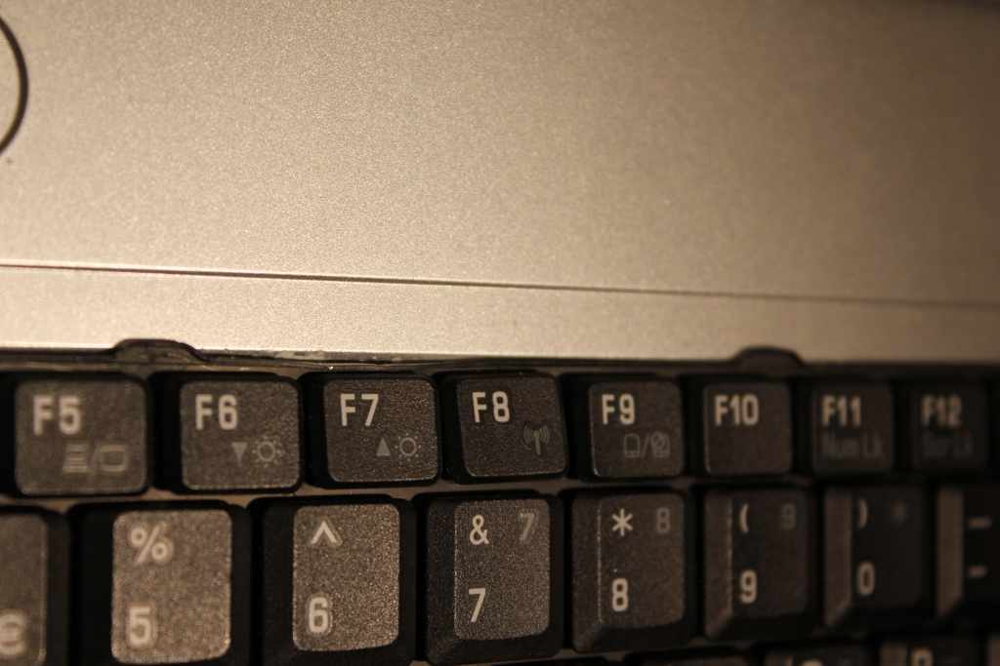