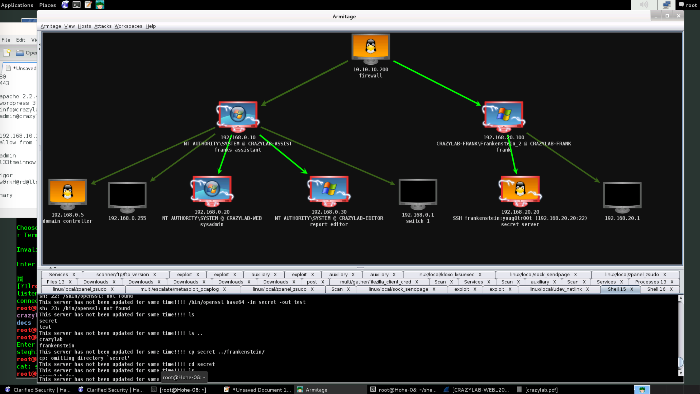

пятница, 15 декабря 2017 г. в 10:21:10

Прошёл двухдневный workshop компании [Clarified Security](https://www.clarifiedsecurity.com/) по основам взлома в сети и серверы. Оплатил это Pipedrive, но вы можете [заказать себе](https://oppia.ee/) такую же тренировку. Тренинги построены по шагам с такой оценочной системой, что какое-то время можно самому искать решение, потом тебе объясняют как это сделать в действительности.

Спешу поделиться самым интересным. Вначале было введение в историю, в т.ч. последние уязвимости типа [KRACK](https://www.krackattacks.com/). 

Потом был пример взлома по-старинке - старый апач с уязвимостью на переполнение буфера. Как раньше приходилось искать код на C, компилировать. Как в ходе этого gcc ругался на отсутсвующие хедер-файлы.

Второй день мы провели в [Kali Linux](https://www.offensive-security.com/kali-linux-vmware-virtualbox-image-download/) за двумя главными программками - Meterpreter и Armitage. Первая это библиотека эксплоитов с их поддержкой в виде сервера, а вторая это UI для управления атакой.

Итог пугающий. Уязвимости в java, flash и прочих неизвестных 0-day штуках позволяет влезть через веб к человеку на комп. Дальше обычно приходится делать повышение привилегий процесса. В винде можно прыгать с процесса на процесс, так что если клиент заразился через открытый word файл, то связь со злоумышленником остаётся переходом под более постоянный процесс, типа explorer. Повышение привилегий даёт в итоге полный контроль над машиной. Дальше можно захватывать компьютеры во внутренней сети, менять настройки файрволла так что-бы ничего не заподозрил владелец. Можно взламывать и линуксовые машины, так же поднимаясь до рута.

Кроме этих двух утилит в Kali предустановлены wordlistы, с которыми можно перебирать пароли к линуксовым shadow-файлам, есть сканеры путей для вебсайта и проч.

