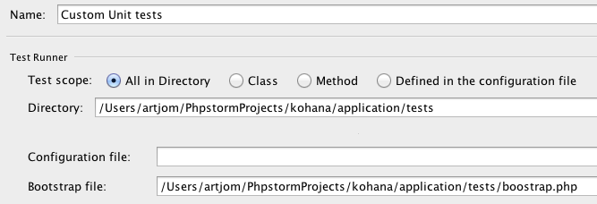
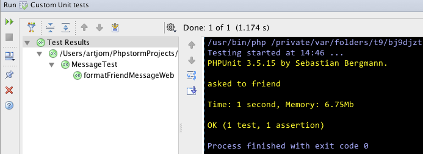

вторник, 6 декабря 2011 г. в 14:29:11

[Kohana](http://kohanaframework.org/) - один из десятка php-фреймворков, имеющий в том числе и модуль для юнит-тестирования написанного кода. Про [тестирование в общем](http://kurapov.name/rus/lab/software_testing/) я уже писал, про [настройку phpunit](http://kurapov.name/rus/lab/php_unit_testing/) тоже. Упростив [статью одного безымянного товарища](http://blog.lysender.com/2011/02/kohana-3-1-migration-unit-testing/), в сторону использования PHPStorm IDE вот к чему я пришёл..

1. В application/boostrap.php надо найти строчку с unittest модулем и раскоментировать
2. Создать папку и файл application/tests/boostrap.php - тут у нас будут лежать тесты для приложения  
    `define('SUPPRESS_REQUEST', true);   require_once('../../index.php');`
3. Обернуть последние строчки index.php в IF что-бы для юнит-тестов не выводилась заглавная страница `if (!defined('SUPPRESS_REQUEST')){ echo Request::factory()... }`
4. Теперь в настройках PHPStorm 3.0 (Run-Edit configurations) прописываем пути с запуском всей папки..




Теперь можно добавлять тесты в application/tests/classes/ где уже будет работать автозагрузка Kohana-классов. В моём примере тестируется класс Model_Message который отвечает за форматирование текста для оповещения пользователя. То как хранятся оповещения или переводятся в данном случае неважно - тестируется конкретный случай передачи массива и получения строки.

```php
defined('SYSPATH') or die('No direct access allowed!');
/** @property Model_Message object */
class MessageTest extends Unittest_TestCase {
    private $object;
    public function setUp() {
        parent::setUp();
        $this->object = new Model_Message();
    }
    /** @test */
    public function formatFriendMessageWeb() {
        $result = $this->object->formatForWeb(array(
            'object'=> 'friend',
            'action'=> 'request'
        ));
        $this->assertEquals($result, 'asked to friend');
    }
}
```

Сам тестируемый объект я не привожу, тут важно как идёт подгрузка, запуск и результат:
