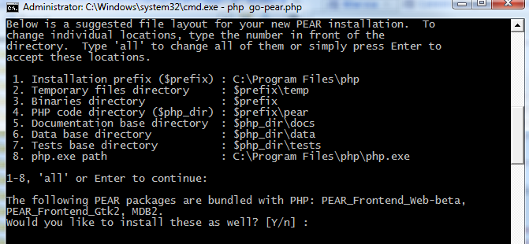
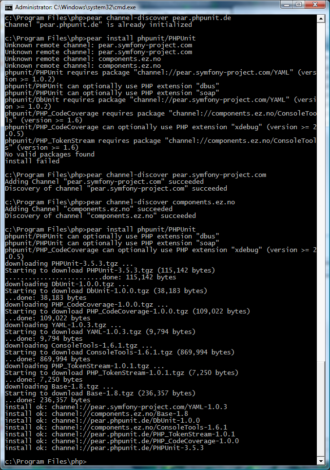
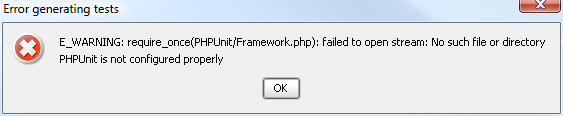
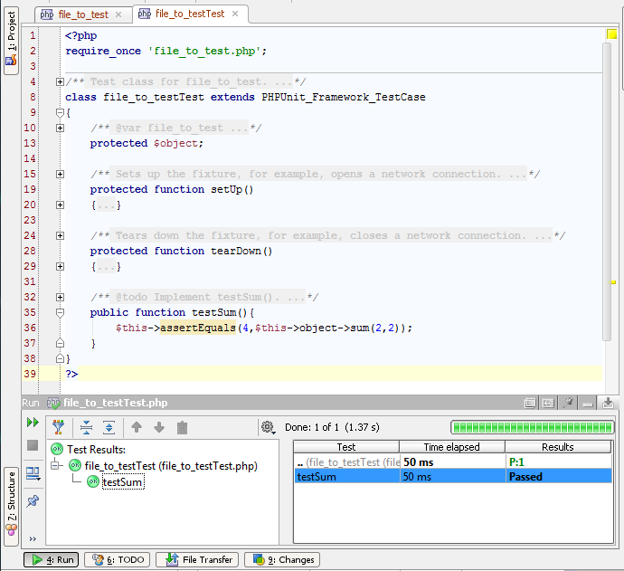

понедельник, 15 февраля 2010 г. в 10:39:39

Unit-тестирование это хорошо. Много [хороших статей](http://habrahabr.ru/blogs/php/56289/) написано о том как прекрасно это взять класс и для него написать юнит-тест. Позавчера вот [Андрей Солнцев](http://blog.codeborne.com/2010/10/unit-test-evolution.html) даже про расширение к TDD рассказывал — BDD. А большинство программистов по прежнему не используют.. просто потому что сложно даже настроить. Вот попробуем это для php сделать.

Прежде всего понадобится свой локально установленный php — я поставил последнюю [5.3.3 thread safe x86](http://windows.php.net/download/) версию. До этого я пробовал всякие WAMP, XAMPP, Apache2triad, Денвер.. и отсюда все проблемы которые далее возникли.

[Ставим PEAR](http://pear.php.net/manual/en/installation.getting.php) запустив в консольном режиме php с гигантским файликом установки [go-pear.php](http://pear.php.net/go-pear) — я его положил в папку с установленным php. Если у вас уже есть старенький PEAR, то pear.bat upgrade обновит его.

Установщик сам всё подкачает и распакует. У меня правда вылазили deprecation-ошибки и ошибки винды "CGI / FastCGI has stopped working" из-за параллельно существовавшего старого Apache2Triad пака. Пришлось его удалить и поменять путь к php (прямо в диалоге установки)

Теперь ставим библиотеку PHPUnit — ничего скачивать заранее не надо, PEAR подгрузит всё сам..  
`pear channel-discover pear.phpunit.de   pear install phpunit/PHPUnit`  
Опять возникли ошибки из-за того что PHP_PEAR_INSTALL_DIR is not set correctly. Пришлось ставить вручную  
  
`set PHP_PEAR_INSTALL_DIR=C:Program Filesphppear   set PHP_PEAR_BIN_DIR=C:Program Filesphppear   set PHP_PEAR_PHP_BIN=C:Program Filesphpphp.exe`  
Оказывается  PHPUnit хочет левые каналы используются из symphony-project.com... добавляем их и установка  проходит в штатном режиме  

### Связываем PHPStorm

[В детальном описании](http://blogs.jetbrains.com/webide/2009/12/phpunit-support/) настройки всё идеально. А у меня при создании теста возникает ошибка об отсутствии файла E_WARNING: PHPUnit/Framework.php.

На форуме это [объясняют путями](http://devnet.jetbrains.net/message/5271717;jsessionid=216059978C100470FEC18C00C63D4B81) к PEAR — IDE и у меня ругается при настройке путей к php на несовместимость с каким-то "оригинальным путём к php" который почему-то C:php5pear.. А всё потому что include_path не установлен из-за отсутсвия php.ini в C:Windows.[

Обновляем IDE [до 2.0](http://confluence.jetbrains.net/display/WI/Web+IDE+EAP) и вуаля - тесты генерируются! Но при запуске теста почему-то вылетает ошибка о нечитаемом файле. Лезем в Fileloader.php и закомментирываем exception и о чудо..

Теперь уже можно [разбираться с тест-пакетами](http://www.zyxist.com/en/archives/48), синтаксисом..

В Zend Studio 8.0 после этого может возникнуть ошибка Fatal error: require_once() [function.require]: Failed opening required 'PHPUnit/TextUI/TestRunner.php'  in C:Program FilesZendZend Studio - 8.0.0pluginscom.zend.php.phpunit_8.0.0.v20101001-0100resourcesZendPHPUnit.php on line 87. Для этого переименуйте во что-нибудь PHPUnit из PEAR папки и скопируйте поставляемую в качестве плагина зендовскую phpunit на уровень выше.
