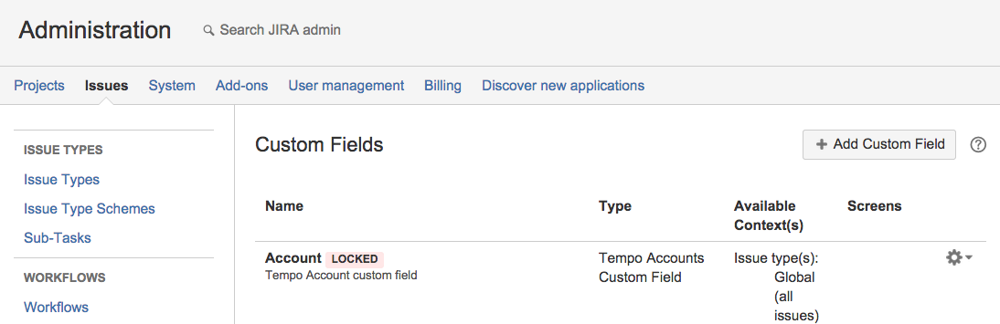
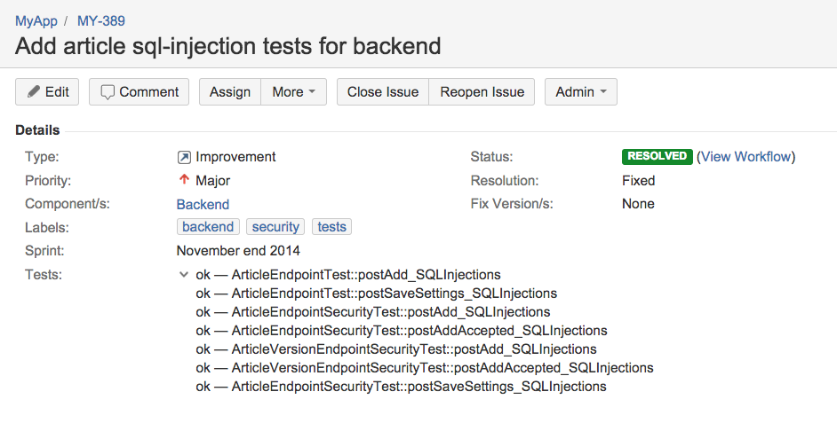

понедельник, 23 марта 2015 г. в 11:16:41

[Jira от Atlassian](https://www.atlassian.com/software/jira) — самый современный трекер задач и багов позволяющий гибко настроить workflow организации. Но если вы не доросли, не хотите использовать [Bamboo](https://www.atlassian.com/software/bamboo), а скажем используете [PHPCI](https://www.phptesting.org/) для автоматического тестирования, то вам возможно будет полезно видеть результаты прогона тестов сгруппированных по фичам.

Это достаточно спорная тем, многие апологеты тестирования не понимают зачем надо связывать тесты с фичами. Такие разработчики либо придерживаются простого мировоззрения что «все тесты должны проходить всегда», либо считают это излишним усложнением не дающего ничего в итоге.

По-моему эта методика достаточно полезна для повышения прозрачности покрытия фич. Если разработчик пишет новую фичу, то это не значит что он сразу же покроет код тестами. И даже если код на 100% покрыт юнит-тестами, это не значит что ошибок нет. Надо писать интеграционные тесты. А интеграционные тесты как правило не генерируют покрытия. Поэтому видеть - написаны ли какие-то тесты для фичи полезны для уверенности. Это справедливо и если вы программист и не следуете методике TDD "test first" и если вы менеджер и для вас покрытие тестами недостаточно прозрачно, не гранулярно.

Второй мой довод — код, тесты и фичи устаревают. Надо избавляться от старых областей. Обычно покрытие юнит-тестами помогает обнаружить код который никогда не запустится. С интеграционными тестами такой гибкости нет — ваш код покрыт, но нет нужды в его вызове на уровне клиента (устаревшая API, миграция на другой сервис). В таких случаях обычно код никто не удаляет и он мёртвым грузом остаётся в codebase. Мне кажется что хорошая альтернативная практика была бы feature deprecation, которая бы требовала удаление завязанных тестов и завязанного функционала. Аннотация в таком случае помогает связать всё воедино.

Наконец, аннотация на jira task — информационная ссылка, это форма развёрнутого комментария, куда можно вставить картинку, прочитать историю всех решений и связанных изменений, увидеть более общую картину. Поэтому я порой практикую @ticket аннотацию не только к тестам, но и к сложным участкам кода.

Интересный побочный эффект, возникающий с такой методикой - приходится правильно организовывать уже сами таски. Становится неудобно штамповать дубликаты для задач, сильно размывать описание по разным таскам или наоборот концентрировать всё описание в одном. Хочется правильно связать не только тесты с кодом, но и таски между собой. Документация напрямую завязывается на тестах, но без [огурцов](https://cukes.info/).

## Установка для PHPUnit

Для связки тестов нам понадобится [API клиент](https://github.com/chobie/jira-api-restclient) для Jirы..

composer install chobie/jira-api-restclient

В tests/bootstrap.php, который будет использоваться как бутстрап для phpunit, вставим настройку авторизации API и заинклудим эту библиотеку:

```
define('JIRA_LOGIN', '');
define('JIRA_PASS', '');
require __DIR__ . '/../vendor/composer/chobie/jira-api-restclient/src/Jira/Api.php';
```

Что-бы в Jira сохранить данные для каждой фичи, нам надо добавить custom field. Для этого идём в настройки и добавляем новое поле Tests..

**myapp**.atlassian.net/secure/admin/ViewCustomFields.jspa

Заметьте под каким номером поле сохранилось - он будет использоваться в коде. В моём случае это customfield_10402.





### Код

Дальше, мы в каждый класс тестов будем внедрять дополнительные функции. А что-бы не сбивать очерёдность наследования, будем использовать trait. Что-бы тесты не пинговали API после каждого теста, надо будет результаты сохранять в json и делать сетевой запрос только в конце. Замените константы и URL на свои.

```
trait JiraConnect {

    private $ticket;
    private $currentTest;
//    private $failed = false;

    static $testResults = [
        //ticket=>text
    ];

    //Store test results in file for cross-class results
    function saveJira($status) {
        if (!$this->ticket) {
            return;
        }

        $storage = PATH_APP . '/tests/ticket_status.json';
        if (!file_exists($storage)) {
            touch($storage);
        }

        $s = json_decode(file_get_contents($storage), true);

        if (!isset($s['testResults'][$this->ticket])) {
            $s['testResults'][$this->ticket] = [];
        }
        $s['testResults'][$this->ticket][$this->currentTest] = ($status ? 'ok' : 'fail');

        file_put_contents($storage, json_encode($s));
    }

    static function updateJiraTestStatus() {
//        $name = $this->currentTest;

        if (!defined('JIRA_LOGIN') || JIRA_LOGIN == '') {
//            echo('Please define JIRA_LOGIN, JIRA_PASS in bootstrap.php to update JIRA issues');
            return;
        }

        $api = new \chobie\Jira\Api(
            "https://myapp.atlassian.net",
            new chobie\Jira\Api\Authentication\Basic(JIRA_LOGIN, JIRA_PASS)
        );

        $storage = PATH_APP . '/tests/ticket_status.json';
        $s       = json_decode(file_get_contents($storage), true);

        foreach ($s['testResults'] as $ticket => $testResults) {
            $sResult = "";
            foreach ($testResults as $class => $status) {
                $sResult .= $status . " — " . $class . "\n";
            }

            $updObj                    = new stdClass();
            $updObj->customfield_10402 = [
                ['set' => $sResult]
            ];

            $r = $api->editIssue($ticket, [
                "update" => $updObj
            ]);
        }
    }

    function usingMethod($class, $method) {
//        echo $class;
        $this->ticket      = $this->getTicket($class, $method);
        $this->currentTest = $class . '::' . $method;

        return $this;
    }

    function getTicket($class, $method) {
        $r   = new ReflectionMethod($class, $method);
        $doc = $r->getDocComment();
        preg_match_all('#@ticket (.*?)\n#s', $doc, $annotations);

        if (isset($annotations[1][0]))
            return $annotations[1][0];
    }


    function tearDown() {
        $className = explode('::', $this->toString())[0];
        $this->usingMethod($className, $this->getName());
        $this->saveJira(!$this->hasFailed());
    }

    static function tearDownAfterClass() {
        self::updateJiraTestStatus();
    }


    function onNotSuccessfulTest(Exception $e) {

        if (method_exists($e, 'getComparisonFailure') && $e->getComparisonFailure()) {
            $trace = $e->getComparisonFailure()->getTrace();
        } elseif (method_exists($e, 'getSerializableTrace')) {
            $trace = $e->getSerializableTrace();
        }

        if (isset($trace)) {
            $method = $trace[4]['function'];
            $class  = $trace[4]['class'];

            $this->usingMethod($class, $method)->saveJira(false);
        }
        throw $e;
    }
}
```

Теперь сам интеграционный тест

```
require_once 'JiraConnect.php';
class EndpointConnector extends \PHPUnit_Framework_TestCase {
    use JiraConnect;
    
    /**
     * @test
     * @depends login
     * @group security
     * @ticket MY-389
     */
    function postAdd_SQLInjections() {…}
}
```

Когда он будет проходить или заваливаться, поле в JIRA таске будет обновляться со всеми результатами. Лучше всего такую завязку с Jira ставить на staging сервере, что-бы видеть последнее состояние проекта




Из недостатков — хотя по полю «Tests» можно искать, фильтрация недостаточно удобная, нет подсветки (как у статуса выше), нет вида для всех фич-тестов, нет лога, ссылок. Это всё-таки не полноценная интеграция с CI сервером. Вторая проблема - обновление тестов забивает «Activity stream» реальных пользователей. Наконец, это решение пока работает только с phpunit и я ничего не делал с protractor e2e тестами, которые по-хорошему, были бы ещё полезней в Jira