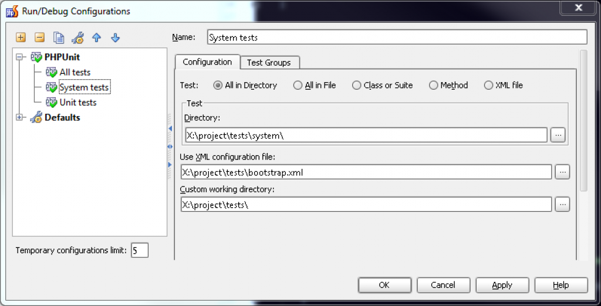
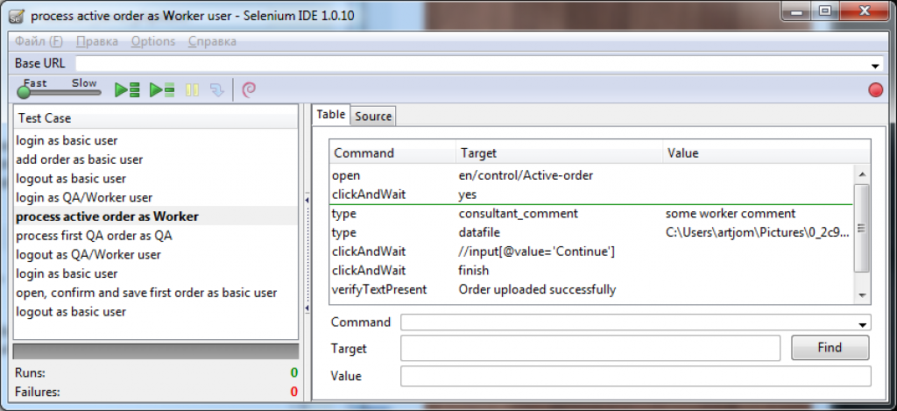
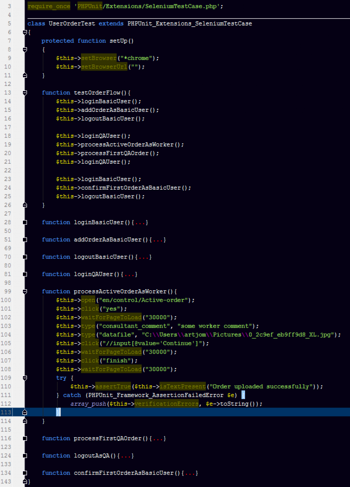

вторник, 8 марта 2011 г. в 18:57:49

Все в округе говорят про юнит-тестирование и TDD, но основательно менять парадигму мышления и мегабайты строк кода нехватает воли, денег и времени? Временное решение — системное black-box тестирование с Selenium Server (RC). Это значит что мы тестируем не каждый класс изнутри как то делает unit-тест (т.н. whitebox-тестирование), а только UI который виден пользователю.

Помоему лучше начинать внедрять тестирование в существующие проекты в компании именно с этого, потому что это может стать первой ласточкой о том работает ли ещё навигация в проекте с вашими изменениями или что-то упало (сравните с результатом unit-тестов которые говорят работает ли всё правильно)  

Если вы уже видели плагин для Mozilla Firefox который позволял записывать ваши действия и воспроизводить как макрос, то вы уже в теме, потому что это был Selenium IDE, который к нынешнему времени может макро-комманды превращать в ruby, python, java, perl, c# и PHP код. А делается это вот для чего..

После того как мы записали макро-тест из Selenium IDE, скопировали код в PHP (см. Options → Clipboard format) и создали php-файл этим кодом, можно увидеть что тест нуждается в

1. [PHPUnit и локальной копии php](http://kurapov.name/rus/lab/php_unit_testing/)  
    
2. Selenium Server - эдакой прослойке на java, которая самостоятельно запускает браузер и выполняет наш код
3. PHPStorm или консоли которые бы запускали phpunit со всеми параметрами

Второй пункт делается [скачиванием](http://seleniumhq.org/download/) и установокой простенького сервера, который запускается

`java -jar selenium-server.jar -interactive`  
Ну а третий пункт настраивается в PHPStorm подобно дебагу, об этом чуть ниже  

### Создавая чемодан тестов

Наследуя PHPUnit_Extensions_SeleniumTestCase, мы тем самым получаем некоторые возможности в настройке работы теста в setUp(), это в частности  

- Браузер - firefox, googlechrome, iexplore, safari, konqueror и проч.  
    $this->setBrowser("*chrome");  
    
- Пауза между коммандами  
    $this->setSleep(1);  
    

Но этого мало, ведь тесты могут быть закоммичены в SVN для других пользователей, у которых могут быть другие настройки (другой URL, логин/пароль для тестирования, БД для более хитрого graybox-тестирования).. Для этого при запуске тестов используется bootstrap-файлы. XML-файлик для PHPUnit скуден и просто указывает на php-файл в который мы и кидаем настройки под каждого разработчика


`<phpunit bootstrap="bootstrap.php"></phpunit>`

На этой же картинке показаны и настройки запуска PHPUnit-тестов. Теперь достаточно запустить Run и наслаждаться тем как в браузере всё летает.

Теперь поподробней о наборах тестов.. Если test case это элементарный набор инструкций для одной страницы (или по крайней мере я так это интерпретирую), то test suite это их набор, созданный что-бы показать весь процесс. Вот вам пример..


Допустим у нас какой-то заказ создаваемый клиентом обрабатывается привилегированными пользователями. Что-бы протестировать всё движение заказа с изменениями статусов и передвижением данных, мы группируем элементарные тесты в набор.

К сожалению, Selenium ещё не имеет «Export Test Suite As → PHP» поддержки, поэтому приходится создавать внутренние функции, которые использовал бы один тест. Очевидный минус здесь в том что suite как правило очень длинный и его падение не очень точно говорит на каком шаге он упал.


Вторая проблема с наборами тестов, это генерируемые данные. Если вы прогоняете регистрацию пользователя, то наверняка где-то стоит валидация на существующий email/login. Естественно что после одной удачной регистрации вторая провалится. Ставить удаление пользователя в конец теста - тоже плохая идея. Как результат - необходим либо веб-доступ к ручному удалению пользователя из админки, либо же прямой запрос в БД (вот вам и graybox / зависимость от БД структуры)

Если углубиться в доки, то можно найти PHPUnit_Framework_TestSuite который насколько я понял только обобщает результаты тестов по темам, мол «все тесты с заказами» или «все тесты с оплатой» прошли успешно, не учитывая их последовательности.

### Через тернии к звёздам

Впрочем не всё так безоблачно как я описал. Во-первых написать хороший тест для Selenium не так то просто, ибо приходится учитывать то что DOM меняется, могут появляться popup окна или что-то может происходить периодически с ajax'ом. Ещё хорошее препятствие - капчи, меняющиеся текстовые проверки (в банках при оплате) и авторизация в социальных сетях.

Для борьбы с этими проблемами есть waitForElementPresent. Кроме того Selenium можно настроить делать скриншот в случае ошибки в конце теста и дальше уже отправлять по почте или сохранять в файловую систему

```php
protected function onNotSuccessfulTest(Exception $e){
    date_default_timezone_set('Europe/Minsk');
    $this->getEval("window.resizeTo(1024, 1000); window.moveTo(0,0);");
    
    $png_image = base64_decode($this->captureEntirePageScreenshotToString());
    $sFile = $this->screenshotPath.date('d.m.Y_H-i',time()).'.png';
    touch($sFile);
    $fp = fopen($sFile,'w+');
    fwrite($fp,$png_image);
    fclose($fp);
    
    //throw $e;
}
```

Вторая проблема — то что написав эти тесты, разработчики о них могут забыть, потому что даже хорошо написанный тест зависит от xpath-адресов элементов в html и следовательно изменение шаблонов или логики должно отражаться в тестах. Плюс запуск всех тестов может занимать десятки минут. Для того что-бы это частично обходить, есть Selenium Grid, который запускает тесты параллельно на разных браузерах и есть [Hudson](http://habrahabr.ru/blogs/testing/108928/) что-бы эти тесты запускать постоянно в качестве мониторинга «здоровья системы». Просто до настройки их я ещё не дорос.

В заключение ещё раз о целесообразности. Протестировать всё и вся невозможно, поэтому начинайте с самых главных и сложных частей - основной функциональности и там где замешана оплата или деньги.

Источники
- [Юнит-тесты уровня браузера на связке Selenium+PHP](http://javascript.ru/unsorted/selenium-rc)
- [Блог LogicSoftware](http://blogs.logicsoftware.net/qa/)  
- [Selenium и PHPUnit](http://symfonyru.blogspot.com/2008/12/selenium-phpunit.html)
