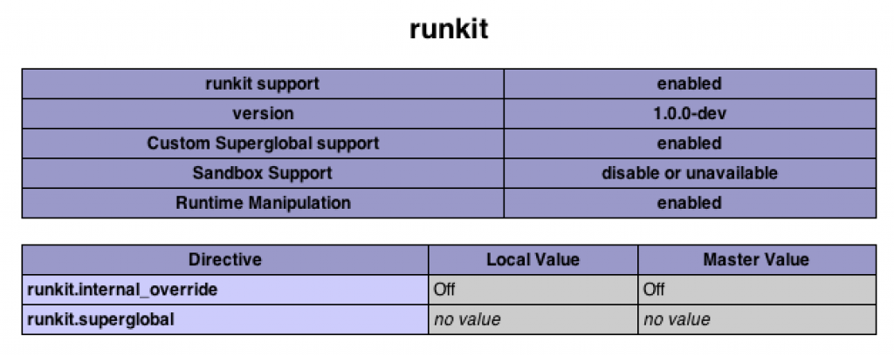

четверг, 8 декабря 2011 г. в 11:47:55

PHPUnit хороший инструмент для тестирования PHP-кода. Но у него есть существенные ограничения влияющие его использование рядовыми программистами. Я даже не говорю об установке. Дело в том что юнит-тесты подразумевают

```
public function methodIWantToTest(){
    $s='';
    for($i=1;$i<10;$i++){
        $s.=$this->innerMethodIWantToAvoidCalling($i);
    }
    return $s;
}
```

Это серъёзная проблема, ведь редко какой сложный метод обходится без вызова внутренних. Один из выходов — использовать новый instance этого же класса, и [с помощью моков](http://www.phpunit.de/manual/3.0/en/mock-objects.html) сымитировать поведение внутренней переменной (фактически запрещая использования $this). Моки конечно полезные, но я нехочу из-за ограничений фреймворка для тестирования менять свой код в неоптимальную сторону, добавляя выделение памяти под объект который уже и так создан. Поэтому..

### Runkit


Runkit это экспериментальное расширение для php, позволяющее перезаписывать структуру классов на лету, что собственно нам и надо, потому что стандартный [Reflection](http://php.net/manual/en/book.reflection.php) просто создаёт новые классы, а нам надо совместить существующий код с перезаписью внутреннего метода сделав из него заглушку (stub).

Самое неприятное тут это [установка](http://www.php.net/manual/en/runkit.installation.php), потому что обычный pecl-install не работает и приходится делать checkout из репозитория с локальной установкой, потом копировать файл расширения (so/dll), прописывать в php.ini. Ну и потом у меня были опять проблемы из-за того что я использую не стандартный php на маке, а тот что в [MAMP](http://www.mamp.info/en/index.html).  

В итоге, после того как я инициализировал объект от класса, я просто перезаписываю его внутреннюю функцию на постоянно возвращаемое значение которое мне надо:

`runkit_method_redefine('MyClassName','innerMethodIWantToAvoidCalling','','return "someFixedValue";',RUNKIT_ACC_PUBLIC);`

Это конечно не так хорошо как динамический мок, но лучше чем не тестировать методы высокого уровня вообще

См. также..

- [Testing protected methods](http://www.littlehart.net/atthekeyboard/2012/04/19/metatesting-extending-your-testing-tools/)