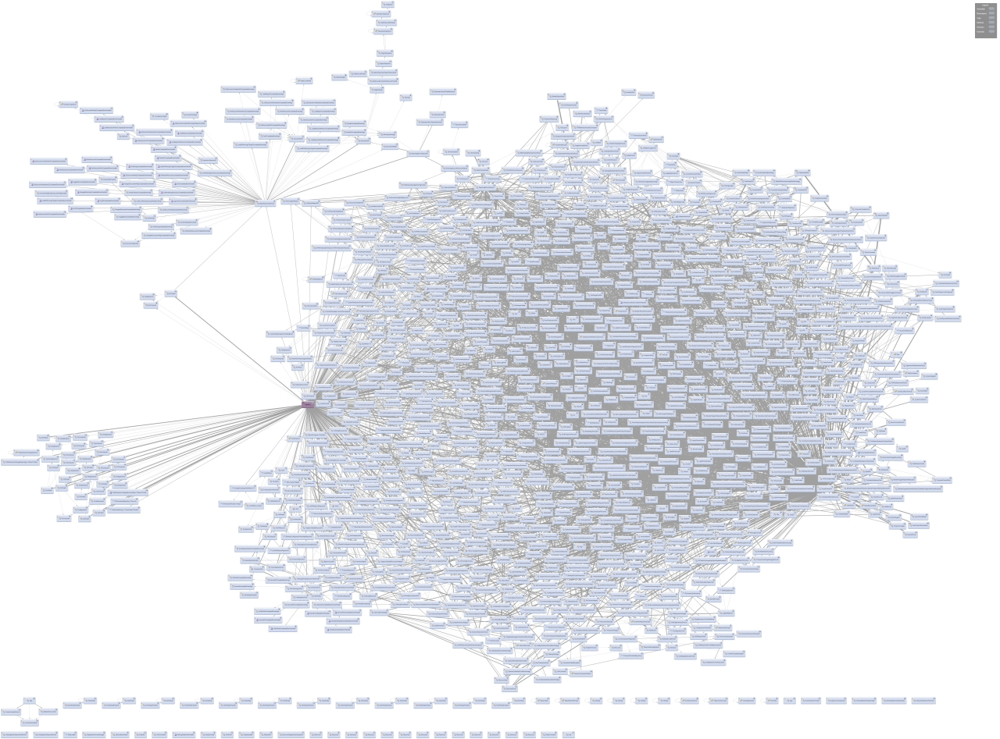

среда, 8 апреля 2015 г. в 17:51:45

Я когда-то писал про то что в phpunit небыло возможности нормально протестировать внутренние методы класса и приходится обращаться к runkit. Незнаю, была ли это моя недоработка, либо с версии 3.8 прошло уже много времени, но в 4.5 эта возможность есть! Моки в 4.5 [стали удобней](https://phpunit.de/manual/current/en/test-doubles.html) — они умеют **перезаписывать** как весь класс, так и **его части**.

У меня подход к разработке эволюционный и к тестам прагматичный — тесты должны позволять **постепенно** улучшать качество приложения. В реальной жизни приложение уже существует в какой-то форме, а программисты ленивые и тесты не писали. Поэтому надо уметь минимальным рефакторингом добавлять автоматические тесты, постепенно приводя людей и покрытие к вере в Бога TDD. По-оправдывался, теперь к конкретике..

### Проблема

Когда вы начинаете писать юнит тесты для своих классов, то первая проблема с чем вы сталкиваетесь — зависимости, в частности **создание новых экземпляров** каких-то классов. Это как зависимости у людей — сигареты, пиво, сладкое, деньги, порно.


Практически все сразу же советуют **Dependency Injection**. Мол вынесите все зависимости в качестве аргументов! В реальной жизни это значит перейти на **что-то послабее** — электронные сигареты, вино, фрукты, благотворительность и спорт. Например, если у нас есть такой метод в классе, то его проблемно тестировать..

```php
class A{
    function a($c){
        $b = new B();
        return $c * $b->calc(2);
    }
}
```

  

С вынесением зависимостей, **new B** вы можете передавать как аргумент.  
Теперь в тестах можно внедрять какой-то dummy-обьект. Это типичное решение.

```php
function a($c, B $b){
    return $c * $b->calc(2);
}
```

  

Второе решение - **инкапсуляция + DI**. Практически то же самое, только что-бы не засорять аргументы внутренними параметрами, мы внедряем зависимость в целый класс. Это более тяжёлая форма зависимости — мол да, я пью пиво не только в компании, но и в других случаях тоже. Это удобно тем что зависимость сразу видна (проще в магазине найти нужный отдел)

```php
function a($c){
    return $c * $this->b->calc(2);
}
```

  

Обычно такой подход работает на низком уровне моделей, улучшая в целом дизайн, но вы не можете вечно вырезать создание новых экземпляров — рано или поздно вам надо сказать что же за классы вы используете. Итого, что мне не нравится

- Когда зависимости **сконценрированы** выше в коде (в контроллерах), то именно их тестировать становится сложно - они как конфигурация становятся. Хотя в целом это правильный подход
- Юнит тесты настолько диктуют что и как мне писать, что начинающий программист не может даже начать писать тесты без значительного изменения логики
- Рано или поздно, новый instance создавать прийдётся, а значит надо создавать мок! И вопрос лишь в том где это делать что-бы тест был проще, а код - менее хрупким

### Класс это не обьект

Проблему с new B просто так не решить не связывая код с тестом. Phpunit не генерирует логику внутри самого мок-класса. Т.е. если вы создадите перезаписывающий весь класс мок..

```php
$bMock = $this->getMockBuilder('B')
->disableOriginalConstructor()
->disableAutoload()
->setMethods(['calc'])
->getMock();
```

  

То он вернёт обьект..

```php
class B_5dc6f9ad#2958 (2) {
    private $__phpunit_invocationMocker => NULL
    private $__phpunit_originalObject => NULL
}
```

  

Но если вы этот обьект **никак не будете использовать**, оставив new B в коде, то хотя класс во время runtime моком был сгенерирован, он будет пуст..

```php
class B#2950 (0) {}
Fatal error: Call to undefined method B::calc()
```

  

**Надо подменять** инстанс на мок как-то.. Но я не хочу инжектить мок явно в класс или метод, поэтому..

### Решение

По-моему проще всего **new B** вынести в отдельный метод и заменить его при тестировании. В жизни, это похоже на вынесение зависимости через кошелёк. Если деньги есть - остальные зависимости подключаются, забыл или потерял кошелёк - мокаем замену вина на воду. 

```php
class A{
    function a($c){
        $b = $this->getB();
        return $c * $b->calc(2);
    }
    
    protected function getB(){
        return new B();
    }
}
```

  
Теперь в тесте мы мокаем B, описываем что должен вернуть B->calc() и для внедрения зависимости мокаем getB():

```php
$bMock = $this->getMockBuilder('B')
    ->disableAutoload()
    ->setMethods(['calc'])
    ->getMock();

$bMock->method('calc')->willReturn(2);
$o = $this->getMock('A',['getB']);
$o->method('getB')->willReturn($bMock); //actual mock injection here
/** @var \B $o */ //for IDE to see method usage
$this->assertEquals(4, $o->a(2));
```

  
При этом сам B не вызывается и не используется, зависимость из класса не выносится и при необходимости, зависимость можно легко заменить на инкапсуляцию с сеттером. Профит.

Недостатки — тесты становятся на строчку сложней, т.к. надо заменять методы зависимостей, вместо передачи в качестве аргумента. А из-за того что код вызывается через мок обьекта, а не его instance, IDE не сможет автоматически рефакторить и находить использование.. это конечно неприятно, но аннотации спасают

Остаётся проблема с [parent-методами](http://stackoverflow.com/questions/6711647/in-phpunit-how-do-i-mock-parent-methods)